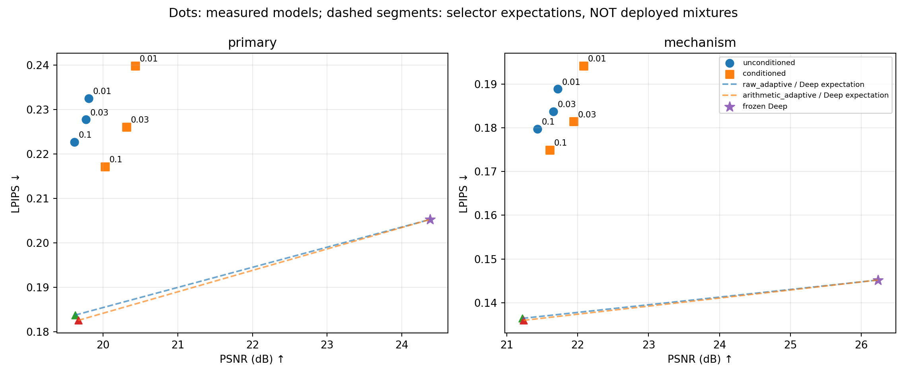

# VAR-Comm：有限资源下的图像通信研究

围绕 **VAR / next-scale 表示在图像通信中的作用**，研究有限信道次数、总能量和明确接收信息约束下的传输与恢复。

这是可追溯的研究快照，不是已经定稿的论文或“全面超过DeepJSCC”的声明。仓库保留有效机制、强对照、负结果和停止决定，不把代理指标改善等同于系统成功。

## 当前结论 · 2026-09-16

- **数字VAR自适应**仍是重要的系统参考；实际整帧算术编码＋FEC、可靠性/图像质量模式选择都保留。
- **条件读取确实有结构作用**：固定m7混合接收器中，lambda=0.03在相近LPIPS下，相对同训练机会控制提高0.5440 dB PSNR（主区间1/4/7 dB）。
- **当前固定m7混合主线结束**：三权重、两结构收尾后，仍未达到原联合系统要求。不自动追加网络、资源分配或loss搜索。
- CSI不确定性只形成了文献核查和未执行草案；没有新训练、没有新的最终holdout结果。

详细结论：[三权重收敛报告](reports/hybrid_weight_closure_convergence_20260916.md) · [研究状态](docs/RESEARCH_STATUS.md)

### 最新主区间结果

原100张development图，1/4/7 dB，每图三个噪声；所有失败计入；每帧3060 complex uses、归一化总能量6120。

| 方法 | PSNR ↑ | LPIPS ↓ | DINO ↑ |
|---|---:|---:|---:|
| 无条件混合，lambda=0.03 | 19.77231 | 0.227766 | 0.787945 |
| 基图条件混合，lambda=0.03 | 20.31631 | 0.226105 | 0.781101 |
| 基图条件混合，lambda=0.1 | 20.02556 | 0.217177 | 0.784135 |
| 完整raw数字自适应 | 19.62665 | 0.183763 | 0.886743 |
| 实际整帧算术码＋FEC自适应 | 19.66918 | 0.182580 | 0.887229 |
| 感知DeepJSCC | 24.37834 | 0.205291 | 0.544427 |

这不是新独立测试。DINO没有参与本轮训练/选点，但在项目早期研究中有过暴露。更完整的逐SNR结果、源图级配对区间、训练预算和计算成本均在报告及CSV中。



图中点是实际模型，虚线只是固定比例帧间选择的**期望组合**，不是两条链同时传输、不是逐图oracle，也不是已部署方法。数值比较只使用校准冻结的比例。

## 内容组织

```text
src/var_comm/          VAR通信、PHY、算术码、接收器与统计实现
scripts/              原研究的训练、评测、审计与分析入口
configs/              原协议配置快照（机器路径已脱敏）
experiments/          学习参考的自有源码、配置和检查；无vendor/权重
reports/              原理、协议、结果、收敛与负结果报告
results/              精选表格、逐帧指标、固定选择、审计与统计图
docs/                 状态、复现边界、资产说明、历史索引
tools/                无GPU的公开结果复算与发布检查
tests/                公开数据完整性与复算测试
release_manifest.json 原始文件SHA、发布文件SHA和脱敏记录
```

## 可以立即复现什么？

**不需要GPU、ImageNet像素或大模型，即可从公开逐帧CSV重算最新均值、1856项配对区间、固定比例期望参考，并核对原结果。**

```bash
python -m venv .venv
source .venv/bin/activate
python -m pip install -r requirements-results.txt
python tools/check_release.py
python -m unittest discover -s tests -v
python tools/reproduce_results.py
python scripts/check_mode_policies.py
```

复算输出写入被Git忽略的`reproduced/`，不覆盖发布结果。这里复算的是已保存指标的统计，**不是重新训练、重新传输或重新计算LPIPS/DINO像素指标**。

### 全量训练 / 图像重渲染的边界

这是“代码＋配置＋可复算结果”发布，**不是完整训练资产包**。原GPU脚本还依赖外部视觉模型、自有历史JSCC组件、图像/特征缓存和共同暖启动/Adam。检查点、数据集像素、虚拟环境、第三方vendor和论文PDF均不上传。

配置中的`/workspace/...`是脱敏占位路径，不是承诺clone后即可训练。请先读[复现说明](docs/REPRODUCIBILITY.md)；迁移时不能伪造新校准/新holdout，也不能直接改旧哈希绕过审计。

## 推荐阅读顺序

1. [当前固定混合路线为何结束](reports/hybrid_weight_closure_convergence_20260916.md)
2. [数字VAR及实际整帧熵编码的收敛结果](reports/communication_convergence_final_20260915.md)
3. [真实基图条件读取：原0.01结果](reports/hybrid_base_conditioning_result_20260916.md)
4. [表格、图和历史输出映射](docs/RESULTS_INDEX.md)
5. [CSI不确定性：三篇原文与未执行草案](reports/tx_csi_uncertainty_literature_preparation_20260916.md)

旧报告的科学数值和结论保留，仅对发布副本中的机器路径做脱敏。历史文档中的PID、运行命令、`outputs/`引用和授权快照不是当前待执行任务；以本README和研究状态为准。

## 依赖与使用

VAR的next-scale、多尺度量化、DeepJSCC和鲁棒链路适配等基础思想属于相应已有工作，不被本仓库冒称首次提出。[第三方说明](docs/THIRD_PARTY.md)列出外部依赖边界。当前未额外附加统一代码许可证；第三方代码、模型和数据的使用条件需分别遵守其上游要求。
