# N512 极低带宽探索性验证

P512 单个训练 seed=2026093001；完成更新 40000；校准选中更新 40000；checkpoint SHA-256 `28009f4263905bf307abec341ff4aff147140e3543ec3eae231781ca5ff0036b`。本报告只交付第一阶段 N512。

## 训练预算与结论范围（2026-10-01 核查）

P512 在 40,000 步时，最近两个完整校准区间的损失仍分别下降 0.5073% 和 0.6497%。训练达到预设 40,000 步上限后停止，记录为 `budget_truncated=true`，未确认已收敛。以下结论针对本次单个训练 seed、校准选中的 40,000 步模型。

本轮数字方案的 `CLEAR_GAIN` 全部来自 DINO 与匹配特异性分支；PSNR、LPIPS 和 F 误差同时变差。VAR 接收插件在五档 SNR 下均选择真正旁路，未建立独立接收增量。

[训练完成与预算记录](../results/extreme_bandwidth_20260930_R1/provenance/training/completion.json)；[40k 停止决定](../results/extreme_bandwidth_20260930_R1/provenance/training/extension_40000.json)。

1. **同 Dc、无额外类别的数字分工是否胜过 P512？** 严格逐帧同能量无条件 QPSK 的明显增益点：1 dB D_U_QPSK、4 dB D_U_QPSK、7 dB D_U_QPSK、13 dB D_U_QPSK、19 dB D_U_QPSK。下面同时给出 PSNR、F 平方和及配对区间。
2. **属于什么资源口径？** 连续与 QPSK 的每帧 E=1024、N=512；16QAM 保留原星座，其实测帧能量分布另表。全部数字明显信号：1 dB D_U_QPSK、1 dB D_C_QPSK、1 dB D_U_16QAM、1 dB D_C_16QAM、4 dB D_U_QPSK、4 dB D_C_QPSK、4 dB D_U_16QAM、4 dB D_C_16QAM、7 dB D_U_QPSK、7 dB D_C_QPSK、7 dB D_U_16QAM、7 dB D_C_16QAM、13 dB D_U_QPSK、13 dB D_C_QPSK、13 dB D_U_16QAM、13 dB D_C_16QAM、19 dB D_U_QPSK、19 dB D_C_QPSK、19 dB D_U_16QAM、19 dB D_C_16QAM。类别辅助与 16QAM 点分别限定解释。
3. **插件是否同时超过 P、A1、A2？** 同一个质量分支同时超过三控制的明显点：无。真正 BYPASS 不计为修正成功；共同 A1 alpha 的内容差值单列。
4. **D0、类别、失败与计算改变多少结论？** 同 latent 的 D0−Dc、同动作接收前缀的 C−U、生成−prefix、失败率及 CPU 波形→图像时间均列在下表。类别来自原应用/数据标签，通过付费头接收；该来源本身不等于部署可免费取得正确类别。
5. **是否需要 N1024？** 本轮单点信号支持用已冻结 N1024 协议验证资源区间；需要用户另行确认后执行。未自动启动 N1024、生成模型训练或旧队列。

## 同 Dc 主表

所有主输出使用同视觉 Encoder、32×16×16 的 F 及冻结 Dc。先对每张源图三个噪声求均值，再对 100 张源图平均。原坐标 F 平方和除以 8192 才是均方误差。

| SNR | 方法 | PSNR dB | LPIPS alex | DINO | F平方和 | DINO<0.6 | LPIPS>0.35 |
|---:|---|---:|---:|---:|---:|---:|---:|
| 1 | P512 | 17.7741 | 0.34987 | 0.21299 | 4595.418 (有效300/300) | 1.0000 | 0.5567 |
| 1 | A1_policy | 17.7741 | 0.34987 | 0.21299 | 4595.418 (有效300/300) | 1.0000 | 0.5567 |
| 1 | A2_policy | 17.7741 | 0.34987 | 0.21299 | 4595.418 (有效300/300) | 1.0000 | 0.5567 |
| 1 | V_policy | 17.7741 | 0.34987 | 0.21299 | 4595.418 (有效300/300) | 1.0000 | 0.5567 |
| 1 | D_U_QPSK | 14.2552 | 0.44889 | 0.40044 | 5712.179 (有效300/300) | 0.8167 | 0.8933 |
| 1 | D_C_QPSK | 14.5122 | 0.43021 | 0.62056 | 5701.763 (有效300/300) | 0.4033 | 0.8467 |
| 1 | D_U_16QAM | 12.5908 | 0.54829 | 0.27059 | 6310.599 (有效300/300) | 0.9233 | 0.9800 |
| 1 | D_C_16QAM | 12.7667 | 0.52629 | 0.50773 | 6289.499 (有效300/300) | 0.6000 | 0.9667 |
| 4 | P512 | 18.6002 | 0.30245 | 0.28932 | 4374.202 (有效300/300) | 0.9867 | 0.1867 |
| 4 | A1_policy | 18.6002 | 0.30245 | 0.28932 | 4374.202 (有效300/300) | 0.9867 | 0.1867 |
| 4 | A2_policy | 18.6002 | 0.30245 | 0.28932 | 4374.202 (有效300/300) | 0.9867 | 0.1867 |
| 4 | V_policy | 18.6002 | 0.30245 | 0.28932 | 4374.202 (有效300/300) | 0.9867 | 0.1867 |
| 4 | D_U_QPSK | 14.5966 | 0.43007 | 0.43499 | 5606.292 (有效300/300) | 0.7800 | 0.8900 |
| 4 | D_C_QPSK | 14.8808 | 0.41183 | 0.63231 | 5600.527 (有效300/300) | 0.3800 | 0.8200 |
| 4 | D_U_16QAM | 14.5994 | 0.43024 | 0.43512 | 5608.635 (有效300/300) | 0.7800 | 0.8900 |
| 4 | D_C_16QAM | 14.8694 | 0.41257 | 0.63211 | 5605.093 (有效300/300) | 0.3833 | 0.8233 |
| 7 | P512 | 19.1576 | 0.27212 | 0.34757 | 4219.898 (有效300/300) | 0.9500 | 0.0567 |
| 7 | A1_policy | 19.1576 | 0.27212 | 0.34757 | 4219.898 (有效300/300) | 0.9500 | 0.0567 |
| 7 | A2_policy | 19.1576 | 0.27212 | 0.34757 | 4219.898 (有效300/300) | 0.9500 | 0.0567 |
| 7 | V_policy | 19.1576 | 0.27212 | 0.34757 | 4219.898 (有效300/300) | 0.9500 | 0.0567 |
| 7 | D_U_QPSK | 15.8408 | 0.35272 | 0.56971 | 5383.645 (有效300/300) | 0.5300 | 0.5533 |
| 7 | D_C_QPSK | 15.9617 | 0.34135 | 0.72164 | 5344.266 (有效300/300) | 0.2100 | 0.4900 |
| 7 | D_U_16QAM | 15.7991 | 0.35406 | 0.56803 | 5387.660 (有效300/300) | 0.5233 | 0.5600 |
| 7 | D_C_16QAM | 15.9229 | 0.34297 | 0.72035 | 5349.189 (有效300/300) | 0.2100 | 0.4967 |
| 13 | P512 | 19.6734 | 0.24589 | 0.40026 | 4055.427 (有效300/300) | 0.8800 | 0.0167 |
| 13 | A1_policy | 19.6734 | 0.24589 | 0.40026 | 4055.427 (有效300/300) | 0.8800 | 0.0167 |
| 13 | A2_policy | 19.6734 | 0.24589 | 0.40026 | 4055.427 (有效300/300) | 0.8800 | 0.0167 |
| 13 | V_policy | 19.6734 | 0.24589 | 0.40026 | 4055.427 (有效300/300) | 0.8800 | 0.0167 |
| 13 | D_U_QPSK | 15.8400 | 0.35265 | 0.56966 | 5382.022 (有效300/300) | 0.5300 | 0.5500 |
| 13 | D_C_QPSK | 15.9637 | 0.34140 | 0.72199 | 5343.104 (有效300/300) | 0.2100 | 0.4900 |
| 13 | D_U_16QAM | 17.0114 | 0.28918 | 0.67819 | 4969.909 (有效300/300) | 0.2800 | 0.1400 |
| 13 | D_C_16QAM | 17.1739 | 0.27830 | 0.78660 | 4930.070 (有效300/300) | 0.0500 | 0.0900 |
| 19 | P512 | 19.8170 | 0.23934 | 0.41593 | 3999.156 (有效300/300) | 0.8667 | 0.0100 |
| 19 | A1_policy | 19.8170 | 0.23934 | 0.41593 | 3999.156 (有效300/300) | 0.8667 | 0.0100 |
| 19 | A2_policy | 19.8170 | 0.23934 | 0.41593 | 3999.156 (有效300/300) | 0.8667 | 0.0100 |
| 19 | V_policy | 19.8170 | 0.23934 | 0.41593 | 3999.156 (有效300/300) | 0.8667 | 0.0100 |
| 19 | D_U_QPSK | 15.8400 | 0.35265 | 0.56966 | 5382.022 (有效300/300) | 0.5300 | 0.5500 |
| 19 | D_C_QPSK | 15.9637 | 0.34140 | 0.72199 | 5343.104 (有效300/300) | 0.2100 | 0.4900 |
| 19 | D_U_16QAM | 17.0114 | 0.28918 | 0.67819 | 4969.909 (有效300/300) | 0.2800 | 0.1400 |
| 19 | D_C_16QAM | 17.1739 | 0.27830 | 0.78660 | 4930.070 (有效300/300) | 0.0500 | 0.0900 |

两个阈值比例仅为所设指标阈值的失效比例，不能直接称业务可靠性。数字头失败沿原规则输出RGB=0.5，没有实际latent；像素/LPIPS/DINO统计和区间仍计入全部失败帧，F平方和单独在有效latent条件下统计。主表标明有效帧数，paired.csv的F差值只使用双方有效帧的交集并标明帧数和源图数。这些条件F误差不能解释为全体失败帧的系统F误差。raw m4/m5/m6/m7 为 360/660/1092/1860 bit；数字 header 为 68 个复符号、正文 444 个，CRC16 与 6 tail bit 均计入。本轮不使用算术码均值。

## H_D：数字分工与匹配训练 P512

| SNR | 方法 | 标签/条件 | ΔPSNR [95% CI] | ΔLPIPS [95% CI] | ΔDINO [95% CI] | Δspecific [95% CI] | ΔF平方和 [95% CI] |
|---:|---|---|---|---|---|---|---|
| 1 | D_U_QPSK | CLEAR_GAIN; unconditional; per_frame_2N | -3.51884 [-3.78101, -3.26201] | 0.09902 [0.08901, 0.10876] | 0.18744 [0.15281, 0.22224] | 0.18939 [0.15243, 0.22717] | 1116.762 [1017.171, 1216.892] (有效300/300) |
| 1 | D_C_QPSK | CLEAR_GAIN; paid_received_class; per_frame_2N | -3.26187 [-3.52387, -3.00699] | 0.08034 [0.07045, 0.09016] | 0.40757 [0.36763, 0.44714] | 0.40769 [0.36407, 0.45052] | 1106.346 [1007.033, 1205.129] (有效300/300) |
| 1 | D_U_16QAM | CLEAR_GAIN; unconditional; original_constellation_actual_frame_energy | -5.18324 [-5.51096, -4.87006] | 0.19842 [0.18502, 0.21236] | 0.05759 [0.02633, 0.09114] | 0.05984 [0.02625, 0.09511] | 1715.182 [1608.650, 1822.792] (有效300/300) |
| 1 | D_C_16QAM | CLEAR_GAIN; paid_received_class; original_constellation_actual_frame_energy | -5.00740 [-5.32982, -4.69198] | 0.17642 [0.16302, 0.19010] | 0.29473 [0.25486, 0.33530] | 0.29850 [0.25655, 0.34109] | 1694.081 [1589.854, 1799.484] (有效300/300) |
| 4 | D_U_QPSK | CLEAR_GAIN; unconditional; per_frame_2N | -4.00365 [-4.29069, -3.72036] | 0.12762 [0.11749, 0.13767] | 0.14567 [0.11017, 0.18094] | 0.14604 [0.10804, 0.18262] | 1232.090 [1122.891, 1341.774] (有效300/300) |
| 4 | D_C_QPSK | CLEAR_GAIN; paid_received_class; per_frame_2N | -3.71944 [-3.98628, -3.45481] | 0.10938 [0.09980, 0.11867] | 0.34299 [0.30323, 0.38261] | 0.34346 [0.30153, 0.38500] | 1226.325 [1117.898, 1333.434] (有效300/300) |
| 4 | D_U_16QAM | CLEAR_GAIN; unconditional; original_constellation_actual_frame_energy | -4.00079 [-4.28598, -3.71904] | 0.12779 [0.11767, 0.13783] | 0.14580 [0.11004, 0.18115] | 0.14646 [0.10816, 0.18306] | 1234.433 [1124.891, 1343.860] (有效300/300) |
| 4 | D_C_16QAM | CLEAR_GAIN; paid_received_class; original_constellation_actual_frame_energy | -3.73082 [-3.99645, -3.46832] | 0.11012 [0.10044, 0.11946] | 0.34279 [0.30292, 0.38239] | 0.34363 [0.30198, 0.38513] | 1230.892 [1122.950, 1338.420] (有效300/300) |
| 7 | D_U_QPSK | CLEAR_GAIN; unconditional; per_frame_2N | -3.31679 [-3.55179, -3.08378] | 0.08060 [0.07199, 0.08905] | 0.22214 [0.18773, 0.25682] | 0.22512 [0.18884, 0.26234] | 1163.747 [1058.096, 1267.303] (有效300/300) |
| 7 | D_C_QPSK | CLEAR_GAIN; paid_received_class; per_frame_2N | -3.19589 [-3.44671, -2.93665] | 0.06922 [0.06039, 0.07799] | 0.37407 [0.33882, 0.40983] | 0.37739 [0.33943, 0.41569] | 1124.369 [1022.409, 1226.517] (有效300/300) |
| 7 | D_U_16QAM | CLEAR_GAIN; unconditional; original_constellation_actual_frame_energy | -3.35846 [-3.59635, -3.12254] | 0.08193 [0.07337, 0.09040] | 0.22046 [0.18603, 0.25509] | 0.22380 [0.18767, 0.26101] | 1167.762 [1062.272, 1271.478] (有效300/300) |
| 7 | D_C_16QAM | CLEAR_GAIN; paid_received_class; original_constellation_actual_frame_energy | -3.23463 [-3.48771, -2.97720] | 0.07085 [0.06210, 0.07951] | 0.37278 [0.33804, 0.40837] | 0.37576 [0.33808, 0.41396] | 1129.291 [1027.814, 1230.991] (有效300/300) |
| 13 | D_U_QPSK | CLEAR_GAIN; unconditional; per_frame_2N | -3.83337 [-4.09446, -3.57386] | 0.10676 [0.09751, 0.11574] | 0.16940 [0.13423, 0.20445] | 0.17035 [0.13365, 0.20736] | 1326.594 [1214.092, 1438.073] (有效300/300) |
| 13 | D_C_QPSK | CLEAR_GAIN; paid_received_class; per_frame_2N | -3.70976 [-3.98102, -3.43747] | 0.09551 [0.08607, 0.10497] | 0.32173 [0.28571, 0.35865] | 0.32299 [0.28479, 0.36191] | 1287.676 [1178.676, 1397.330] (有效300/300) |
| 13 | D_U_16QAM | CLEAR_GAIN; unconditional; original_constellation_actual_frame_energy | -2.66207 [-2.90428, -2.42202] | 0.04329 [0.03603, 0.05029] | 0.27793 [0.24595, 0.31029] | 0.27675 [0.24483, 0.30916] | 914.482 [832.857, 994.360] (有效300/300) |
| 13 | D_C_16QAM | CLEAR_GAIN; paid_received_class; original_constellation_actual_frame_energy | -2.49951 [-2.74776, -2.24521] | 0.03242 [0.02504, 0.03956] | 0.38634 [0.35314, 0.42006] | 0.38981 [0.35600, 0.42427] | 874.643 [793.009, 953.566] (有效300/300) |
| 19 | D_U_QPSK | CLEAR_GAIN; unconditional; per_frame_2N | -3.97698 [-4.24394, -3.71097] | 0.11331 [0.10383, 0.12247] | 0.15373 [0.11835, 0.18914] | 0.15391 [0.11731, 0.19115] | 1382.866 [1268.809, 1495.516] (有效300/300) |
| 19 | D_C_QPSK | CLEAR_GAIN; paid_received_class; per_frame_2N | -3.85336 [-4.13295, -3.57584] | 0.10206 [0.09241, 0.11168] | 0.30606 [0.26947, 0.34357] | 0.30654 [0.26847, 0.34622] | 1343.948 [1232.979, 1455.294] (有效300/300) |
| 19 | D_U_16QAM | CLEAR_GAIN; unconditional; original_constellation_actual_frame_energy | -2.80567 [-3.05251, -2.56176] | 0.04984 [0.04245, 0.05694] | 0.26226 [0.23018, 0.29500] | 0.26030 [0.22790, 0.29295] | 970.753 [887.577, 1051.987] (有效300/300) |
| 19 | D_C_16QAM | CLEAR_GAIN; paid_received_class; original_constellation_actual_frame_energy | -2.64311 [-2.89670, -2.38649] | 0.03897 [0.03142, 0.04633] | 0.37067 [0.33762, 0.40505] | 0.37337 [0.33929, 0.40831] | 930.914 [847.704, 1011.195] (有效300/300) |

H_D 是感知/语义取舍，未要求 PSNR 获胜。16QAM 的 signal 仅属于当前实际 N/E 工作点；仅 C 获胜则属于类别辅助系统，不能归因于同 F 信息的逐尺度机制胜利。

## H_R：同观测插件面对三个控制

| SNR | 标签 | 动作 | 同分支明显/支持 | PSNR约束(校准/实测) |
|---:|---|---|---|---|
| 1 | BYPASS_SELECTED | BYPASS | [] / [] | True / True (cap 0.3) |
| 4 | BYPASS_SELECTED | BYPASS | [] / [] | True / True (cap 0.3) |
| 7 | BYPASS_SELECTED | BYPASS | [] / [] | True / True (cap 0.3) |
| 13 | BYPASS_SELECTED | BYPASS | [] / [] | True / True (cap 0.2) |
| 19 | BYPASS_SELECTED | BYPASS | [] / [] | True / True (cap 0.3) |

| SNR | V策略对控制 | ΔPSNR | ΔLPIPS | ΔDINO | Δspecific |
|---:|---|---|---|---|---|
| 1 | P512 | 0.00000 [0.00000, 0.00000] | 0.00000 [0.00000, 0.00000] | 0.00000 [0.00000, 0.00000] | 0.00000 [0.00000, 0.00000] |
| 1 | A1_policy | 0.00000 [0.00000, 0.00000] | 0.00000 [0.00000, 0.00000] | 0.00000 [0.00000, 0.00000] | 0.00000 [0.00000, 0.00000] |
| 1 | A2_policy | 0.00000 [0.00000, 0.00000] | 0.00000 [0.00000, 0.00000] | 0.00000 [0.00000, 0.00000] | 0.00000 [0.00000, 0.00000] |
| 4 | P512 | 0.00000 [0.00000, 0.00000] | 0.00000 [0.00000, 0.00000] | 0.00000 [0.00000, 0.00000] | 0.00000 [0.00000, 0.00000] |
| 4 | A1_policy | 0.00000 [0.00000, 0.00000] | 0.00000 [0.00000, 0.00000] | 0.00000 [0.00000, 0.00000] | 0.00000 [0.00000, 0.00000] |
| 4 | A2_policy | 0.00000 [0.00000, 0.00000] | 0.00000 [0.00000, 0.00000] | 0.00000 [0.00000, 0.00000] | 0.00000 [0.00000, 0.00000] |
| 7 | P512 | 0.00000 [0.00000, 0.00000] | 0.00000 [0.00000, 0.00000] | 0.00000 [0.00000, 0.00000] | 0.00000 [0.00000, 0.00000] |
| 7 | A1_policy | 0.00000 [0.00000, 0.00000] | 0.00000 [0.00000, 0.00000] | 0.00000 [0.00000, 0.00000] | 0.00000 [0.00000, 0.00000] |
| 7 | A2_policy | 0.00000 [0.00000, 0.00000] | 0.00000 [0.00000, 0.00000] | 0.00000 [0.00000, 0.00000] | 0.00000 [0.00000, 0.00000] |
| 13 | P512 | 0.00000 [0.00000, 0.00000] | 0.00000 [0.00000, 0.00000] | 0.00000 [0.00000, 0.00000] | 0.00000 [0.00000, 0.00000] |
| 13 | A1_policy | 0.00000 [0.00000, 0.00000] | 0.00000 [0.00000, 0.00000] | 0.00000 [0.00000, 0.00000] | 0.00000 [0.00000, 0.00000] |
| 13 | A2_policy | 0.00000 [0.00000, 0.00000] | 0.00000 [0.00000, 0.00000] | 0.00000 [0.00000, 0.00000] | 0.00000 [0.00000, 0.00000] |
| 19 | P512 | 0.00000 [0.00000, 0.00000] | 0.00000 [0.00000, 0.00000] | 0.00000 [0.00000, 0.00000] | 0.00000 [0.00000, 0.00000] |
| 19 | A1_policy | 0.00000 [0.00000, 0.00000] | 0.00000 [0.00000, 0.00000] | 0.00000 [0.00000, 0.00000] | 0.00000 [0.00000, 0.00000] |
| 19 | A2_policy | 0.00000 [0.00000, 0.00000] | 0.00000 [0.00000, 0.00000] | 0.00000 [0.00000, 0.00000] | 0.00000 [0.00000, 0.00000] |

明显增益须同一 LPIPS 分支或同一 DINO+specific 分支超过 P512/A1/A2 全部控制，不能将不同控制的不同指标拼成成功。calibration 选参 PSNR cap 在 13 dB 为 0.2、其余为 0.3 dB；development 实测 ΔPSNR 与约束符合情况只报告代价，不作为第二次筛选门槛。λ=0 仍是量化修正，BYPASS 原样返回 P512。

## 共同权重、类别与 Decoder 归因

| SNR | 比较/作用 | ΔPSNR | ΔLPIPS | ΔDINO | ΔF平方和 |
|---:|---|---|---|---|---|
| 1 | V_common−A1_common (common_content) | 0.00000 [0.00000, 0.00000] | 0.00000 [0.00000, 0.00000] | 0.00000 [0.00000, 0.00000] | 0.000 [0.000, 0.000] (有效300/300) |
| 1 | V_common−A2_common (common_content) | 0.01024 [-0.00469, 0.02574] | 0.00082 [0.00004, 0.00161] | 0.00039 [-0.00520, 0.00607] | -23.987 [-27.034, -20.881] (有效300/300) |
| 1 | D_C_QPSK_at_U_action−D_U_QPSK (same_action_class_effect) | 0.25697 [0.15198, 0.37109] | -0.01868 [-0.02394, -0.01342] | 0.22013 [0.18625, 0.25515] | -10.416 [-38.895, 17.477] (有效300/300) |
| 1 | D_C_QPSK−D_U_QPSK_at_C_action (same_action_class_effect) | 0.25697 [0.15198, 0.37109] | -0.01868 [-0.02394, -0.01342] | 0.22013 [0.18625, 0.25515] | -10.416 [-38.895, 17.477] (有效300/300) |
| 1 | D_U_QPSK−D_prefix_U_QPSK (same_observation_generation_effect) | -0.52037 [-0.76041, -0.27154] | -0.24877 [-0.26466, -0.23291] | 0.37289 [0.33695, 0.40963] | 1332.814 [1259.898, 1406.089] (有效300/300) |
| 1 | D_U_QPSK_D0−D_U_QPSK (same_latent_decoder_effect) | -0.37528 [-0.41058, -0.34049] | 0.01726 [0.01519, 0.01941] | -0.00005 [-0.00598, 0.00590] | 0.000 [0.000, 0.000] (有效300/300) |
| 1 | D_C_QPSK−D_prefix_C_QPSK (same_observation_generation_effect) | -0.26341 [-0.53231, 0.00927] | -0.26745 [-0.28302, -0.25140] | 0.59302 [0.55756, 0.62814] | 1322.398 [1252.148, 1393.609] (有效300/300) |
| 1 | D_C_QPSK_D0−D_C_QPSK (same_latent_decoder_effect) | -0.38850 [-0.42443, -0.35357] | 0.01663 [0.01474, 0.01860] | 0.00066 [-0.00435, 0.00552] | 0.000 [0.000, 0.000] (有效300/300) |
| 1 | D_C_16QAM_at_U_action−D_U_16QAM (same_action_class_effect) | 0.17584 [0.11030, 0.24162] | -0.02200 [-0.02645, -0.01759] | 0.23714 [0.20791, 0.26737] | -21.100 [-44.922, 2.665] (有效300/300) |
| 1 | D_C_16QAM−D_U_16QAM_at_C_action (same_action_class_effect) | 0.17584 [0.11030, 0.24162] | -0.02200 [-0.02645, -0.01759] | 0.23714 [0.20791, 0.26737] | -21.100 [-44.922, 2.665] (有效300/300) |
| 1 | D_U_16QAM−D_prefix_U_16QAM (same_observation_generation_effect) | -1.13346 [-1.32088, -0.93755] | -0.19157 [-0.20709, -0.17621] | 0.24917 [0.21975, 0.27968] | 1710.364 [1641.301, 1779.458] (有效300/300) |
| 1 | D_U_16QAM_D0−D_U_16QAM (same_latent_decoder_effect) | -0.32447 [-0.35241, -0.29773] | 0.01642 [0.01482, 0.01805] | -0.00260 [-0.00684, 0.00161] | 0.000 [0.000, 0.000] (有效300/300) |
| 1 | D_C_16QAM−D_prefix_C_16QAM (same_observation_generation_effect) | -0.95763 [-1.13982, -0.76447] | -0.21357 [-0.22915, -0.19745] | 0.48631 [0.45091, 0.52174] | 1689.263 [1620.920, 1756.547] (有效300/300) |
| 1 | D_C_16QAM_D0−D_C_16QAM (same_latent_decoder_effect) | -0.34140 [-0.37099, -0.31317] | 0.01613 [0.01468, 0.01758] | 0.00228 [-0.00286, 0.00738] | 0.000 [0.000, 0.000] (有效300/300) |
| 4 | V_common−A1_common (common_content) | 0.00000 [0.00000, 0.00000] | 0.00000 [0.00000, 0.00000] | 0.00000 [0.00000, 0.00000] | 0.000 [0.000, 0.000] (有效300/300) |
| 4 | V_common−A2_common (common_content) | 0.02743 [0.00973, 0.04786] | -0.00051 [-0.00141, 0.00038] | 0.00596 [0.00012, 0.01174] | -25.893 [-28.996, -22.803] (有效300/300) |
| 4 | D_C_QPSK_at_U_action−D_U_QPSK (same_action_class_effect) | 0.28421 [0.15311, 0.42021] | -0.01824 [-0.02432, -0.01244] | 0.19732 [0.16305, 0.23274] | -5.765 [-36.937, 25.156] (有效300/300) |
| 4 | D_C_QPSK−D_U_QPSK_at_C_action (same_action_class_effect) | 0.28421 [0.15311, 0.42021] | -0.01824 [-0.02432, -0.01244] | 0.19732 [0.16305, 0.23274] | -5.765 [-36.937, 25.156] (有效300/300) |
| 4 | D_U_QPSK−D_prefix_U_QPSK (same_observation_generation_effect) | -0.37930 [-0.64098, -0.10616] | -0.25826 [-0.27476, -0.24176] | 0.40557 [0.36753, 0.44378] | 1266.333 [1192.959, 1341.097] (有效300/300) |
| 4 | D_U_QPSK_D0−D_U_QPSK (same_latent_decoder_effect) | -0.38648 [-0.42357, -0.34960] | 0.01677 [0.01452, 0.01907] | 0.00099 [-0.00601, 0.00801] | 0.000 [0.000, 0.000] (有效300/300) |
| 4 | D_C_QPSK−D_prefix_C_QPSK (same_observation_generation_effect) | -0.09509 [-0.37713, 0.20168] | -0.27650 [-0.29229, -0.26050] | 0.60289 [0.56590, 0.63944] | 1260.568 [1188.196, 1333.685] (有效300/300) |
| 4 | D_C_QPSK_D0−D_C_QPSK (same_latent_decoder_effect) | -0.40241 [-0.44159, -0.36482] | 0.01656 [0.01464, 0.01855] | 0.00034 [-0.00575, 0.00618] | 0.000 [0.000, 0.000] (有效300/300) |
| 4 | D_C_16QAM_at_U_action−D_U_16QAM (same_action_class_effect) | 0.26996 [0.14237, 0.40428] | -0.01767 [-0.02376, -0.01195] | 0.19699 [0.16269, 0.23262] | -3.541 [-34.688, 27.383] (有效300/300) |
| 4 | D_C_16QAM−D_U_16QAM_at_C_action (same_action_class_effect) | 0.26996 [0.14237, 0.40428] | -0.01767 [-0.02376, -0.01195] | 0.19699 [0.16269, 0.23262] | -3.541 [-34.688, 27.383] (有效300/300) |
| 4 | D_U_16QAM−D_prefix_U_16QAM (same_observation_generation_effect) | -0.36508 [-0.62542, -0.09261] | -0.25842 [-0.27488, -0.24199] | 0.40553 [0.36731, 0.44366] | 1267.687 [1194.218, 1342.409] (有效300/300) |
| 4 | D_U_16QAM_D0−D_U_16QAM (same_latent_decoder_effect) | -0.38711 [-0.42397, -0.35063] | 0.01673 [0.01449, 0.01900] | 0.00122 [-0.00559, 0.00803] | 0.000 [0.000, 0.000] (有效300/300) |
| 4 | D_C_16QAM−D_prefix_C_16QAM (same_observation_generation_effect) | -0.09512 [-0.37429, 0.19936] | -0.27609 [-0.29190, -0.26009] | 0.60252 [0.56563, 0.63910] | 1264.146 [1192.144, 1336.636] (有效300/300) |
| 4 | D_C_16QAM_D0−D_C_16QAM (same_latent_decoder_effect) | -0.40209 [-0.44105, -0.36452] | 0.01661 [0.01469, 0.01860] | 0.00053 [-0.00540, 0.00621] | 0.000 [0.000, 0.000] (有效300/300) |
| 7 | V_common−A1_common (common_content) | 0.00000 [0.00000, 0.00000] | 0.00000 [0.00000, 0.00000] | 0.00000 [0.00000, 0.00000] | 0.000 [0.000, 0.000] (有效300/300) |
| 7 | V_common−A2_common (common_content) | 0.00000 [0.00000, 0.00000] | 0.00000 [0.00000, 0.00000] | 0.00000 [0.00000, 0.00000] | 0.000 [0.000, 0.000] (有效300/300) |
| 7 | D_C_QPSK_at_U_action−D_U_QPSK (same_action_class_effect) | 0.12091 [-0.00619, 0.26249] | -0.01138 [-0.01605, -0.00679] | 0.15193 [0.12381, 0.18159] | -39.379 [-64.431, -15.224] (有效300/300) |
| 7 | D_C_QPSK−D_U_QPSK_at_C_action (same_action_class_effect) | 0.12091 [-0.00619, 0.26249] | -0.01138 [-0.01605, -0.00679] | 0.15193 [0.12381, 0.18159] | -39.379 [-64.431, -15.224] (有效300/300) |
| 7 | D_U_QPSK−D_prefix_U_QPSK (same_observation_generation_effect) | 0.23866 [-0.01951, 0.50420] | -0.28427 [-0.30129, -0.26745] | 0.52584 [0.48945, 0.56127] | 1177.492 [1112.613, 1241.543] (有效300/300) |
| 7 | D_U_QPSK_D0−D_U_QPSK (same_latent_decoder_effect) | -0.49907 [-0.53862, -0.45937] | 0.01696 [0.01503, 0.01885] | 0.00069 [-0.00625, 0.00768] | 0.000 [0.000, 0.000] (有效300/300) |
| 7 | D_C_QPSK−D_prefix_C_QPSK (same_observation_generation_effect) | 0.35957 [0.08189, 0.64595] | -0.29565 [-0.31242, -0.27959] | 0.67777 [0.64589, 0.70882] | 1138.114 [1074.623, 1201.410] (有效300/300) |
| 7 | D_C_QPSK_D0−D_C_QPSK (same_latent_decoder_effect) | -0.48864 [-0.52934, -0.44814] | 0.01704 [0.01519, 0.01890] | 0.00511 [-0.00088, 0.01119] | 0.000 [0.000, 0.000] (有效300/300) |
| 7 | D_C_16QAM_at_U_action−D_U_16QAM (same_action_class_effect) | 0.12382 [-0.00232, 0.26369] | -0.01109 [-0.01571, -0.00657] | 0.15233 [0.12410, 0.18167] | -38.471 [-63.186, -14.427] (有效300/300) |
| 7 | D_C_16QAM−D_U_16QAM_at_C_action (same_action_class_effect) | 0.12382 [-0.00232, 0.26369] | -0.01109 [-0.01571, -0.00657] | 0.15233 [0.12410, 0.18167] | -38.471 [-63.186, -14.427] (有效300/300) |
| 7 | D_U_16QAM−D_prefix_U_16QAM (same_observation_generation_effect) | 0.21655 [-0.03487, 0.47546] | -0.28392 [-0.30096, -0.26701] | 0.52398 [0.48706, 0.55990] | 1179.918 [1114.914, 1244.541] (有效300/300) |
| 7 | D_U_16QAM_D0−D_U_16QAM (same_latent_decoder_effect) | -0.49511 [-0.53379, -0.45644] | 0.01694 [0.01506, 0.01880] | 0.00078 [-0.00614, 0.00768] | 0.000 [0.000, 0.000] (有效300/300) |
| 7 | D_C_16QAM−D_prefix_C_16QAM (same_observation_generation_effect) | 0.34037 [0.06565, 0.62069] | -0.29501 [-0.31186, -0.27890] | 0.67630 [0.64442, 0.70717] | 1141.448 [1078.345, 1204.738] (有效300/300) |
| 7 | D_C_16QAM_D0−D_C_16QAM (same_latent_decoder_effect) | -0.48602 [-0.52653, -0.44602] | 0.01698 [0.01513, 0.01884] | 0.00533 [-0.00049, 0.01127] | 0.000 [0.000, 0.000] (有效300/300) |
| 13 | V_common−A1_common (common_content) | 0.00000 [0.00000, 0.00000] | 0.00000 [0.00000, 0.00000] | 0.00000 [0.00000, 0.00000] | 0.000 [0.000, 0.000] (有效300/300) |
| 13 | V_common−A2_common (common_content) | 0.00000 [0.00000, 0.00000] | 0.00000 [0.00000, 0.00000] | 0.00000 [0.00000, 0.00000] | 0.000 [0.000, 0.000] (有效300/300) |
| 13 | D_C_QPSK_at_U_action−D_U_QPSK (same_action_class_effect) | 0.12362 [-0.00383, 0.26545] | -0.01125 [-0.01595, -0.00665] | 0.15233 [0.12406, 0.18187] | -38.918 [-64.168, -14.415] (有效300/300) |
| 13 | D_C_QPSK−D_U_QPSK_at_C_action (same_action_class_effect) | 0.12362 [-0.00383, 0.26545] | -0.01125 [-0.01595, -0.00665] | 0.15233 [0.12406, 0.18187] | -38.918 [-64.168, -14.415] (有效300/300) |
| 13 | D_U_QPSK−D_prefix_U_QPSK (same_observation_generation_effect) | 0.23678 [-0.02195, 0.50270] | -0.28431 [-0.30132, -0.26752] | 0.52564 [0.48901, 0.56149] | 1176.244 [1111.419, 1240.628] (有效300/300) |
| 13 | D_U_QPSK_D0−D_U_QPSK (same_latent_decoder_effect) | -0.49908 [-0.53861, -0.45939] | 0.01702 [0.01506, 0.01894] | 0.00112 [-0.00577, 0.00815] | 0.000 [0.000, 0.000] (有效300/300) |
| 13 | D_C_QPSK−D_prefix_C_QPSK (same_observation_generation_effect) | 0.36040 [0.08376, 0.64679] | -0.29556 [-0.31236, -0.27948] | 0.67797 [0.64595, 0.70910] | 1137.326 [1073.679, 1200.544] (有效300/300) |
| 13 | D_C_QPSK_D0−D_C_QPSK (same_latent_decoder_effect) | -0.48887 [-0.52963, -0.44846] | 0.01703 [0.01517, 0.01890] | 0.00507 [-0.00093, 0.01112] | 0.000 [0.000, 0.000] (有效300/300) |
| 13 | D_C_16QAM_at_U_action−D_U_16QAM (same_action_class_effect) | 0.16256 [0.08342, 0.24504] | -0.01087 [-0.01403, -0.00773] | 0.10841 [0.08903, 0.12855] | -39.839 [-59.912, -20.211] (有效300/300) |
| 13 | D_C_16QAM−D_U_16QAM_at_C_action (same_action_class_effect) | 0.16256 [0.08342, 0.24504] | -0.01087 [-0.01403, -0.00773] | 0.10841 [0.08903, 0.12855] | -39.839 [-59.912, -20.211] (有效300/300) |
| 13 | D_U_16QAM−D_prefix_U_16QAM (same_observation_generation_effect) | 0.72222 [0.48185, 0.98399] | -0.27097 [-0.28610, -0.25618] | 0.58857 [0.55801, 0.61902] | 913.906 [868.089, 958.201] (有效300/300) |
| 13 | D_U_16QAM_D0−D_U_16QAM (same_latent_decoder_effect) | -0.58506 [-0.62565, -0.54394] | 0.01766 [0.01578, 0.01961] | 0.00554 [-0.00198, 0.01389] | 0.000 [0.000, 0.000] (有效300/300) |
| 13 | D_C_16QAM−D_prefix_C_16QAM (same_observation_generation_effect) | 0.88479 [0.62658, 1.17086] | -0.28184 [-0.29683, -0.26698] | 0.69698 [0.66976, 0.72364] | 874.067 [828.516, 917.927] (有效300/300) |
| 13 | D_C_16QAM_D0−D_C_16QAM (same_latent_decoder_effect) | -0.57992 [-0.62160, -0.53761] | 0.01728 [0.01534, 0.01928] | 0.00509 [0.00019, 0.00993] | 0.000 [0.000, 0.000] (有效300/300) |
| 19 | V_common−A1_common (common_content) | 0.00000 [0.00000, 0.00000] | 0.00000 [0.00000, 0.00000] | 0.00000 [0.00000, 0.00000] | 0.000 [0.000, 0.000] (有效300/300) |
| 19 | V_common−A2_common (common_content) | 0.02125 [0.00703, 0.03590] | -0.00050 [-0.00120, 0.00020] | 0.00608 [-0.00090, 0.01345] | -23.962 [-27.168, -20.690] (有效300/300) |
| 19 | D_C_QPSK_at_U_action−D_U_QPSK (same_action_class_effect) | 0.12362 [-0.00383, 0.26545] | -0.01125 [-0.01595, -0.00665] | 0.15233 [0.12406, 0.18187] | -38.918 [-64.168, -14.415] (有效300/300) |
| 19 | D_C_QPSK−D_U_QPSK_at_C_action (same_action_class_effect) | 0.12362 [-0.00383, 0.26545] | -0.01125 [-0.01595, -0.00665] | 0.15233 [0.12406, 0.18187] | -38.918 [-64.168, -14.415] (有效300/300) |
| 19 | D_U_QPSK−D_prefix_U_QPSK (same_observation_generation_effect) | 0.23678 [-0.02195, 0.50270] | -0.28431 [-0.30132, -0.26752] | 0.52564 [0.48901, 0.56149] | 1176.244 [1111.419, 1240.628] (有效300/300) |
| 19 | D_U_QPSK_D0−D_U_QPSK (same_latent_decoder_effect) | -0.49908 [-0.53861, -0.45939] | 0.01702 [0.01506, 0.01894] | 0.00112 [-0.00577, 0.00815] | 0.000 [0.000, 0.000] (有效300/300) |
| 19 | D_C_QPSK−D_prefix_C_QPSK (same_observation_generation_effect) | 0.36040 [0.08376, 0.64679] | -0.29556 [-0.31236, -0.27948] | 0.67797 [0.64595, 0.70910] | 1137.326 [1073.679, 1200.544] (有效300/300) |
| 19 | D_C_QPSK_D0−D_C_QPSK (same_latent_decoder_effect) | -0.48887 [-0.52963, -0.44846] | 0.01703 [0.01517, 0.01890] | 0.00507 [-0.00093, 0.01112] | 0.000 [0.000, 0.000] (有效300/300) |
| 19 | D_C_16QAM_at_U_action−D_U_16QAM (same_action_class_effect) | 0.16256 [0.08342, 0.24504] | -0.01087 [-0.01403, -0.00773] | 0.10841 [0.08903, 0.12855] | -39.839 [-59.912, -20.211] (有效300/300) |
| 19 | D_C_16QAM−D_U_16QAM_at_C_action (same_action_class_effect) | 0.16256 [0.08342, 0.24504] | -0.01087 [-0.01403, -0.00773] | 0.10841 [0.08903, 0.12855] | -39.839 [-59.912, -20.211] (有效300/300) |
| 19 | D_U_16QAM−D_prefix_U_16QAM (same_observation_generation_effect) | 0.72222 [0.48185, 0.98399] | -0.27097 [-0.28610, -0.25618] | 0.58857 [0.55801, 0.61902] | 913.906 [868.089, 958.201] (有效300/300) |
| 19 | D_U_16QAM_D0−D_U_16QAM (same_latent_decoder_effect) | -0.58506 [-0.62565, -0.54394] | 0.01766 [0.01578, 0.01961] | 0.00554 [-0.00198, 0.01389] | 0.000 [0.000, 0.000] (有效300/300) |
| 19 | D_C_16QAM−D_prefix_C_16QAM (same_observation_generation_effect) | 0.88479 [0.62658, 1.17086] | -0.28184 [-0.29683, -0.26698] | 0.69698 [0.66976, 0.72364] | 874.067 [828.516, 917.927] (有效300/300) |
| 19 | D_C_16QAM_D0−D_C_16QAM (same_latent_decoder_effect) | -0.57992 [-0.62160, -0.53761] | 0.01728 [0.01534, 0.01928] | 0.00509 [0.00019, 0.00993] | 0.000 [0.000, 0.000] (有效300/300) |

共同权重固定使用 A1 calibration alpha，不重选 λ；未旁路候选仅是诊断。C/U 独立动作主表包含动作变化，类别归因采用同动作、同波形/接收前缀的比较。D0 只重渲染已选 Dc 动作的同一 latent，不重选动作或合并两 Decoder 最好值。数字 CRC 失败图均保留，并沿既有 raw hard-candidate 前缀规则处理；生成−prefix 只说明局部作用。

## 13 dB 的实际取舍

| 输出相对 P512 | ΔPSNR | ΔLPIPS | ΔDINO | ΔF平方和 |
|---|---|---|---|---|
| D_U_QPSK | -3.83337 [-4.09446, -3.57386] | 0.10676 [0.09751, 0.11574] | 0.16940 [0.13423, 0.20445] | 1326.594 [1214.092, 1438.073] (有效300/300) |
| D_C_QPSK | -3.70976 [-3.98102, -3.43747] | 0.09551 [0.08607, 0.10497] | 0.32173 [0.28571, 0.35865] | 1287.676 [1178.676, 1397.330] (有效300/300) |
| D_U_16QAM | -2.66207 [-2.90428, -2.42202] | 0.04329 [0.03603, 0.05029] | 0.27793 [0.24595, 0.31029] | 914.482 [832.857, 994.360] (有效300/300) |
| D_C_16QAM | -2.49951 [-2.74776, -2.24521] | 0.03242 [0.02504, 0.03956] | 0.38634 [0.35314, 0.42006] | 874.643 [793.009, 953.566] (有效300/300) |
| V_policy | 0.00000 [0.00000, 0.00000] | 0.00000 [0.00000, 0.00000] | 0.00000 [0.00000, 0.00000] | 0.000 [0.000, 0.000] (有效300/300) |
| V_raw_fused | -0.11174 [-0.12680, -0.09705] | 0.00492 [0.00419, 0.00567] | 0.00026 [-0.00568, 0.00617] | 90.803 [87.185, 94.514] (有效300/300) |
| V_common | -0.11174 [-0.12680, -0.09705] | 0.00492 [0.00419, 0.00567] | 0.00026 [-0.00568, 0.00617] | 90.803 [87.185, 94.514] (有效300/300) |
| V_tok | -0.60775 [-0.65055, -0.56625] | 0.01737 [0.01578, 0.01903] | -0.00601 [-0.02021, 0.00815] | 557.160 [546.404, 568.336] (有效300/300) |
| V_lambda1 | -0.99404 [-1.16181, -0.84309] | 0.04472 [0.03985, 0.04977] | 0.01366 [-0.00719, 0.03376] | 13.500 [-1.135, 28.270] (有效300/300) |

本轮 13 dB 位于训练集合内。未旁路候选不因 development 的某一指标更好而升级为部署策略。

## 能量和失败

| SNR | 方法 | 约束 | E均值 | 最小/P05/P95/最大 | 头失败 | CRC失败 |
|---:|---|---|---:|---|---:|---:|
| 1 | A1_policy | per_frame_2N | 1024.000 | 1024.000/1024.000/1024.000/1024.000 | 0.0000 | 0.0000 |
| 1 | A2_policy | per_frame_2N | 1024.000 | 1024.000/1024.000/1024.000/1024.000 | 0.0000 | 0.0000 |
| 1 | D_C_16QAM | fixed_constellation_average_2_per_symbol | 1024.064 | 934.400/979.040/1070.560/1097.600 | 0.0000 | 0.9567 |
| 1 | D_C_QPSK | per_frame_2N | 1024.000 | 1024.000/1024.000/1024.000/1024.000 | 0.0000 | 0.4367 |
| 1 | D_U_16QAM | fixed_constellation_average_2_per_symbol | 1024.064 | 934.400/979.040/1070.560/1097.600 | 0.0000 | 0.9567 |
| 1 | D_U_QPSK | per_frame_2N | 1024.000 | 1024.000/1024.000/1024.000/1024.000 | 0.0000 | 0.4367 |
| 1 | P512 | per_frame_2N | 1024.000 | 1024.000/1024.000/1024.000/1024.000 | 0.0000 | 0.0000 |
| 1 | V_policy | per_frame_2N | 1024.000 | 1024.000/1024.000/1024.000/1024.000 | 0.0000 | 0.0000 |
| 4 | A1_policy | per_frame_2N | 1024.000 | 1024.000/1024.000/1024.000/1024.000 | 0.0000 | 0.0000 |
| 4 | A2_policy | per_frame_2N | 1024.000 | 1024.000/1024.000/1024.000/1024.000 | 0.0000 | 0.0000 |
| 4 | D_C_16QAM | fixed_constellation_average_2_per_symbol | 1024.064 | 934.400/979.040/1070.560/1097.600 | 0.0000 | 0.0200 |
| 4 | D_C_QPSK | per_frame_2N | 1024.000 | 1024.000/1024.000/1024.000/1024.000 | 0.0000 | 0.0000 |
| 4 | D_U_16QAM | fixed_constellation_average_2_per_symbol | 1024.064 | 934.400/979.040/1070.560/1097.600 | 0.0000 | 0.0200 |
| 4 | D_U_QPSK | per_frame_2N | 1024.000 | 1024.000/1024.000/1024.000/1024.000 | 0.0000 | 0.0000 |
| 4 | P512 | per_frame_2N | 1024.000 | 1024.000/1024.000/1024.000/1024.000 | 0.0000 | 0.0000 |
| 4 | V_policy | per_frame_2N | 1024.000 | 1024.000/1024.000/1024.000/1024.000 | 0.0000 | 0.0000 |
| 7 | A1_policy | per_frame_2N | 1024.000 | 1024.000/1024.000/1024.000/1024.000 | 0.0000 | 0.0000 |
| 7 | A2_policy | per_frame_2N | 1024.000 | 1024.000/1024.000/1024.000/1024.000 | 0.0000 | 0.0000 |
| 7 | D_C_16QAM | fixed_constellation_average_2_per_symbol | 1024.688 | 960.000/988.640/1068.880/1094.400 | 0.0000 | 0.0367 |
| 7 | D_C_QPSK | per_frame_2N | 1024.000 | 1024.000/1024.000/1024.000/1024.000 | 0.0000 | 0.0100 |
| 7 | D_U_16QAM | fixed_constellation_average_2_per_symbol | 1024.688 | 960.000/988.640/1068.880/1094.400 | 0.0000 | 0.0367 |
| 7 | D_U_QPSK | per_frame_2N | 1024.000 | 1024.000/1024.000/1024.000/1024.000 | 0.0000 | 0.0100 |
| 7 | P512 | per_frame_2N | 1024.000 | 1024.000/1024.000/1024.000/1024.000 | 0.0000 | 0.0000 |
| 7 | V_policy | per_frame_2N | 1024.000 | 1024.000/1024.000/1024.000/1024.000 | 0.0000 | 0.0000 |
| 13 | A1_policy | per_frame_2N | 1024.000 | 1024.000/1024.000/1024.000/1024.000 | 0.0000 | 0.0000 |
| 13 | A2_policy | per_frame_2N | 1024.000 | 1024.000/1024.000/1024.000/1024.000 | 0.0000 | 0.0000 |
| 13 | D_C_16QAM | fixed_constellation_average_2_per_symbol | 1029.648 | 974.400/990.320/1070.560/1091.200 | 0.0000 | 0.0000 |
| 13 | D_C_QPSK | per_frame_2N | 1024.000 | 1024.000/1024.000/1024.000/1024.000 | 0.0000 | 0.0000 |
| 13 | D_U_16QAM | fixed_constellation_average_2_per_symbol | 1029.648 | 974.400/990.320/1070.560/1091.200 | 0.0000 | 0.0000 |
| 13 | D_U_QPSK | per_frame_2N | 1024.000 | 1024.000/1024.000/1024.000/1024.000 | 0.0000 | 0.0000 |
| 13 | P512 | per_frame_2N | 1024.000 | 1024.000/1024.000/1024.000/1024.000 | 0.0000 | 0.0000 |
| 13 | V_policy | per_frame_2N | 1024.000 | 1024.000/1024.000/1024.000/1024.000 | 0.0000 | 0.0000 |
| 19 | A1_policy | per_frame_2N | 1024.000 | 1024.000/1024.000/1024.000/1024.000 | 0.0000 | 0.0000 |
| 19 | A2_policy | per_frame_2N | 1024.000 | 1024.000/1024.000/1024.000/1024.000 | 0.0000 | 0.0000 |
| 19 | D_C_16QAM | fixed_constellation_average_2_per_symbol | 1029.648 | 974.400/990.320/1070.560/1091.200 | 0.0000 | 0.0000 |
| 19 | D_C_QPSK | per_frame_2N | 1024.000 | 1024.000/1024.000/1024.000/1024.000 | 0.0000 | 0.0000 |
| 19 | D_U_16QAM | fixed_constellation_average_2_per_symbol | 1029.648 | 974.400/990.320/1070.560/1091.200 | 0.0000 | 0.0000 |
| 19 | D_U_QPSK | per_frame_2N | 1024.000 | 1024.000/1024.000/1024.000/1024.000 | 0.0000 | 0.0000 |
| 19 | P512 | per_frame_2N | 1024.000 | 1024.000/1024.000/1024.000/1024.000 | 0.0000 | 0.0000 |
| 19 | V_policy | per_frame_2N | 1024.000 | 1024.000/1024.000/1024.000/1024.000 | 0.0000 | 0.0000 |

连续的头/CRC栏不适用，表内计数为0；逐帧文件不适用字段为空。16QAM 等概率星座平均能量为2不保证实际数据帧 E=1024。本实验没有静默逐帧归一化或免费增益。

## 接收与发送计算代价

| SNR | 方法 | 实际VAR | RX均值/中位/p95 ms | TX均值 ms | 次数 |
|---:|---|---|---|---|---:|
| 1 | D_C_16QAM | True | 120.097/119.732/121.344 | 9.758886508643627 | 20 |
| 1 | D_C_QPSK | True | 119.741/119.599/120.461 | 9.707440272904932 | 20 |
| 1 | D_U_16QAM | True | 119.991/119.866/120.748 | 9.743523376528174 | 20 |
| 1 | D_U_QPSK | True | 119.885/119.786/120.646 | 9.787363873329014 | 20 |
| 1 | P512 | False | 13.230/13.010/15.233 |  | 20 |
| 1 | V_lambda1 | True | 123.562/123.257/125.003 |  | 20 |
| 1 | V_policy | False | 13.082/12.976/13.148 |  | 20 |
| 1 | V_raw | False | 16.873/16.561/17.261 |  | 20 |
| 4 | D_C_16QAM | True | 120.071/119.802/120.880 | 9.741932561155409 | 20 |
| 4 | D_C_QPSK | True | 119.876/119.668/121.153 | 9.733444603625685 | 20 |
| 4 | D_U_16QAM | True | 120.193/119.969/121.286 | 9.74960686871782 | 20 |
| 4 | D_U_QPSK | True | 120.441/119.683/125.111 | 9.782828867901117 | 20 |
| 4 | P512 | False | 13.007/12.987/13.103 |  | 20 |
| 4 | V_lambda1 | True | 123.365/123.008/125.374 |  | 20 |
| 4 | V_policy | False | 12.984/12.978/13.061 |  | 20 |
| 4 | V_raw | False | 16.883/16.553/17.419 |  | 20 |
| 7 | D_C_16QAM | True | 120.512/119.872/121.418 | 9.974108322057873 | 20 |
| 7 | D_C_QPSK | True | 120.020/119.649/121.204 | 9.950228221714497 | 20 |
| 7 | D_U_16QAM | True | 120.061/119.848/121.284 | 9.902589826378971 | 20 |
| 7 | D_U_QPSK | True | 120.216/119.679/123.315 | 9.908264537807554 | 20 |
| 7 | P512 | False | 13.199/12.975/15.202 |  | 20 |
| 7 | V_lambda1 | True | 123.224/122.847/125.244 |  | 20 |
| 7 | V_policy | False | 12.981/12.973/13.037 |  | 20 |
| 7 | V_raw | False | 16.580/16.547/16.758 |  | 20 |
| 13 | D_C_16QAM | True | 120.760/119.904/126.569 | 10.307385714258999 | 20 |
| 13 | D_C_QPSK | True | 119.993/119.804/121.021 | 10.13149373466149 | 20 |
| 13 | D_U_16QAM | True | 120.344/120.002/121.660 | 10.206217935774475 | 20 |
| 13 | D_U_QPSK | True | 120.042/119.715/122.231 | 9.98805146664381 | 20 |
| 13 | P512 | False | 12.994/12.987/13.085 |  | 20 |
| 13 | V_lambda1 | True | 123.495/123.218/124.299 |  | 20 |
| 13 | V_policy | False | 12.968/12.965/13.015 |  | 20 |
| 13 | V_raw | False | 16.902/16.598/18.105 |  | 20 |
| 19 | D_C_16QAM | True | 120.510/119.717/123.667 | 10.148558695800602 | 20 |
| 19 | D_C_QPSK | True | 122.192/119.643/137.525 | 9.946505667176098 | 20 |
| 19 | D_U_16QAM | True | 119.858/119.845/120.481 | 10.172608855646104 | 20 |
| 19 | D_U_QPSK | True | 120.142/119.546/122.971 | 9.910098020918667 | 20 |
| 19 | P512 | False | 13.199/12.993/15.034 |  | 20 |
| 19 | V_lambda1 | True | 123.541/123.017/126.450 |  | 20 |
| 19 | V_policy | False | 12.989/12.979/13.060 |  | 20 |
| 19 | V_raw | False | 16.607/16.597/16.733 |  | 20 |

RX 主边界为 CPU 已接收波形→CPU 浮点 RGB，包括 P 接收网络与实际修正/生成/解码。噪声抽样在计时外；10张固定源图×2测量，warmup沿用3次。V_raw 若 λ=0 只量化，不能称运行 VAR 的耗时。数字 source encoding 与 TX 另列。

## 协议、证据与后续边界

- 100个源图为统计单位；每图先平均三噪声，所有比较共用10000组bootstrap索引 seed=20260930，95%百分位区间，未校正多重比较。单点信号属于探索性证据。
- Development 已多轮使用；区间不包含训练 seed 变异。未访问holdout、未用development挑checkpoint、λ、m或停止规则。
- P512采用真实N512训练，完整1000cal、五SNR、三噪声选模；200cal重新校准插件。误差方差包含学习和压缩误差，经验融合不称精确物理后验。
- 同 P512 的后处理复用同一波形/观测；完整数字与连续系统按source/noise重复配对，不声称跨系统同观测。
- 资源图只画已完成且有兼容证据的点；没有以坐标比例代替信息保留量，也没有补画未测曲线。较大预算旧点缺兼容证据时单列。
- 当前自动执行范围在N512交付结束，N1024及生成模型训练需后续明确决定。

文件SHA-256：config.json `ef0a4c0d694d8078f551c096f8a7abd44222082dcedcebc4d4df7626118fae3a`；selected_policy.json `2db4c88ec65da4ef4ef5151d1985a850b411c8a4a2951591560f50aec7c4601f`；per_frame.csv `8b6cdab96bd7549dc6935e16fe6b8c68317c49d5ec5d674682a189de343561ab`。

详细表：source_references.csv、digital_candidates.csv、digital_action_ledger.csv、selected_policy.json、per_frame.csv、summary.csv、paired.csv、decisions.json、energy_summary.csv、timing.csv、plugin_error_stats.csv与token诊断表。

较大预算曲线参考：audited_compatible_old_budget_points，已核查并绘制 15 个点。仅历史纯连续模型点与P512形成资源参考；高预算数字/插件未测点没有补线。旧点缺少错配DINO及F误差，不进入新H_R/H_D判定、source specificity或配对区间。它们是不同模型/训练历史的工作点，不能把N视为唯一模型差别。

| 历史纯连续参考 | 初始化seed/训练标签seed | 选中/完成更新 | 历史配方差异 |
|---|---|---|---|
| P2048_original | 2026092304/2026092304 | 30000/30000 | micro4 through20k; registered micro8 from20k to30k; parent=None |
| P3060_original | 2026092304/2026092304 | 37500/40000 | micro4 throughout; parent=None |
| P4084_original_selected27500 | 2026092303/2026092304 | 27500/30000 | micro4 throughout; parent=original selected10000 PureContinuous; inherited model/optimizer/order/channel/CPU CUDA RNG |

新P512为fresh seed2026093001，保持原P2048 fresh配方micro4；旧P2048在20k后登记micro8，旧P4084是原seed2026092303的续训。资源图反映这些实测系统工作点，不是仅N改变的因果实验。

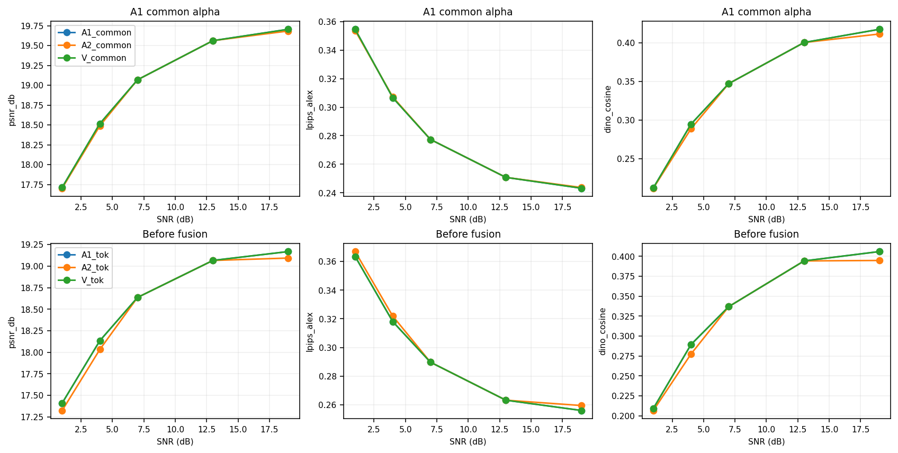

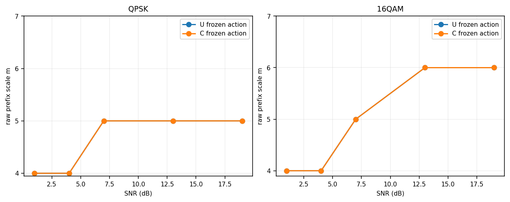

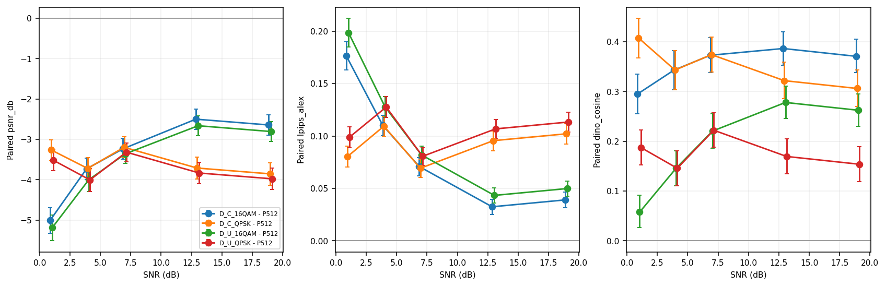

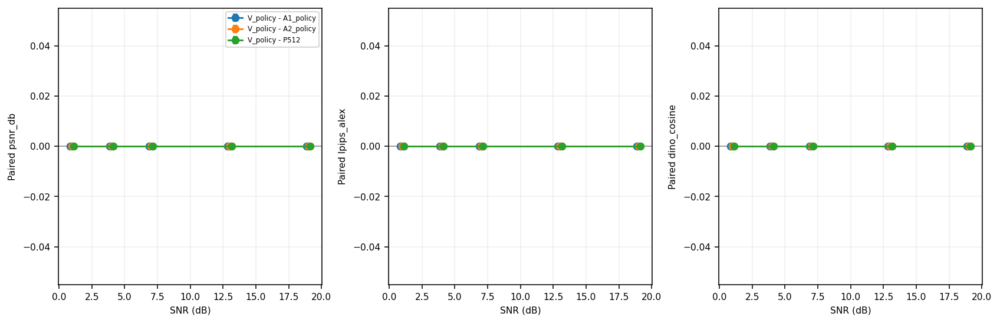

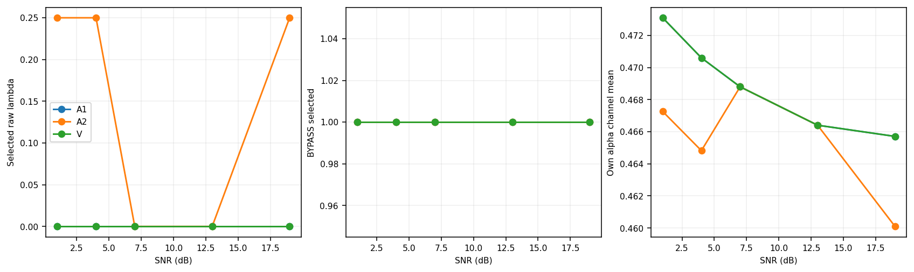

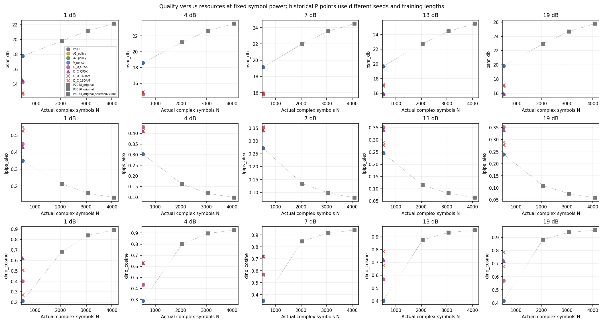

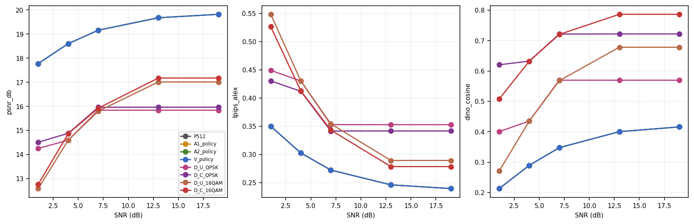

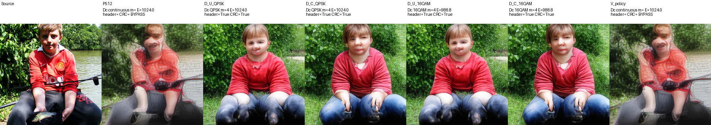

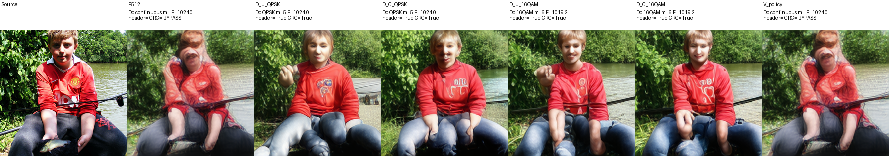

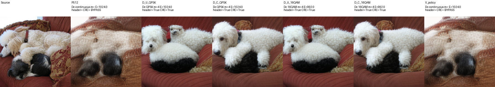

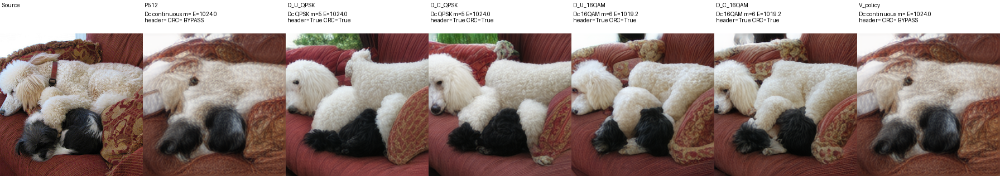

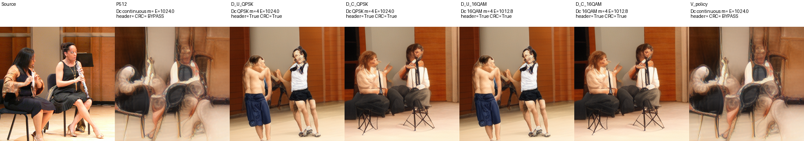

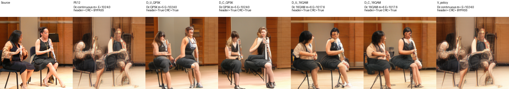

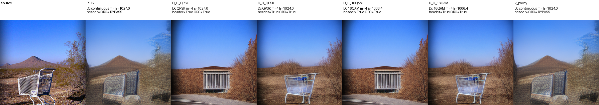

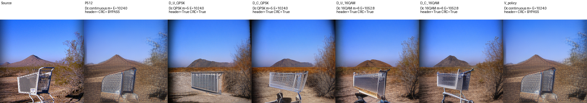
