# N1024 第二阶段及 N512 资源取舍比较

P1024 单个训练 seed=2026093001；完成更新 40000；校准选中更新 40000；checkpoint SHA-256 `12b979260ebf46dc3ec6a453ef7218d734f9b6aed6c3157c3676a833c3bb7df9`。预算截断且末段仍改善，不能称理论收敛。

N512 已完成更新 40000、选中 40000；预算截断且末段仍改善，不能称理论收敛。本轮保留其原始模型、策略和结果，完成用户已授权的 N1024 第二阶段，并在相同100源图/三噪声重复上比较两预算。

1. **同 Dc、无额外类别的数字分工是否胜过 P1024？** 严格逐帧同能量无条件 QPSK 的明显增益点：1 dB D_U_QPSK (DINO_WITH_SPECIFICITY)、4 dB D_U_QPSK (DINO_WITH_SPECIFICITY)、7 dB D_U_QPSK (DINO_WITH_SPECIFICITY)。下面同时给出 PSNR、F 平方和及配对区间。
2. **属于什么资源口径？** 连续与 QPSK 的每帧 E=2048、N=1024；16QAM 保留原星座，其实测帧能量分布另表。全部数字明显信号：1 dB D_U_QPSK (DINO_WITH_SPECIFICITY)、1 dB D_C_QPSK (DINO_WITH_SPECIFICITY)、1 dB D_U_16QAM (DINO_WITH_SPECIFICITY)、1 dB D_C_16QAM (DINO_WITH_SPECIFICITY)、4 dB D_U_QPSK (DINO_WITH_SPECIFICITY)、4 dB D_C_QPSK (DINO_WITH_SPECIFICITY)、4 dB D_U_16QAM (DINO_WITH_SPECIFICITY)、4 dB D_C_16QAM (DINO_WITH_SPECIFICITY)、7 dB D_U_QPSK (DINO_WITH_SPECIFICITY)、7 dB D_C_QPSK (DINO_WITH_SPECIFICITY)、7 dB D_U_16QAM (DINO_WITH_SPECIFICITY)、7 dB D_C_16QAM (DINO_WITH_SPECIFICITY)、13 dB D_C_QPSK (DINO_WITH_SPECIFICITY)、13 dB D_U_16QAM (DINO_WITH_SPECIFICITY)、13 dB D_C_16QAM (DINO_WITH_SPECIFICITY)、19 dB D_C_QPSK (DINO_WITH_SPECIFICITY)、19 dB D_U_16QAM (DINO_WITH_SPECIFICITY)、19 dB D_C_16QAM (DINO_WITH_SPECIFICITY)。类别辅助与 16QAM 点分别限定解释。
3. **插件是否同时超过 P、A1、A2？** 同一个质量分支同时超过三控制的明显点：无。真正 BYPASS 不计为修正成功；共同 A1 alpha 的内容差值单列。
4. **D0、类别、失败与计算改变多少结论？** 同 latent 的 D0−Dc、同动作接收前缀的 C−U、生成−prefix、失败率及 CPU 波形→图像时间均列在下表。类别来自原应用/数据标签，通过付费头接收；该来源本身不等于部署可免费取得正确类别。
5. **从 N512 到 N1024 的取舍如何变化？** 后文给出全部同方法跨预算差值，以及 (D1024−P1024)−(D512−P512) 的源图配对区间。这区分数字系统自身改善和匹配连续基线变强，不把两个预算当作独立测试。完成本轮后停止；未自动启动新预算、生成模型训练或旧队列。

## 同 Dc 主表

所有主输出使用同视觉 Encoder、32×16×16 的 F 及冻结 Dc。先对每张源图三个噪声求均值，再对 100 张源图平均。原坐标 F 平方和除以 8192 才是均方误差。

| SNR | 方法 | PSNR dB | LPIPS alex | DINO | F平方和 | DINO<0.6 | LPIPS>0.35 |
|---:|---|---:|---:|---:|---:|---:|---:|
| 1 | P1024 | 18.5873 | 0.28550 | 0.40362 | 4175.054 (有效300/300) | 0.8567 | 0.0933 |
| 1 | A1_policy | 18.5873 | 0.28550 | 0.40362 | 4175.054 (有效300/300) | 0.8567 | 0.0933 |
| 1 | A2_policy | 18.5873 | 0.28550 | 0.40362 | 4175.054 (有效300/300) | 0.8567 | 0.0933 |
| 1 | V_policy | 18.5873 | 0.28550 | 0.40362 | 4175.054 (有效300/300) | 0.8567 | 0.0933 |
| 1 | D_U_QPSK | 15.7379 | 0.35806 | 0.56222 | 5414.558 (有效300/300) | 0.5500 | 0.5633 |
| 1 | D_C_QPSK | 15.8727 | 0.34638 | 0.71156 | 5371.371 (有效300/300) | 0.2367 | 0.5133 |
| 1 | D_U_16QAM | 14.6771 | 0.41068 | 0.47463 | 5733.948 (有效300/300) | 0.6967 | 0.7500 |
| 1 | D_C_16QAM | 14.7711 | 0.39967 | 0.64967 | 5695.141 (有效300/300) | 0.3100 | 0.7100 |
| 4 | P1024 | 19.5159 | 0.23654 | 0.53289 | 3850.993 (有效300/300) | 0.6100 | 0.0067 |
| 4 | A1_policy | 19.5159 | 0.23654 | 0.53289 | 3850.993 (有效300/300) | 0.6100 | 0.0067 |
| 4 | A2_policy | 19.5159 | 0.23654 | 0.53289 | 3850.993 (有效300/300) | 0.6100 | 0.0067 |
| 4 | V_policy | 19.5159 | 0.23654 | 0.53289 | 3850.993 (有效300/300) | 0.6100 | 0.0067 |
| 4 | D_U_QPSK | 16.9871 | 0.29012 | 0.67699 | 4973.571 (有效300/300) | 0.2800 | 0.1433 |
| 4 | D_C_QPSK | 17.1631 | 0.27894 | 0.78616 | 4932.947 (有效300/300) | 0.0533 | 0.0933 |
| 4 | D_U_16QAM | 16.6219 | 0.30450 | 0.65676 | 5073.834 (有效300/300) | 0.3333 | 0.2433 |
| 4 | D_C_16QAM | 16.7504 | 0.29536 | 0.76406 | 5030.454 (有效300/300) | 0.0833 | 0.2067 |
| 7 | P1024 | 20.1413 | 0.20700 | 0.60952 | 3626.010 (有效300/300) | 0.4167 | 0.0000 |
| 7 | A1_policy | 20.1413 | 0.20700 | 0.60952 | 3626.010 (有效300/300) | 0.4167 | 0.0000 |
| 7 | A2_policy | 20.1413 | 0.20700 | 0.60952 | 3626.010 (有效300/300) | 0.4167 | 0.0000 |
| 7 | V_policy | 20.1413 | 0.20700 | 0.60952 | 3626.010 (有效300/300) | 0.4167 | 0.0000 |
| 7 | D_U_QPSK | 17.0114 | 0.28918 | 0.67819 | 4969.909 (有效300/300) | 0.2800 | 0.1400 |
| 7 | D_C_QPSK | 17.1739 | 0.27830 | 0.78660 | 4930.070 (有效300/300) | 0.0500 | 0.0900 |
| 7 | D_U_16QAM | 18.3599 | 0.23162 | 0.77441 | 4367.522 (有效300/300) | 0.0867 | 0.0167 |
| 7 | D_C_16QAM | 18.4370 | 0.22744 | 0.83180 | 4331.154 (有效300/300) | 0.0067 | 0.0167 |
| 13 | P1024 | 20.7284 | 0.18247 | 0.67317 | 3390.139 (有效300/300) | 0.2600 | 0.0000 |
| 13 | A1_policy | 20.7284 | 0.18247 | 0.67317 | 3390.139 (有效300/300) | 0.2600 | 0.0000 |
| 13 | A2_policy | 20.7284 | 0.18247 | 0.67317 | 3390.139 (有效300/300) | 0.2600 | 0.0000 |
| 13 | V_policy | 20.7284 | 0.18247 | 0.67317 | 3390.139 (有效300/300) | 0.2600 | 0.0000 |
| 13 | D_U_QPSK | 17.0114 | 0.28918 | 0.67819 | 4969.909 (有效300/300) | 0.2800 | 0.1400 |
| 13 | D_C_QPSK | 17.1739 | 0.27830 | 0.78660 | 4930.070 (有效300/300) | 0.0500 | 0.0900 |
| 13 | D_U_16QAM | 18.6661 | 0.22291 | 0.78162 | 4308.213 (有效300/300) | 0.0800 | 0.0000 |
| 13 | D_C_16QAM | 18.7532 | 0.21840 | 0.84147 | 4265.693 (有效300/300) | 0.0000 | 0.0000 |
| 19 | P1024 | 20.9063 | 0.17622 | 0.68962 | 3312.941 (有效300/300) | 0.2167 | 0.0000 |
| 19 | A1_policy | 20.9063 | 0.17622 | 0.68962 | 3312.941 (有效300/300) | 0.2167 | 0.0000 |
| 19 | A2_policy | 20.9063 | 0.17622 | 0.68962 | 3312.941 (有效300/300) | 0.2167 | 0.0000 |
| 19 | V_policy | 20.9063 | 0.17622 | 0.68962 | 3312.941 (有效300/300) | 0.2167 | 0.0000 |
| 19 | D_U_QPSK | 17.0114 | 0.28918 | 0.67819 | 4969.909 (有效300/300) | 0.2800 | 0.1400 |
| 19 | D_C_QPSK | 17.1739 | 0.27830 | 0.78660 | 4930.070 (有效300/300) | 0.0500 | 0.0900 |
| 19 | D_U_16QAM | 18.6661 | 0.22291 | 0.78162 | 4308.213 (有效300/300) | 0.0800 | 0.0000 |
| 19 | D_C_16QAM | 18.7532 | 0.21840 | 0.84147 | 4265.693 (有效300/300) | 0.0000 | 0.0000 |

两个阈值比例仅为所设指标阈值的失效比例，不能直接称业务可靠性。数字头失败沿原规则输出RGB=0.5，没有实际latent；像素/LPIPS/DINO统计和区间仍计入全部失败帧，F平方和单独在有效latent条件下统计。主表标明有效帧数，paired.csv的F差值只使用双方有效帧的交集并标明帧数和源图数。这些条件F误差不能解释为全体失败帧的系统F误差。raw m4/m5/m6/m7 为 360/660/1092/1860 bit；数字 header 为 68 个复符号、正文 956 个，CRC16 与 6 tail bit 均计入。本轮不使用算术码均值。

## H_D：数字分工与匹配训练 P1024

| SNR | 方法 | 标签/条件 | ΔPSNR [95% CI] | ΔLPIPS [95% CI] | ΔDINO [95% CI] | Δspecific [95% CI] | ΔF平方和 [95% CI] |
|---:|---|---|---|---|---|---|---|
| 1 | D_U_QPSK | CLEAR_GAIN (DINO_WITH_SPECIFICITY); unconditional; per_frame_2N | -2.84936 [-3.06430, -2.63683] | 0.07257 [0.06396, 0.08093] | 0.15860 [0.12597, 0.19128] | 0.16786 [0.13267, 0.20304] | 1239.503 [1118.820, 1358.635] (有效300/300) |
| 1 | D_C_QPSK | CLEAR_GAIN (DINO_WITH_SPECIFICITY); paid_received_class; per_frame_2N | -2.71459 [-2.94002, -2.49147] | 0.06088 [0.05204, 0.06969] | 0.30793 [0.27485, 0.34103] | 0.31574 [0.27926, 0.35178] | 1196.317 [1078.472, 1313.316] (有效300/300) |
| 1 | D_U_16QAM | CLEAR_GAIN (DINO_WITH_SPECIFICITY); unconditional; original_constellation_actual_frame_energy | -3.91014 [-4.19713, -3.64394] | 0.12518 [0.11504, 0.13554] | 0.07101 [0.03645, 0.10445] | 0.07704 [0.04093, 0.11260] | 1558.894 [1440.216, 1679.132] (有效300/300) |
| 1 | D_C_16QAM | CLEAR_GAIN (DINO_WITH_SPECIFICITY); paid_received_class; original_constellation_actual_frame_energy | -3.81614 [-4.09250, -3.55976] | 0.11417 [0.10400, 0.12442] | 0.24605 [0.21080, 0.28213] | 0.25568 [0.21826, 0.29314] | 1520.087 [1402.681, 1639.099] (有效300/300) |
| 4 | D_U_QPSK | CLEAR_GAIN (DINO_WITH_SPECIFICITY); unconditional; per_frame_2N | -2.52882 [-2.73246, -2.32473] | 0.05358 [0.04666, 0.06033] | 0.14410 [0.11556, 0.17347] | 0.14724 [0.11775, 0.17711] | 1122.578 [1023.235, 1218.713] (有效300/300) |
| 4 | D_C_QPSK | CLEAR_GAIN (DINO_WITH_SPECIFICITY); paid_received_class; per_frame_2N | -2.35285 [-2.56664, -2.13395] | 0.04240 [0.03542, 0.04912] | 0.25328 [0.22419, 0.28244] | 0.26165 [0.23199, 0.29031] | 1081.955 [981.961, 1178.552] (有效300/300) |
| 4 | D_U_16QAM | CLEAR_GAIN (DINO_WITH_SPECIFICITY); unconditional; original_constellation_actual_frame_energy | -2.89408 [-3.14047, -2.64818] | 0.06796 [0.05996, 0.07579] | 0.12388 [0.09663, 0.15123] | 0.12791 [0.09991, 0.15623] | 1222.842 [1121.221, 1324.106] (有效300/300) |
| 4 | D_C_16QAM | CLEAR_GAIN (DINO_WITH_SPECIFICITY); paid_received_class; original_constellation_actual_frame_energy | -2.76553 [-3.02022, -2.50830] | 0.05882 [0.05077, 0.06662] | 0.23117 [0.20220, 0.26091] | 0.24087 [0.21188, 0.27017] | 1179.461 [1076.778, 1279.956] (有效300/300) |
| 7 | D_U_QPSK | CLEAR_GAIN (DINO_WITH_SPECIFICITY); unconditional; per_frame_2N | -3.12992 [-3.35831, -2.90117] | 0.08217 [0.07459, 0.08962] | 0.06867 [0.03982, 0.09847] | 0.06775 [0.03847, 0.09719] | 1343.899 [1235.243, 1449.915] (有效300/300) |
| 7 | D_C_QPSK | CLEAR_GAIN (DINO_WITH_SPECIFICITY); paid_received_class; per_frame_2N | -2.96735 [-3.19842, -2.73163] | 0.07130 [0.06350, 0.07879] | 0.17708 [0.15004, 0.20546] | 0.18082 [0.15326, 0.20827] | 1304.061 [1194.859, 1410.328] (有效300/300) |
| 7 | D_U_16QAM | CLEAR_GAIN (DINO_WITH_SPECIFICITY); unconditional; original_constellation_actual_frame_energy | -1.78142 [-1.96893, -1.59703] | 0.02462 [0.01916, 0.02998] | 0.16489 [0.13874, 0.19127] | 0.16880 [0.14201, 0.19635] | 741.512 [666.050, 815.209] (有效300/300) |
| 7 | D_C_16QAM | CLEAR_GAIN (DINO_WITH_SPECIFICITY); paid_received_class; original_constellation_actual_frame_energy | -1.70423 [-1.90314, -1.50297] | 0.02043 [0.01503, 0.02587] | 0.22228 [0.19543, 0.24986] | 0.22844 [0.20131, 0.25610] | 705.145 [633.097, 776.511] (有效300/300) |
| 13 | D_U_QPSK | NO_GAIN_ESTABLISHED (无支持分支); unconditional; per_frame_2N | -3.71710 [-3.97494, -3.46250] | 0.10671 [0.09836, 0.11493] | 0.00502 [-0.02460, 0.03478] | 0.00178 [-0.02746, 0.03110] | 1579.770 [1461.282, 1695.511] (有效300/300) |
| 13 | D_C_QPSK | CLEAR_GAIN (DINO_WITH_SPECIFICITY); paid_received_class; per_frame_2N | -3.55453 [-3.81111, -3.29189] | 0.09584 [0.08725, 0.10415] | 0.11343 [0.08735, 0.14131] | 0.11484 [0.08897, 0.14147] | 1539.931 [1421.594, 1655.857] (有效300/300) |
| 13 | D_U_16QAM | CLEAR_GAIN (DINO_WITH_SPECIFICITY); unconditional; original_constellation_actual_frame_energy | -2.06231 [-2.26475, -1.85502] | 0.04044 [0.03460, 0.04615] | 0.10844 [0.08217, 0.13456] | 0.10850 [0.08247, 0.13537] | 918.074 [832.438, 1001.866] (有效300/300) |
| 13 | D_C_16QAM | CLEAR_GAIN (DINO_WITH_SPECIFICITY); paid_received_class; original_constellation_actual_frame_energy | -1.97530 [-2.18300, -1.76291] | 0.03594 [0.03046, 0.04122] | 0.16829 [0.14320, 0.19534] | 0.17417 [0.14938, 0.20024] | 875.554 [794.557, 955.301] (有效300/300) |
| 19 | D_U_QPSK | NO_GAIN_ESTABLISHED (无支持分支); unconditional; per_frame_2N | -3.89491 [-4.15955, -3.63307] | 0.11295 [0.10436, 0.12145] | -0.01142 [-0.04149, 0.01904] | -0.01560 [-0.04507, 0.01408] | 1656.968 [1536.539, 1774.980] (有效300/300) |
| 19 | D_C_QPSK | CLEAR_GAIN (DINO_WITH_SPECIFICITY); paid_received_class; per_frame_2N | -3.73235 [-3.99570, -3.46086] | 0.10208 [0.09319, 0.11069] | 0.09698 [0.07084, 0.12518] | 0.09746 [0.07170, 0.12410] | 1617.130 [1496.370, 1735.634] (有效300/300) |
| 19 | D_U_16QAM | CLEAR_GAIN (DINO_WITH_SPECIFICITY); unconditional; original_constellation_actual_frame_energy | -2.24013 [-2.45041, -2.02628] | 0.04669 [0.04058, 0.05267] | 0.09200 [0.06554, 0.11841] | 0.09112 [0.06495, 0.11751] | 995.272 [907.253, 1081.193] (有效300/300) |
| 19 | D_C_16QAM | CLEAR_GAIN (DINO_WITH_SPECIFICITY); paid_received_class; original_constellation_actual_frame_energy | -2.15311 [-2.36734, -1.93752] | 0.04218 [0.03644, 0.04771] | 0.15185 [0.12649, 0.17907] | 0.15680 [0.13215, 0.18292] | 952.753 [869.394, 1034.828] (有效300/300) |

H_D 是感知/语义取舍，未要求 PSNR 获胜。16QAM 的 signal 仅属于当前实际 N/E 工作点；仅 C 获胜则属于类别辅助系统，不能归因于同 F 信息的逐尺度机制胜利。

## H_R：同观测插件面对三个控制

| SNR | 标签 | 动作 | 同分支明显/支持 | PSNR约束(校准/实测) |
|---:|---|---|---|---|
| 1 | BYPASS_SELECTED | BYPASS | [] / [] | True / True (cap 0.3) |
| 4 | BYPASS_SELECTED | BYPASS | [] / [] | True / True (cap 0.3) |
| 7 | BYPASS_SELECTED | BYPASS | [] / [] | True / True (cap 0.3) |
| 13 | BYPASS_SELECTED | BYPASS | [] / [] | True / True (cap 0.2) |
| 19 | BYPASS_SELECTED | BYPASS | [] / [] | True / True (cap 0.3) |

| SNR | V策略对控制 | ΔPSNR | ΔLPIPS | ΔDINO | Δspecific |
|---:|---|---|---|---|---|
| 1 | P1024 | 0.00000 [0.00000, 0.00000] | 0.00000 [0.00000, 0.00000] | 0.00000 [0.00000, 0.00000] | 0.00000 [0.00000, 0.00000] |
| 1 | A1_policy | 0.00000 [0.00000, 0.00000] | 0.00000 [0.00000, 0.00000] | 0.00000 [0.00000, 0.00000] | 0.00000 [0.00000, 0.00000] |
| 1 | A2_policy | 0.00000 [0.00000, 0.00000] | 0.00000 [0.00000, 0.00000] | 0.00000 [0.00000, 0.00000] | 0.00000 [0.00000, 0.00000] |
| 4 | P1024 | 0.00000 [0.00000, 0.00000] | 0.00000 [0.00000, 0.00000] | 0.00000 [0.00000, 0.00000] | 0.00000 [0.00000, 0.00000] |
| 4 | A1_policy | 0.00000 [0.00000, 0.00000] | 0.00000 [0.00000, 0.00000] | 0.00000 [0.00000, 0.00000] | 0.00000 [0.00000, 0.00000] |
| 4 | A2_policy | 0.00000 [0.00000, 0.00000] | 0.00000 [0.00000, 0.00000] | 0.00000 [0.00000, 0.00000] | 0.00000 [0.00000, 0.00000] |
| 7 | P1024 | 0.00000 [0.00000, 0.00000] | 0.00000 [0.00000, 0.00000] | 0.00000 [0.00000, 0.00000] | 0.00000 [0.00000, 0.00000] |
| 7 | A1_policy | 0.00000 [0.00000, 0.00000] | 0.00000 [0.00000, 0.00000] | 0.00000 [0.00000, 0.00000] | 0.00000 [0.00000, 0.00000] |
| 7 | A2_policy | 0.00000 [0.00000, 0.00000] | 0.00000 [0.00000, 0.00000] | 0.00000 [0.00000, 0.00000] | 0.00000 [0.00000, 0.00000] |
| 13 | P1024 | 0.00000 [0.00000, 0.00000] | 0.00000 [0.00000, 0.00000] | 0.00000 [0.00000, 0.00000] | 0.00000 [0.00000, 0.00000] |
| 13 | A1_policy | 0.00000 [0.00000, 0.00000] | 0.00000 [0.00000, 0.00000] | 0.00000 [0.00000, 0.00000] | 0.00000 [0.00000, 0.00000] |
| 13 | A2_policy | 0.00000 [0.00000, 0.00000] | 0.00000 [0.00000, 0.00000] | 0.00000 [0.00000, 0.00000] | 0.00000 [0.00000, 0.00000] |
| 19 | P1024 | 0.00000 [0.00000, 0.00000] | 0.00000 [0.00000, 0.00000] | 0.00000 [0.00000, 0.00000] | 0.00000 [0.00000, 0.00000] |
| 19 | A1_policy | 0.00000 [0.00000, 0.00000] | 0.00000 [0.00000, 0.00000] | 0.00000 [0.00000, 0.00000] | 0.00000 [0.00000, 0.00000] |
| 19 | A2_policy | 0.00000 [0.00000, 0.00000] | 0.00000 [0.00000, 0.00000] | 0.00000 [0.00000, 0.00000] | 0.00000 [0.00000, 0.00000] |

明显增益须同一 LPIPS 分支或同一 DINO+specific 分支超过 P1024/A1/A2 全部控制，不能将不同控制的不同指标拼成成功。calibration 选参 PSNR cap 在 13 dB 为 0.2、其余为 0.3 dB；development 实测 ΔPSNR 与约束符合情况只报告代价，不作为第二次筛选门槛。λ=0 仍是量化修正，BYPASS 原样返回 P1024。

## 共同权重、类别与 Decoder 归因

| SNR | 比较/作用 | ΔPSNR | ΔLPIPS | ΔDINO | ΔF平方和 |
|---:|---|---|---|---|---|
| 1 | V_common−A1_common (common_content) | 0.00000 [0.00000, 0.00000] | 0.00000 [0.00000, 0.00000] | 0.00000 [0.00000, 0.00000] | 0.000 [0.000, 0.000] (有效300/300) |
| 1 | V_common−A2_common (common_content) | 0.00000 [0.00000, 0.00000] | 0.00000 [0.00000, 0.00000] | 0.00000 [0.00000, 0.00000] | 0.000 [0.000, 0.000] (有效300/300) |
| 1 | D_C_QPSK_at_U_action−D_U_QPSK (same_action_class_effect) | 0.13477 [0.01340, 0.26882] | -0.01168 [-0.01609, -0.00735] | 0.14933 [0.12207, 0.17779] | -43.186 [-67.033, -20.203] (有效300/300) |
| 1 | D_C_QPSK−D_U_QPSK_at_C_action (same_action_class_effect) | 0.13477 [0.01340, 0.26882] | -0.01168 [-0.01609, -0.00735] | 0.14933 [0.12207, 0.17779] | -43.186 [-67.033, -20.203] (有效300/300) |
| 1 | D_U_QPSK−D_prefix_U_QPSK (same_observation_generation_effect) | 0.19491 [-0.07648, 0.46934] | -0.28244 [-0.29910, -0.26582] | 0.51833 [0.48204, 0.55427] | 1196.374 [1132.385, 1259.877] (有效300/300) |
| 1 | D_U_QPSK_D0−D_U_QPSK (same_latent_decoder_effect) | -0.48889 [-0.52893, -0.44886] | 0.01693 [0.01506, 0.01878] | -0.00055 [-0.00706, 0.00596] | 0.000 [0.000, 0.000] (有效300/300) |
| 1 | D_C_QPSK−D_prefix_C_QPSK (same_observation_generation_effect) | 0.32968 [0.04578, 0.61949] | -0.29413 [-0.31048, -0.27857] | 0.66767 [0.63478, 0.69932] | 1153.188 [1089.587, 1216.142] (有效300/300) |
| 1 | D_C_QPSK_D0−D_C_QPSK (same_latent_decoder_effect) | -0.48574 [-0.52659, -0.44493] | 0.01701 [0.01519, 0.01879] | 0.00288 [-0.00311, 0.00887] | 0.000 [0.000, 0.000] (有效300/300) |
| 1 | D_C_16QAM_at_U_action−D_U_16QAM (same_action_class_effect) | 0.09401 [0.03448, 0.15914] | -0.01101 [-0.01432, -0.00778] | 0.17504 [0.14715, 0.20414] | -38.808 [-59.381, -19.341] (有效300/300) |
| 1 | D_C_16QAM−D_U_16QAM_at_C_action (same_action_class_effect) | 0.09401 [0.03448, 0.15914] | -0.01101 [-0.01432, -0.00778] | 0.17504 [0.14715, 0.20414] | -38.808 [-59.381, -19.341] (有效300/300) |
| 1 | D_U_16QAM−D_prefix_U_16QAM (same_observation_generation_effect) | -0.27557 [-0.48088, -0.06304] | -0.25314 [-0.26891, -0.23737] | 0.44152 [0.40557, 0.47684] | 1389.400 [1329.658, 1450.002] (有效300/300) |
| 1 | D_U_16QAM_D0−D_U_16QAM (same_latent_decoder_effect) | -0.45115 [-0.48392, -0.41764] | 0.01711 [0.01544, 0.01875] | -0.00137 [-0.00597, 0.00323] | 0.000 [0.000, 0.000] (有效300/300) |
| 1 | D_C_16QAM−D_prefix_C_16QAM (same_observation_generation_effect) | -0.18157 [-0.38352, 0.02842] | -0.26415 [-0.27989, -0.24855] | 0.61656 [0.58309, 0.64978] | 1350.592 [1290.259, 1411.285] (有效300/300) |
| 1 | D_C_16QAM_D0−D_C_16QAM (same_latent_decoder_effect) | -0.45367 [-0.48761, -0.41938] | 0.01677 [0.01518, 0.01835] | 0.00204 [-0.00294, 0.00696] | 0.000 [0.000, 0.000] (有效300/300) |
| 4 | V_common−A1_common (common_content) | 0.00000 [0.00000, 0.00000] | 0.00000 [0.00000, 0.00000] | 0.00000 [0.00000, 0.00000] | 0.000 [0.000, 0.000] (有效300/300) |
| 4 | V_common−A2_common (common_content) | 0.00000 [0.00000, 0.00000] | 0.00000 [0.00000, 0.00000] | 0.00000 [0.00000, 0.00000] | 0.000 [0.000, 0.000] (有效300/300) |
| 4 | D_C_QPSK_at_U_action−D_U_QPSK (same_action_class_effect) | 0.17597 [0.10060, 0.25569] | -0.01118 [-0.01424, -0.00815] | 0.10917 [0.08989, 0.12916] | -40.623 [-60.813, -20.925] (有效300/300) |
| 4 | D_C_QPSK−D_U_QPSK_at_C_action (same_action_class_effect) | 0.17597 [0.10060, 0.25569] | -0.01118 [-0.01424, -0.00815] | 0.10917 [0.08989, 0.12916] | -40.623 [-60.813, -20.925] (有效300/300) |
| 4 | D_U_QPSK−D_prefix_U_QPSK (same_observation_generation_effect) | 0.71344 [0.47542, 0.97368] | -0.27062 [-0.28578, -0.25581] | 0.58839 [0.55797, 0.61877] | 916.064 [870.357, 960.205] (有效300/300) |
| 4 | D_U_QPSK_D0−D_U_QPSK (same_latent_decoder_effect) | -0.58263 [-0.62332, -0.54176] | 0.01759 [0.01572, 0.01952] | 0.00524 [-0.00240, 0.01356] | 0.000 [0.000, 0.000] (有效300/300) |
| 4 | D_C_QPSK−D_prefix_C_QPSK (same_observation_generation_effect) | 0.88940 [0.63142, 1.17518] | -0.28180 [-0.29684, -0.26691] | 0.69756 [0.67054, 0.72418] | 875.441 [829.691, 919.359] (有效300/300) |
| 4 | D_C_QPSK_D0−D_C_QPSK (same_latent_decoder_effect) | -0.57801 [-0.61998, -0.53535] | 0.01741 [0.01548, 0.01939] | 0.00498 [0.00020, 0.00980] | 0.000 [0.000, 0.000] (有效300/300) |
| 4 | D_C_16QAM_at_U_action−D_U_16QAM (same_action_class_effect) | 0.12855 [0.07339, 0.18927] | -0.00914 [-0.01166, -0.00669] | 0.10730 [0.08848, 0.12747] | -43.380 [-59.997, -26.795] (有效300/300) |
| 4 | D_C_16QAM−D_U_16QAM_at_C_action (same_action_class_effect) | 0.12855 [0.07339, 0.18927] | -0.00914 [-0.01166, -0.00669] | 0.10730 [0.08848, 0.12747] | -43.380 [-59.997, -26.795] (有效300/300) |
| 4 | D_U_16QAM−D_prefix_U_16QAM (same_observation_generation_effect) | 0.56268 [0.32022, 0.82483] | -0.26536 [-0.28091, -0.25000] | 0.57443 [0.54516, 0.60302] | 976.149 [928.503, 1022.783] (有效300/300) |
| 4 | D_U_16QAM_D0−D_U_16QAM (same_latent_decoder_effect) | -0.57073 [-0.61084, -0.53018] | 0.01734 [0.01557, 0.01913] | 0.00422 [-0.00223, 0.01051] | 0.000 [0.000, 0.000] (有效300/300) |
| 4 | D_C_16QAM−D_prefix_C_16QAM (same_observation_generation_effect) | 0.69122 [0.43634, 0.97373] | -0.27450 [-0.28952, -0.25964] | 0.68173 [0.65530, 0.70794] | 932.769 [885.828, 978.181] (有效300/300) |
| 4 | D_C_16QAM_D0−D_C_16QAM (same_latent_decoder_effect) | -0.56026 [-0.60212, -0.51738] | 0.01702 [0.01528, 0.01880] | 0.00624 [0.00232, 0.01012] | 0.000 [0.000, 0.000] (有效300/300) |
| 7 | V_common−A1_common (common_content) | 0.00000 [0.00000, 0.00000] | 0.00000 [0.00000, 0.00000] | 0.00000 [0.00000, 0.00000] | 0.000 [0.000, 0.000] (有效300/300) |
| 7 | V_common−A2_common (common_content) | 0.00000 [0.00000, 0.00000] | 0.00000 [0.00000, 0.00000] | 0.00000 [0.00000, 0.00000] | 0.000 [0.000, 0.000] (有效300/300) |
| 7 | D_C_QPSK_at_U_action−D_U_QPSK (same_action_class_effect) | 0.16256 [0.08342, 0.24504] | -0.01087 [-0.01403, -0.00773] | 0.10841 [0.08903, 0.12855] | -39.839 [-59.912, -20.211] (有效300/300) |
| 7 | D_C_QPSK−D_U_QPSK_at_C_action (same_action_class_effect) | 0.16256 [0.08342, 0.24504] | -0.01087 [-0.01403, -0.00773] | 0.10841 [0.08903, 0.12855] | -39.839 [-59.912, -20.211] (有效300/300) |
| 7 | D_U_QPSK−D_prefix_U_QPSK (same_observation_generation_effect) | 0.72222 [0.48185, 0.98399] | -0.27097 [-0.28610, -0.25618] | 0.58857 [0.55801, 0.61902] | 913.906 [868.089, 958.201] (有效300/300) |
| 7 | D_U_QPSK_D0−D_U_QPSK (same_latent_decoder_effect) | -0.58506 [-0.62565, -0.54394] | 0.01766 [0.01578, 0.01961] | 0.00554 [-0.00198, 0.01389] | 0.000 [0.000, 0.000] (有效300/300) |
| 7 | D_C_QPSK−D_prefix_C_QPSK (same_observation_generation_effect) | 0.88479 [0.62658, 1.17086] | -0.28184 [-0.29683, -0.26698] | 0.69698 [0.66976, 0.72364] | 874.067 [828.516, 917.927] (有效300/300) |
| 7 | D_C_QPSK_D0−D_C_QPSK (same_latent_decoder_effect) | -0.57992 [-0.62160, -0.53761] | 0.01728 [0.01534, 0.01928] | 0.00509 [0.00019, 0.00993] | 0.000 [0.000, 0.000] (有效300/300) |
| 7 | D_C_16QAM_at_U_action−D_U_16QAM (same_action_class_effect) | 0.07719 [0.01433, 0.14844] | -0.00418 [-0.00590, -0.00250] | 0.05740 [0.04312, 0.07287] | -36.367 [-50.537, -22.910] (有效300/300) |
| 7 | D_C_16QAM−D_U_16QAM_at_C_action (same_action_class_effect) | 0.07719 [0.01433, 0.14844] | -0.00418 [-0.00590, -0.00250] | 0.05740 [0.04312, 0.07287] | -36.367 [-50.537, -22.910] (有效300/300) |
| 7 | D_U_16QAM−D_prefix_U_16QAM (same_observation_generation_effect) | 1.12332 [0.92801, 1.33993] | -0.20164 [-0.21281, -0.19054] | 0.54156 [0.50832, 0.57454] | 519.087 [485.047, 551.256] (有效300/300) |
| 7 | D_U_16QAM_D0−D_U_16QAM (same_latent_decoder_effect) | -0.62536 [-0.66442, -0.58613] | 0.01508 [0.01356, 0.01657] | 0.01357 [0.00739, 0.01981] | 0.000 [0.000, 0.000] (有效300/300) |
| 7 | D_C_16QAM−D_prefix_C_16QAM (same_observation_generation_effect) | 1.20051 [0.98250, 1.44744] | -0.20582 [-0.21707, -0.19453] | 0.59896 [0.56517, 0.63235] | 482.720 [449.861, 514.458] (有效300/300) |
| 7 | D_C_16QAM_D0−D_C_16QAM (same_latent_decoder_effect) | -0.62521 [-0.66468, -0.58584] | 0.01472 [0.01312, 0.01633] | 0.00919 [0.00533, 0.01309] | 0.000 [0.000, 0.000] (有效300/300) |
| 13 | V_common−A1_common (common_content) | 0.00000 [0.00000, 0.00000] | 0.00000 [0.00000, 0.00000] | 0.00000 [0.00000, 0.00000] | 0.000 [0.000, 0.000] (有效300/300) |
| 13 | V_common−A2_common (common_content) | 0.02773 [0.00497, 0.05196] | -0.00035 [-0.00110, 0.00042] | -0.00179 [-0.00854, 0.00498] | -15.407 [-17.992, -12.696] (有效300/300) |
| 13 | D_C_QPSK_at_U_action−D_U_QPSK (same_action_class_effect) | 0.16256 [0.08342, 0.24504] | -0.01087 [-0.01403, -0.00773] | 0.10841 [0.08903, 0.12855] | -39.839 [-59.912, -20.211] (有效300/300) |
| 13 | D_C_QPSK−D_U_QPSK_at_C_action (same_action_class_effect) | 0.16256 [0.08342, 0.24504] | -0.01087 [-0.01403, -0.00773] | 0.10841 [0.08903, 0.12855] | -39.839 [-59.912, -20.211] (有效300/300) |
| 13 | D_U_QPSK−D_prefix_U_QPSK (same_observation_generation_effect) | 0.72222 [0.48185, 0.98399] | -0.27097 [-0.28610, -0.25618] | 0.58857 [0.55801, 0.61902] | 913.906 [868.089, 958.201] (有效300/300) |
| 13 | D_U_QPSK_D0−D_U_QPSK (same_latent_decoder_effect) | -0.58506 [-0.62565, -0.54394] | 0.01766 [0.01578, 0.01961] | 0.00554 [-0.00198, 0.01389] | 0.000 [0.000, 0.000] (有效300/300) |
| 13 | D_C_QPSK−D_prefix_C_QPSK (same_observation_generation_effect) | 0.88479 [0.62658, 1.17086] | -0.28184 [-0.29683, -0.26698] | 0.69698 [0.66976, 0.72364] | 874.067 [828.516, 917.927] (有效300/300) |
| 13 | D_C_QPSK_D0−D_C_QPSK (same_latent_decoder_effect) | -0.57992 [-0.62160, -0.53761] | 0.01728 [0.01534, 0.01928] | 0.00509 [0.00019, 0.00993] | 0.000 [0.000, 0.000] (有效300/300) |
| 13 | D_C_16QAM_at_U_action−D_U_16QAM (same_action_class_effect) | 0.08702 [0.01759, 0.15459] | -0.00451 [-0.00662, -0.00240] | 0.05985 [0.04287, 0.07780] | -42.519 [-62.164, -23.826] (有效300/300) |
| 13 | D_C_16QAM−D_U_16QAM_at_C_action (same_action_class_effect) | 0.08702 [0.01759, 0.15459] | -0.00451 [-0.00662, -0.00240] | 0.05985 [0.04287, 0.07780] | -42.519 [-62.164, -23.826] (有效300/300) |
| 13 | D_U_16QAM−D_prefix_U_16QAM (same_observation_generation_effect) | 1.19511 [0.97373, 1.43996] | -0.20192 [-0.21321, -0.19056] | 0.53746 [0.50205, 0.57280] | 490.645 [455.162, 524.297] (有效300/300) |
| 13 | D_U_16QAM_D0−D_U_16QAM (same_latent_decoder_effect) | -0.64276 [-0.68334, -0.60209] | 0.01577 [0.01410, 0.01743] | 0.01475 [0.00691, 0.02253] | 0.000 [0.000, 0.000] (有效300/300) |
| 13 | D_C_16QAM−D_prefix_C_16QAM (same_observation_generation_effect) | 1.28213 [1.04501, 1.54855] | -0.20642 [-0.21777, -0.19495] | 0.59731 [0.56148, 0.63344] | 448.126 [412.491, 483.319] (有效300/300) |
| 13 | D_C_16QAM_D0−D_C_16QAM (same_latent_decoder_effect) | -0.65145 [-0.69385, -0.60897] | 0.01540 [0.01368, 0.01719] | 0.00843 [0.00373, 0.01334] | 0.000 [0.000, 0.000] (有效300/300) |
| 19 | V_common−A1_common (common_content) | 0.00000 [0.00000, 0.00000] | 0.00000 [0.00000, 0.00000] | 0.00000 [0.00000, 0.00000] | 0.000 [0.000, 0.000] (有效300/300) |
| 19 | V_common−A2_common (common_content) | 0.02026 [0.00426, 0.03652] | -0.00027 [-0.00100, 0.00045] | 0.00432 [-0.00157, 0.01035] | -13.718 [-16.388, -11.034] (有效300/300) |
| 19 | D_C_QPSK_at_U_action−D_U_QPSK (same_action_class_effect) | 0.16256 [0.08342, 0.24504] | -0.01087 [-0.01403, -0.00773] | 0.10841 [0.08903, 0.12855] | -39.839 [-59.912, -20.211] (有效300/300) |
| 19 | D_C_QPSK−D_U_QPSK_at_C_action (same_action_class_effect) | 0.16256 [0.08342, 0.24504] | -0.01087 [-0.01403, -0.00773] | 0.10841 [0.08903, 0.12855] | -39.839 [-59.912, -20.211] (有效300/300) |
| 19 | D_U_QPSK−D_prefix_U_QPSK (same_observation_generation_effect) | 0.72222 [0.48185, 0.98399] | -0.27097 [-0.28610, -0.25618] | 0.58857 [0.55801, 0.61902] | 913.906 [868.089, 958.201] (有效300/300) |
| 19 | D_U_QPSK_D0−D_U_QPSK (same_latent_decoder_effect) | -0.58506 [-0.62565, -0.54394] | 0.01766 [0.01578, 0.01961] | 0.00554 [-0.00198, 0.01389] | 0.000 [0.000, 0.000] (有效300/300) |
| 19 | D_C_QPSK−D_prefix_C_QPSK (same_observation_generation_effect) | 0.88479 [0.62658, 1.17086] | -0.28184 [-0.29683, -0.26698] | 0.69698 [0.66976, 0.72364] | 874.067 [828.516, 917.927] (有效300/300) |
| 19 | D_C_QPSK_D0−D_C_QPSK (same_latent_decoder_effect) | -0.57992 [-0.62160, -0.53761] | 0.01728 [0.01534, 0.01928] | 0.00509 [0.00019, 0.00993] | 0.000 [0.000, 0.000] (有效300/300) |
| 19 | D_C_16QAM_at_U_action−D_U_16QAM (same_action_class_effect) | 0.08702 [0.01759, 0.15459] | -0.00451 [-0.00662, -0.00240] | 0.05985 [0.04287, 0.07780] | -42.519 [-62.164, -23.826] (有效300/300) |
| 19 | D_C_16QAM−D_U_16QAM_at_C_action (same_action_class_effect) | 0.08702 [0.01759, 0.15459] | -0.00451 [-0.00662, -0.00240] | 0.05985 [0.04287, 0.07780] | -42.519 [-62.164, -23.826] (有效300/300) |
| 19 | D_U_16QAM−D_prefix_U_16QAM (same_observation_generation_effect) | 1.19511 [0.97373, 1.43996] | -0.20192 [-0.21321, -0.19056] | 0.53746 [0.50205, 0.57280] | 490.645 [455.162, 524.297] (有效300/300) |
| 19 | D_U_16QAM_D0−D_U_16QAM (same_latent_decoder_effect) | -0.64276 [-0.68334, -0.60209] | 0.01577 [0.01410, 0.01743] | 0.01475 [0.00691, 0.02253] | 0.000 [0.000, 0.000] (有效300/300) |
| 19 | D_C_16QAM−D_prefix_C_16QAM (same_observation_generation_effect) | 1.28213 [1.04501, 1.54855] | -0.20642 [-0.21777, -0.19495] | 0.59731 [0.56148, 0.63344] | 448.126 [412.491, 483.319] (有效300/300) |
| 19 | D_C_16QAM_D0−D_C_16QAM (same_latent_decoder_effect) | -0.65145 [-0.69385, -0.60897] | 0.01540 [0.01368, 0.01719] | 0.00843 [0.00373, 0.01334] | 0.000 [0.000, 0.000] (有效300/300) |

共同权重固定使用 A1 calibration alpha，不重选 λ；未旁路候选仅是诊断。C/U 独立动作主表包含动作变化，类别归因采用同动作、同波形/接收前缀的比较。D0 只重渲染已选 Dc 动作的同一 latent，不重选动作或合并两 Decoder 最好值。数字 CRC 失败图均保留，并沿既有 raw hard-candidate 前缀规则处理；生成−prefix 只说明局部作用。

## 13 dB 的实际取舍

| 输出相对 P1024 | ΔPSNR | ΔLPIPS | ΔDINO | ΔF平方和 |
|---|---|---|---|---|
| D_U_QPSK | -3.71710 [-3.97494, -3.46250] | 0.10671 [0.09836, 0.11493] | 0.00502 [-0.02460, 0.03478] | 1579.770 [1461.282, 1695.511] (有效300/300) |
| D_C_QPSK | -3.55453 [-3.81111, -3.29189] | 0.09584 [0.08725, 0.10415] | 0.11343 [0.08735, 0.14131] | 1539.931 [1421.594, 1655.857] (有效300/300) |
| D_U_16QAM | -2.06231 [-2.26475, -1.85502] | 0.04044 [0.03460, 0.04615] | 0.10844 [0.08217, 0.13456] | 918.074 [832.438, 1001.866] (有效300/300) |
| D_C_16QAM | -1.97530 [-2.18300, -1.76291] | 0.03594 [0.03046, 0.04122] | 0.16829 [0.14320, 0.19534] | 875.554 [794.557, 955.301] (有效300/300) |
| V_policy | 0.00000 [0.00000, 0.00000] | 0.00000 [0.00000, 0.00000] | 0.00000 [0.00000, 0.00000] | 0.000 [0.000, 0.000] (有效300/300) |
| V_raw_fused | -0.18146 [-0.21015, -0.15361] | 0.00977 [0.00877, 0.01083] | -0.02226 [-0.02850, -0.01628] | 122.582 [113.888, 131.565] (有效300/300) |
| V_common | -0.18146 [-0.21015, -0.15361] | 0.00977 [0.00877, 0.01083] | -0.02226 [-0.02850, -0.01628] | 122.582 [113.888, 131.565] (有效300/300) |
| V_tok | -1.05361 [-1.13093, -0.98117] | 0.03624 [0.03381, 0.03871] | -0.09094 [-0.10357, -0.07856] | 711.618 [686.163, 737.976] (有效300/300) |
| V_lambda1 | -1.20458 [-1.35744, -1.06263] | 0.05446 [0.04923, 0.05980] | -0.06694 [-0.08333, -0.05024] | 76.397 [56.179, 96.041] (有效300/300) |

本轮 13 dB 位于训练集合内。未旁路候选不因 development 的某一指标更好而升级为部署策略。

## 16QAM 与 QPSK 的完整系统取舍

方向为同类别条件的16QAM−QPSK。两PHY家族各自校准m，实际星座帧能量约束不同；下表比较完整系统工作点，不能解释为隔离调制效果或严格同帧能量实验。

| SNR | 类别条件 | ΔPSNR [95% CI] | ΔLPIPS [95% CI] | ΔDINO [95% CI] | Δspecific [95% CI] | ΔF平方和 [95% CI] | Δ实际E [95% CI] |
|---:|---|---|---|---|---|---|---|
| 1 | U | -1.06078 [-1.28825, -0.85034] | 0.05261 [0.04379, 0.06170] | -0.08759 [-0.10763, -0.06760] | -0.09083 [-0.11252, -0.07008] | 319.391 [275.919, 365.759] (有效300/300) | 6.000 [-3.312, 15.296] |
| 1 | C | -1.10154 [-1.34795, -0.87496] | 0.05329 [0.04468, 0.06220] | -0.06189 [-0.07866, -0.04626] | -0.06006 [-0.07731, -0.04375] | 323.769 [278.823, 371.361] (有效300/300) | 6.000 [-3.312, 15.296] |
| 4 | U | -0.36526 [-0.48365, -0.26017] | 0.01438 [0.01058, 0.01834] | -0.02023 [-0.03091, -0.01021] | -0.01934 [-0.03103, -0.00810] | 100.264 [79.978, 122.322] (有效300/300) | 4.304 [-2.848, 11.552] |
| 4 | C | -0.41268 [-0.52316, -0.31233] | 0.01642 [0.01264, 0.02058] | -0.02210 [-0.03063, -0.01421] | -0.02078 [-0.03017, -0.01177] | 97.507 [77.864, 118.466] (有效300/300) | 4.304 [-2.848, 11.552] |
| 7 | U | 1.34850 [1.19244, 1.50720] | -0.05756 [-0.06318, -0.05191] | 0.09621 [0.07870, 0.11350] | 0.10104 [0.08252, 0.11997] | -602.387 [-651.643, -553.590] (有效300/300) | 6.048 [-1.344, 13.664] |
| 7 | C | 1.26312 [1.10537, 1.41757] | -0.05087 [-0.05590, -0.04563] | 0.04520 [0.03441, 0.05630] | 0.04762 [0.03447, 0.06097] | -598.916 [-649.319, -549.514] (有效300/300) | 6.048 [-1.344, 13.664] |
| 13 | U | 1.65479 [1.50052, 1.81908] | -0.06626 [-0.07173, -0.06098] | 0.10342 [0.08532, 0.12155] | 0.10672 [0.08746, 0.12594] | -661.696 [-708.894, -614.157] (有效300/300) | 6.048 [-1.344, 13.664] |
| 13 | C | 1.57924 [1.42816, 1.73706] | -0.05990 [-0.06478, -0.05508] | 0.05487 [0.04379, 0.06617] | 0.05933 [0.04632, 0.07242] | -664.377 [-715.591, -614.626] (有效300/300) | 6.048 [-1.344, 13.664] |
| 19 | U | 1.65479 [1.50052, 1.81908] | -0.06626 [-0.07173, -0.06098] | 0.10342 [0.08532, 0.12155] | 0.10672 [0.08746, 0.12594] | -661.696 [-708.894, -614.157] (有效300/300) | 6.048 [-1.344, 13.664] |
| 19 | C | 1.57924 [1.42816, 1.73706] | -0.05990 [-0.06478, -0.05508] | 0.05487 [0.04379, 0.06617] | 0.05933 [0.04632, 0.07242] | -664.377 [-715.591, -614.626] (有效300/300) | 6.048 [-1.344, 13.664] |

## 能量和失败

| SNR | 方法 | 约束 | E均值 | 最小/P05/P95/最大 | 头失败 | CRC失败 |
|---:|---|---|---:|---|---:|---:|
| 1 | A1_policy | per_frame_2N | 2048.000 | 2048.000/2048.000/2048.000/2048.000 | 0.0000 | 0.0000 |
| 1 | A2_policy | per_frame_2N | 2048.000 | 2048.000/2048.000/2048.000/2048.000 | 0.0000 | 0.0000 |
| 1 | D_C_16QAM | fixed_constellation_average_2_per_symbol | 2054.000 | 1945.600/1993.360/2125.200/2198.400 | 0.0000 | 0.9300 |
| 1 | D_C_QPSK | per_frame_2N | 2048.000 | 2048.000/2048.000/2048.000/2048.000 | 0.0000 | 0.2400 |
| 1 | D_U_16QAM | fixed_constellation_average_2_per_symbol | 2054.000 | 1945.600/1993.360/2125.200/2198.400 | 0.0000 | 0.9300 |
| 1 | D_U_QPSK | per_frame_2N | 2048.000 | 2048.000/2048.000/2048.000/2048.000 | 0.0000 | 0.2400 |
| 1 | P1024 | per_frame_2N | 2048.000 | 2048.000/2048.000/2048.000/2048.000 | 0.0000 | 0.0000 |
| 1 | V_policy | per_frame_2N | 2048.000 | 2048.000/2048.000/2048.000/2048.000 | 0.0000 | 0.0000 |
| 4 | A1_policy | per_frame_2N | 2048.000 | 2048.000/2048.000/2048.000/2048.000 | 0.0000 | 0.0000 |
| 4 | A2_policy | per_frame_2N | 2048.000 | 2048.000/2048.000/2048.000/2048.000 | 0.0000 | 0.0000 |
| 4 | D_C_16QAM | fixed_constellation_average_2_per_symbol | 2052.304 | 1980.800/1992.000/2118.400/2137.600 | 0.0000 | 0.6800 |
| 4 | D_C_QPSK | per_frame_2N | 2048.000 | 2048.000/2048.000/2048.000/2048.000 | 0.0000 | 0.0600 |
| 4 | D_U_16QAM | fixed_constellation_average_2_per_symbol | 2052.304 | 1980.800/1992.000/2118.400/2137.600 | 0.0000 | 0.6800 |
| 4 | D_U_QPSK | per_frame_2N | 2048.000 | 2048.000/2048.000/2048.000/2048.000 | 0.0000 | 0.0600 |
| 4 | P1024 | per_frame_2N | 2048.000 | 2048.000/2048.000/2048.000/2048.000 | 0.0000 | 0.0000 |
| 4 | V_policy | per_frame_2N | 2048.000 | 2048.000/2048.000/2048.000/2048.000 | 0.0000 | 0.0000 |
| 7 | A1_policy | per_frame_2N | 2048.000 | 2048.000/2048.000/2048.000/2048.000 | 0.0000 | 0.0000 |
| 7 | A2_policy | per_frame_2N | 2048.000 | 2048.000/2048.000/2048.000/2048.000 | 0.0000 | 0.0000 |
| 7 | D_C_16QAM | fixed_constellation_average_2_per_symbol | 2054.048 | 1979.200/1993.600/2121.680/2155.200 | 0.0000 | 0.6767 |
| 7 | D_C_QPSK | per_frame_2N | 2048.000 | 2048.000/2048.000/2048.000/2048.000 | 0.0000 | 0.0000 |
| 7 | D_U_16QAM | fixed_constellation_average_2_per_symbol | 2054.048 | 1979.200/1993.600/2121.680/2155.200 | 0.0000 | 0.6767 |
| 7 | D_U_QPSK | per_frame_2N | 2048.000 | 2048.000/2048.000/2048.000/2048.000 | 0.0000 | 0.0000 |
| 7 | P1024 | per_frame_2N | 2048.000 | 2048.000/2048.000/2048.000/2048.000 | 0.0000 | 0.0000 |
| 7 | V_policy | per_frame_2N | 2048.000 | 2048.000/2048.000/2048.000/2048.000 | 0.0000 | 0.0000 |
| 13 | A1_policy | per_frame_2N | 2048.000 | 2048.000/2048.000/2048.000/2048.000 | 0.0000 | 0.0000 |
| 13 | A2_policy | per_frame_2N | 2048.000 | 2048.000/2048.000/2048.000/2048.000 | 0.0000 | 0.0000 |
| 13 | D_C_16QAM | fixed_constellation_average_2_per_symbol | 2054.048 | 1979.200/1993.600/2121.680/2155.200 | 0.0000 | 0.0000 |
| 13 | D_C_QPSK | per_frame_2N | 2048.000 | 2048.000/2048.000/2048.000/2048.000 | 0.0000 | 0.0000 |
| 13 | D_U_16QAM | fixed_constellation_average_2_per_symbol | 2054.048 | 1979.200/1993.600/2121.680/2155.200 | 0.0000 | 0.0000 |
| 13 | D_U_QPSK | per_frame_2N | 2048.000 | 2048.000/2048.000/2048.000/2048.000 | 0.0000 | 0.0000 |
| 13 | P1024 | per_frame_2N | 2048.000 | 2048.000/2048.000/2048.000/2048.000 | 0.0000 | 0.0000 |
| 13 | V_policy | per_frame_2N | 2048.000 | 2048.000/2048.000/2048.000/2048.000 | 0.0000 | 0.0000 |
| 19 | A1_policy | per_frame_2N | 2048.000 | 2048.000/2048.000/2048.000/2048.000 | 0.0000 | 0.0000 |
| 19 | A2_policy | per_frame_2N | 2048.000 | 2048.000/2048.000/2048.000/2048.000 | 0.0000 | 0.0000 |
| 19 | D_C_16QAM | fixed_constellation_average_2_per_symbol | 2054.048 | 1979.200/1993.600/2121.680/2155.200 | 0.0000 | 0.0000 |
| 19 | D_C_QPSK | per_frame_2N | 2048.000 | 2048.000/2048.000/2048.000/2048.000 | 0.0000 | 0.0000 |
| 19 | D_U_16QAM | fixed_constellation_average_2_per_symbol | 2054.048 | 1979.200/1993.600/2121.680/2155.200 | 0.0000 | 0.0000 |
| 19 | D_U_QPSK | per_frame_2N | 2048.000 | 2048.000/2048.000/2048.000/2048.000 | 0.0000 | 0.0000 |
| 19 | P1024 | per_frame_2N | 2048.000 | 2048.000/2048.000/2048.000/2048.000 | 0.0000 | 0.0000 |
| 19 | V_policy | per_frame_2N | 2048.000 | 2048.000/2048.000/2048.000/2048.000 | 0.0000 | 0.0000 |

连续的头/CRC栏不适用，表内计数为0；逐帧文件不适用字段为空。16QAM 等概率星座平均能量为2不保证实际数据帧 E=2048。本实验没有静默逐帧归一化或免费增益。

## 接收与发送计算代价

| SNR | 方法 | 实际VAR | RX均值/中位/p95 ms | TX均值 ms | 次数 |
|---:|---|---|---|---|---:|
| 1 | D_C_16QAM | True | 119.937/119.691/121.907 | 9.90387110505253 | 20 |
| 1 | D_C_QPSK | True | 119.535/119.489/120.011 | 9.848797554150224 | 20 |
| 1 | D_U_16QAM | True | 119.814/119.714/120.374 | 9.916129405610263 | 20 |
| 1 | D_U_QPSK | True | 119.551/119.491/120.167 | 9.868513757828623 | 20 |
| 1 | P1024 | False | 12.994/12.983/13.145 |  | 20 |
| 1 | V_lambda1 | True | 125.030/124.914/125.952 |  | 20 |
| 1 | V_policy | False | 12.974/12.970/13.039 |  | 20 |
| 1 | V_raw | False | 16.737/16.710/16.848 |  | 20 |
| 4 | D_C_16QAM | True | 119.991/119.642/121.489 | 10.118260292802006 | 20 |
| 4 | D_C_QPSK | True | 119.595/119.513/120.523 | 10.131835099309683 | 20 |
| 4 | D_U_16QAM | True | 119.675/119.533/120.510 | 10.102537577040493 | 20 |
| 4 | D_U_QPSK | True | 119.575/119.424/120.325 | 10.082109761424363 | 20 |
| 4 | P1024 | False | 13.086/12.973/13.192 |  | 20 |
| 4 | V_lambda1 | True | 124.962/124.946/125.842 |  | 20 |
| 4 | V_policy | False | 13.095/12.971/13.258 |  | 20 |
| 4 | V_raw | False | 16.699/16.698/16.787 |  | 20 |
| 7 | D_C_16QAM | True | 119.807/119.677/120.563 | 10.489903495181352 | 20 |
| 7 | D_C_QPSK | True | 119.550/119.414/120.418 | 10.076631873380393 | 20 |
| 7 | D_U_16QAM | True | 120.261/119.731/121.150 | 10.510886728297919 | 20 |
| 7 | D_U_QPSK | True | 119.954/119.649/122.795 | 10.179523704573512 | 20 |
| 7 | P1024 | False | 12.997/12.970/13.070 |  | 20 |
| 7 | V_lambda1 | True | 124.982/124.760/126.454 |  | 20 |
| 7 | V_policy | False | 13.071/12.987/13.260 |  | 20 |
| 7 | V_raw | False | 16.716/16.696/16.949 |  | 20 |
| 13 | D_C_16QAM | True | 119.655/119.535/120.234 | 10.469402559101582 | 20 |
| 13 | D_C_QPSK | True | 119.916/119.532/121.732 | 10.110553703270853 | 20 |
| 13 | D_U_16QAM | True | 119.790/119.703/120.377 | 10.457012732513249 | 20 |
| 13 | D_U_QPSK | True | 119.498/119.572/119.856 | 10.06122741382569 | 20 |
| 13 | P1024 | False | 12.985/12.990/13.047 |  | 20 |
| 13 | V_lambda1 | True | 125.552/124.937/128.606 |  | 20 |
| 13 | V_policy | False | 12.986/12.980/13.063 |  | 20 |
| 13 | V_raw | False | 16.753/16.735/16.872 |  | 20 |
| 19 | D_C_16QAM | True | 119.802/119.689/120.399 | 10.680277808569372 | 20 |
| 19 | D_C_QPSK | True | 119.464/119.395/120.290 | 10.109132749494165 | 20 |
| 19 | D_U_16QAM | True | 119.901/119.808/121.075 | 10.497962636873126 | 20 |
| 19 | D_U_QPSK | True | 119.541/119.449/120.406 | 10.081295121926814 | 20 |
| 19 | P1024 | False | 13.075/13.008/13.508 |  | 20 |
| 19 | V_lambda1 | True | 124.910/124.794/125.532 |  | 20 |
| 19 | V_policy | False | 13.005/12.998/13.079 |  | 20 |
| 19 | V_raw | False | 16.757/16.720/17.126 |  | 20 |

RX 主边界为 CPU 已接收波形→CPU 浮点 RGB，包括 P 接收网络与实际修正/生成/解码。噪声抽样在计时外；10张固定源图×2测量，warmup沿用3次。V_raw 若 λ=0 只量化，不能称运行 VAR 的耗时。数字 source encoding 与 TX 另列。

## 协议、证据与后续边界

- 100个源图为统计单位；每图先平均三噪声，所有比较共用10000组bootstrap索引 seed=20260930，95%百分位区间，未校正多重比较。单点信号属于探索性证据。
- Development 已多轮使用；区间不包含训练 seed 变异。未访问holdout、未用development挑checkpoint、λ、m或停止规则。
- P1024采用真实N1024训练，完整1000cal、五SNR、三噪声选模；200cal重新校准插件。误差方差包含学习和压缩误差，经验融合不称精确物理后验。
- 同 P1024 的后处理复用同一波形/观测；完整数字与连续系统按source/noise重复配对，不声称跨系统同观测。
- 资源图只画已完成且有兼容证据的点；没有以坐标比例代替信息保留量，也没有补画未测曲线。较大预算旧点缺兼容证据时单列。
- 当前授权的N1024第二阶段在交付后结束；不自动启动任何进一步实验、生成模型训练或旧队列。

文件SHA-256：config.json `14fdaa3d34375355164ad544691dac9b20d6544bb068004f9672acf25fcebe4f`；selected_policy.json `9590e63112c08bc0e7298b8fbf6312f5ea87b11190b0055d8f1049b97b37dcda`；per_frame.csv `1eaddfd8dfac3228a6cb389a9fdf7454627705a52762d50dd8d0593ae9c83f80`。

详细表：source_references.csv、digital_candidates.csv、digital_action_ledger.csv、selected_policy.json、per_frame.csv、summary.csv、paired.csv、decisions.json、energy_summary.csv、timing.csv、plugin_error_stats.csv、budget_paired.csv、tradeoff_change_paired.csv、tradeoff_change_source_means.csv、budget_pairing.csv、budget_comparison_identity.json与token诊断表。

较大预算曲线参考：audited_compatible_old_budget_points，已核查并绘制 15 个点。仅历史纯连续模型点与P1024形成资源参考；高预算数字/插件未测点没有补线。旧点缺少错配DINO及F误差，不进入新H_R/H_D判定、source specificity或配对区间。它们是不同模型/训练历史的工作点，不能把N视为唯一模型差别。

| 历史纯连续参考 | 初始化seed/训练标签seed | 选中/完成更新 | 历史配方差异 |
|---|---|---|---|
| P2048_original | 2026092304/2026092304 | 30000/30000 | micro4 through20k; registered micro8 from20k to30k; parent=None |
| P3060_original | 2026092304/2026092304 | 37500/40000 | micro4 throughout; parent=None |
| P4084_original_selected27500 | 2026092303/2026092304 | 27500/30000 | micro4 throughout; parent=original selected10000 PureContinuous; inherited model/optimizer/order/channel/CPU CUDA RNG |

P512/P1024为真实预算fresh训练 seed2026093001，保持原P2048 fresh配方micro4；旧P2048在20k后登记micro8，旧P4084是原seed2026092303的续训。资源图反映这些实测系统工作点，不是仅N改变的因果实验。

## N512 与 N1024：同方法跨预算的实际变化

方向为N1024−N512；每个预算各自使用校准冻结的模型、数字m、λ与旁路。N512/E1024与N1024/E2048是固定符号功率下的资源变化；16QAM另保留实际能量。相同噪声seed只定义重复索引，跨N的波形、噪声命名空间和接收观测不同。

| SNR | 方法 | ΔPSNR [95% CI] | ΔLPIPS [95% CI] | ΔDINO [95% CI] | Δspecific [95% CI] | ΔF平方和 [95% CI] |
|---:|---|---|---|---|---|---|
| 1 | P1024 | 0.81320 [0.72538, 0.90530] | -0.06437 [-0.06855, -0.06026] | 0.19063 [0.16894, 0.21286] | 0.18390 [0.16140, 0.20657] | -420.363 [-459.693, -381.208] (有效300/300) |
| 1 | A1_policy | 0.81320 [0.72538, 0.90530] | -0.06437 [-0.06855, -0.06026] | 0.19063 [0.16894, 0.21286] | 0.18390 [0.16140, 0.20657] | -420.363 [-459.693, -381.208] (有效300/300) |
| 1 | A2_policy | 0.81320 [0.72538, 0.90530] | -0.06437 [-0.06855, -0.06026] | 0.19063 [0.16894, 0.21286] | 0.18390 [0.16140, 0.20657] | -420.363 [-459.693, -381.208] (有效300/300) |
| 1 | V_policy | 0.81320 [0.72538, 0.90530] | -0.06437 [-0.06855, -0.06026] | 0.19063 [0.16894, 0.21286] | 0.18390 [0.16140, 0.20657] | -420.363 [-459.693, -381.208] (有效300/300) |
| 1 | D_U_QPSK | 1.48268 [1.27934, 1.69038] | -0.09082 [-0.09860, -0.08309] | 0.16179 [0.13595, 0.18872] | 0.16238 [0.13371, 0.19253] | -297.622 [-337.312, -260.063] (有效300/300) |
| 1 | D_C_QPSK | 1.36048 [1.16133, 1.56690] | -0.08383 [-0.09188, -0.07588] | 0.09100 [0.07281, 0.11003] | 0.09195 [0.07264, 0.11240] | -330.392 [-372.073, -291.284] (有效300/300) |
| 1 | D_U_16QAM | 2.08629 [1.79001, 2.39066] | -0.13761 [-0.15254, -0.12357] | 0.20404 [0.17398, 0.23424] | 0.20110 [0.16917, 0.23325] | -576.651 [-650.940, -502.570] (有效300/300) |
| 1 | D_C_16QAM | 2.00446 [1.70240, 2.31716] | -0.12662 [-0.14159, -0.11265] | 0.14195 [0.11785, 0.16659] | 0.14108 [0.11636, 0.16654] | -594.358 [-668.875, -519.783] (有效300/300) |
| 4 | P1024 | 0.91571 [0.82998, 1.00393] | -0.06591 [-0.06976, -0.06209] | 0.24357 [0.21962, 0.26729] | 0.24094 [0.21567, 0.26628] | -523.209 [-564.424, -482.453] (有效300/300) |
| 4 | A1_policy | 0.91571 [0.82998, 1.00393] | -0.06591 [-0.06976, -0.06209] | 0.24357 [0.21962, 0.26729] | 0.24094 [0.21567, 0.26628] | -523.209 [-564.424, -482.453] (有效300/300) |
| 4 | A2_policy | 0.91571 [0.82998, 1.00393] | -0.06591 [-0.06976, -0.06209] | 0.24357 [0.21962, 0.26729] | 0.24094 [0.21567, 0.26628] | -523.209 [-564.424, -482.453] (有效300/300) |
| 4 | V_policy | 0.91571 [0.82998, 1.00393] | -0.06591 [-0.06976, -0.06209] | 0.24357 [0.21962, 0.26729] | 0.24094 [0.21567, 0.26628] | -523.209 [-564.424, -482.453] (有效300/300) |
| 4 | D_U_QPSK | 2.39054 [2.15874, 2.63626] | -0.13994 [-0.14884, -0.13112] | 0.24200 [0.21288, 0.27306] | 0.24215 [0.21014, 0.27551] | -632.721 [-696.294, -571.251] (有效300/300) |
| 4 | D_C_QPSK | 2.28230 [2.06000, 2.52001] | -0.13289 [-0.14004, -0.12558] | 0.15385 [0.13174, 0.17644] | 0.15914 [0.13515, 0.18408] | -667.580 [-731.455, -607.114] (有效300/300) |
| 4 | D_U_16QAM | 2.02242 [1.76357, 2.29588] | -0.12574 [-0.13489, -0.11688] | 0.22165 [0.19485, 0.25067] | 0.22239 [0.19182, 0.25520] | -534.800 [-599.902, -472.140] (有效300/300) |
| 4 | D_C_16QAM | 1.88100 [1.63023, 2.14540] | -0.11721 [-0.12465, -0.10962] | 0.13195 [0.11055, 0.15384] | 0.13819 [0.11446, 0.16330] | -574.639 [-638.064, -513.929] (有效300/300) |
| 7 | P1024 | 0.98370 [0.89288, 1.07738] | -0.06512 [-0.06897, -0.06131] | 0.26195 [0.23819, 0.28680] | 0.26360 [0.23828, 0.28986] | -593.888 [-636.876, -551.037] (有效300/300) |
| 7 | A1_policy | 0.98370 [0.89288, 1.07738] | -0.06512 [-0.06897, -0.06131] | 0.26195 [0.23819, 0.28680] | 0.26360 [0.23828, 0.28986] | -593.888 [-636.876, -551.037] (有效300/300) |
| 7 | A2_policy | 0.98370 [0.89288, 1.07738] | -0.06512 [-0.06897, -0.06131] | 0.26195 [0.23819, 0.28680] | 0.26360 [0.23828, 0.28986] | -593.888 [-636.876, -551.037] (有效300/300) |
| 7 | V_policy | 0.98370 [0.89288, 1.07738] | -0.06512 [-0.06897, -0.06131] | 0.26195 [0.23819, 0.28680] | 0.26360 [0.23828, 0.28986] | -593.888 [-636.876, -551.037] (有效300/300) |
| 7 | D_U_QPSK | 1.17057 [1.01402, 1.33453] | -0.06355 [-0.06924, -0.05786] | 0.10848 [0.08680, 0.13131] | 0.10623 [0.08337, 0.13032] | -413.736 [-459.242, -369.852] (有效300/300) |
| 7 | D_C_QPSK | 1.21223 [1.06098, 1.36664] | -0.06304 [-0.06821, -0.05799] | 0.06496 [0.05008, 0.08083] | 0.06703 [0.04984, 0.08473] | -414.196 [-456.143, -373.061] (有效300/300) |
| 7 | D_U_16QAM | 2.56074 [2.32917, 2.79178] | -0.12244 [-0.13052, -0.11442] | 0.20638 [0.18171, 0.23268] | 0.20859 [0.18056, 0.23768] | -1020.138 [-1103.060, -937.765] (有效300/300) |
| 7 | D_C_16QAM | 2.51410 [2.27968, 2.74689] | -0.11553 [-0.12357, -0.10734] | 0.11145 [0.09301, 0.13040] | 0.11628 [0.09553, 0.13817] | -1018.035 [-1098.677, -938.301] (有效300/300) |
| 13 | P1024 | 1.05503 [0.95676, 1.15644] | -0.06342 [-0.06721, -0.05960] | 0.27291 [0.24825, 0.29820] | 0.27497 [0.24972, 0.30092] | -665.288 [-709.999, -620.599] (有效300/300) |
| 13 | A1_policy | 1.05503 [0.95676, 1.15644] | -0.06342 [-0.06721, -0.05960] | 0.27291 [0.24825, 0.29820] | 0.27497 [0.24972, 0.30092] | -665.288 [-709.999, -620.599] (有效300/300) |
| 13 | A2_policy | 1.05503 [0.95676, 1.15644] | -0.06342 [-0.06721, -0.05960] | 0.27291 [0.24825, 0.29820] | 0.27497 [0.24972, 0.30092] | -665.288 [-709.999, -620.599] (有效300/300) |
| 13 | V_policy | 1.05503 [0.95676, 1.15644] | -0.06342 [-0.06721, -0.05960] | 0.27291 [0.24825, 0.29820] | 0.27497 [0.24972, 0.30092] | -665.288 [-709.999, -620.599] (有效300/300) |
| 13 | D_U_QPSK | 1.17130 [1.01471, 1.33564] | -0.06347 [-0.06916, -0.05779] | 0.10853 [0.08678, 0.13132] | 0.10640 [0.08360, 0.13048] | -412.113 [-457.959, -367.933] (有效300/300) |
| 13 | D_C_QPSK | 1.21025 [1.06002, 1.36422] | -0.06309 [-0.06830, -0.05802] | 0.06461 [0.04977, 0.08052] | 0.06682 [0.04964, 0.08448] | -413.034 [-454.673, -372.398] (有效300/300) |
| 13 | D_U_16QAM | 1.65479 [1.50052, 1.81908] | -0.06626 [-0.07173, -0.06098] | 0.10342 [0.08532, 0.12155] | 0.10672 [0.08746, 0.12594] | -661.696 [-708.894, -614.157] (有效300/300) |
| 13 | D_C_16QAM | 1.57924 [1.42816, 1.73706] | -0.05990 [-0.06478, -0.05508] | 0.05487 [0.04379, 0.06617] | 0.05933 [0.04632, 0.07242] | -664.377 [-715.591, -614.626] (有效300/300) |
| 19 | P1024 | 1.08924 [0.98694, 1.19398] | -0.06311 [-0.06689, -0.05925] | 0.27369 [0.24861, 0.29959] | 0.27590 [0.25029, 0.30252] | -686.215 [-731.294, -640.966] (有效300/300) |
| 19 | A1_policy | 1.08924 [0.98694, 1.19398] | -0.06311 [-0.06689, -0.05925] | 0.27369 [0.24861, 0.29959] | 0.27590 [0.25029, 0.30252] | -686.215 [-731.294, -640.966] (有效300/300) |
| 19 | A2_policy | 1.08924 [0.98694, 1.19398] | -0.06311 [-0.06689, -0.05925] | 0.27369 [0.24861, 0.29959] | 0.27590 [0.25029, 0.30252] | -686.215 [-731.294, -640.966] (有效300/300) |
| 19 | V_policy | 1.08924 [0.98694, 1.19398] | -0.06311 [-0.06689, -0.05925] | 0.27369 [0.24861, 0.29959] | 0.27590 [0.25029, 0.30252] | -686.215 [-731.294, -640.966] (有效300/300) |
| 19 | D_U_QPSK | 1.17130 [1.01471, 1.33564] | -0.06347 [-0.06916, -0.05779] | 0.10853 [0.08678, 0.13132] | 0.10640 [0.08360, 0.13048] | -412.113 [-457.959, -367.933] (有效300/300) |
| 19 | D_C_QPSK | 1.21025 [1.06002, 1.36422] | -0.06309 [-0.06830, -0.05802] | 0.06461 [0.04977, 0.08052] | 0.06682 [0.04964, 0.08448] | -413.034 [-454.673, -372.398] (有效300/300) |
| 19 | D_U_16QAM | 1.65479 [1.50052, 1.81908] | -0.06626 [-0.07173, -0.06098] | 0.10342 [0.08532, 0.12155] | 0.10672 [0.08746, 0.12594] | -661.696 [-708.894, -614.157] (有效300/300) |
| 19 | D_C_16QAM | 1.57924 [1.42816, 1.73706] | -0.05990 [-0.06478, -0.05508] | 0.05487 [0.04379, 0.06617] | 0.05933 [0.04632, 0.07242] | -664.377 [-715.591, -614.626] (有效300/300) |

## 数字相对匹配 P 的优势/代价是否改变

下表不是两个独立区间相减。每源图先对三噪声求同预算D−P，再求两个预算的差，最后使用同一10000组源图bootstrap。正ΔDINO表示数字相对连续的语义优势扩大，负值表示缩小；负ΔLPIPS表示数字相对连续的感知代价降低。原点是否通过H_D仍由本预算冻结策略的直接D−P比较决定，跨预算变化不另造获胜门槛。

| SNR | 数字系统 | Δ(D−P) PSNR [95% CI] | Δ(D−P) LPIPS [95% CI] | Δ(D−P) DINO [95% CI] | Δ(D−P) specific [95% CI] | Δ(D−P) F平方和 [95% CI] |
|---:|---|---|---|---|---|---|
| 1 | D_U_QPSK | 0.66948 [0.46144, 0.87966] | -0.02645 [-0.03535, -0.01766] | -0.02884 [-0.06129, 0.00495] | -0.02152 [-0.05713, 0.01606] | 122.742 [76.786, 167.734] (有效300/300) |
| 1 | D_C_QPSK | 0.54728 [0.35395, 0.74690] | -0.01945 [-0.02881, -0.01017] | -0.09963 [-0.13166, -0.06728] | -0.09195 [-0.12547, -0.05715] | 89.971 [43.662, 135.819] (有效300/300) |
| 1 | D_U_16QAM | 1.27309 [0.95368, 1.59871] | -0.07324 [-0.08913, -0.05831] | 0.01341 [-0.02150, 0.04952] | 0.01720 [-0.01938, 0.05502] | -156.287 [-237.878, -75.834] (有效300/300) |
| 1 | D_C_16QAM | 1.19126 [0.87062, 1.52081] | -0.06224 [-0.07814, -0.04740] | -0.04868 [-0.08271, -0.01440] | -0.04282 [-0.07733, -0.00766] | -173.995 [-254.765, -94.222] (有效300/300) |
| 4 | D_U_QPSK | 1.47483 [1.25412, 1.70298] | -0.07403 [-0.08272, -0.06531] | -0.00157 [-0.03911, 0.03676] | 0.00120 [-0.03754, 0.04170] | -109.512 [-154.115, -66.662] (有效300/300) |
| 4 | D_C_QPSK | 1.36659 [1.16450, 1.57770] | -0.06697 [-0.07405, -0.05983] | -0.08971 [-0.12601, -0.05384] | -0.08181 [-0.12060, -0.04268] | -144.370 [-188.204, -101.286] (有效300/300) |
| 4 | D_U_16QAM | 1.10670 [0.85816, 1.36028] | -0.05983 [-0.06849, -0.05106] | -0.02192 [-0.05694, 0.01401] | -0.01855 [-0.05643, 0.02075] | -11.591 [-60.066, 36.194] (有效300/300) |
| 4 | D_C_16QAM | 0.96529 [0.72289, 1.20775] | -0.05130 [-0.05881, -0.04376] | -0.11161 [-0.14670, -0.07629] | -0.10276 [-0.14088, -0.06410] | -51.430 [-97.131, -5.801] (有效300/300) |
| 7 | D_U_QPSK | 0.18687 [0.02699, 0.34634] | 0.00157 [-0.00482, 0.00789] | -0.15347 [-0.18854, -0.11869] | -0.15737 [-0.19444, -0.12062] | 180.152 [148.298, 211.793] (有效300/300) |
| 7 | D_C_QPSK | 0.22853 [0.08246, 0.37479] | 0.00208 [-0.00351, 0.00767] | -0.19699 [-0.22690, -0.16778] | -0.19657 [-0.22772, -0.16584] | 179.692 [148.018, 211.966] (有效300/300) |
| 7 | D_U_16QAM | 1.57704 [1.35195, 1.79522] | -0.05732 [-0.06505, -0.04959] | -0.05557 [-0.09264, -0.01849] | -0.05501 [-0.09536, -0.01516] | -426.250 [-479.259, -374.037] (有效300/300) |
| 7 | D_C_16QAM | 1.53040 [1.30095, 1.75521] | -0.05041 [-0.05801, -0.04274] | -0.15050 [-0.18331, -0.11753] | -0.14732 [-0.18280, -0.11163] | -424.146 [-475.971, -373.026] (有效300/300) |
| 13 | D_U_QPSK | 0.11628 [-0.05113, 0.28570] | -0.00005 [-0.00628, 0.00613] | -0.16438 [-0.20031, -0.12875] | -0.16858 [-0.20562, -0.13249] | 253.175 [220.817, 285.883] (有效300/300) |
| 13 | D_C_QPSK | 0.15523 [0.00659, 0.30601] | 0.00032 [-0.00516, 0.00581] | -0.20830 [-0.23797, -0.17895] | -0.20815 [-0.23917, -0.17765] | 252.255 [219.476, 285.527] (有效300/300) |
| 13 | D_U_16QAM | 0.59976 [0.44218, 0.75963] | -0.00284 [-0.00831, 0.00256] | -0.16949 [-0.19918, -0.14104] | -0.16825 [-0.19927, -0.13817] | 3.592 [-31.834, 40.528] (有效300/300) |
| 13 | D_C_16QAM | 0.52421 [0.35713, 0.69215] | 0.00352 [-0.00136, 0.00840] | -0.21804 [-0.24729, -0.18925] | -0.21564 [-0.24735, -0.18439] | 0.911 [-30.978, 32.455] (有效300/300) |
| 19 | D_U_QPSK | 0.08207 [-0.08766, 0.25480] | -0.00036 [-0.00662, 0.00586] | -0.16515 [-0.20166, -0.12903] | -0.16951 [-0.20704, -0.13275] | 274.103 [241.523, 306.924] (有效300/300) |
| 19 | D_C_QPSK | 0.12101 [-0.02961, 0.27245] | 0.00002 [-0.00550, 0.00559] | -0.20908 [-0.23925, -0.17949] | -0.20908 [-0.24010, -0.17832] | 273.182 [240.098, 306.823] (有效300/300) |
| 19 | D_U_16QAM | 0.56555 [0.40668, 0.72698] | -0.00315 [-0.00862, 0.00225] | -0.17027 [-0.20039, -0.14102] | -0.16918 [-0.20019, -0.13920] | 24.519 [-11.180, 61.306] (有效300/300) |
| 19 | D_C_16QAM | 0.49000 [0.32095, 0.65779] | 0.00321 [-0.00170, 0.00812] | -0.21882 [-0.24842, -0.18954] | -0.21657 [-0.24863, -0.18459] | 21.839 [-10.261, 53.483] (有效300/300) |

F变化只使用四项(D/P×两预算)都有真实latent的noise帧交集，表内标明有效帧数；头失败仍完整计入PSNR/LPIPS/DINO。全部跨预算方法与阈值失效率、实际能量和失败变化见budget_paired.csv。

| SNR | N512 无条件同帧QPSK H_D | N1024 无条件同帧QPSK H_D | N512 H_R | N1024 H_R |
|---:|---|---|---|---|
| 1 | CLEAR_GAIN | CLEAR_GAIN | BYPASS_SELECTED | BYPASS_SELECTED |
| 4 | CLEAR_GAIN | CLEAR_GAIN | BYPASS_SELECTED | BYPASS_SELECTED |
| 7 | CLEAR_GAIN | CLEAR_GAIN | BYPASS_SELECTED | BYPASS_SELECTED |
| 13 | CLEAR_GAIN | NO_GAIN_ESTABLISHED | BYPASS_SELECTED | BYPASS_SELECTED |
| 19 | CLEAR_GAIN | NO_GAIN_ESTABLISHED | BYPASS_SELECTED | BYPASS_SELECTED |

两预算使用同一反复使用过的development源图，结果相关；共同源图重采样保留这种相关性。单个训练seed和两次独立真实预算训练不能提供训练seed置信区间，也不能将预算差值解释为纯带宽因果效应。P512/P1024若标为预算截断，属于已登记40k限制下仍在改善的系统工作点，不能把当前训练上限称理论收敛。

| 基线 | seed | 选中/完成更新 | 停止原因 | 预算截断 | 最后两区间相对改善 |
|---|---:|---|---|---|---|
| P512 | 2026093001 | 40000/40000 | BUDGET_CAP_WHILE_IMPROVING | True | 0.5073%/0.6497% |
| P1024 | 2026093001 | 40000/40000 | BUDGET_CAP_WHILE_IMPROVING | True | 0.5670%/0.6275% |

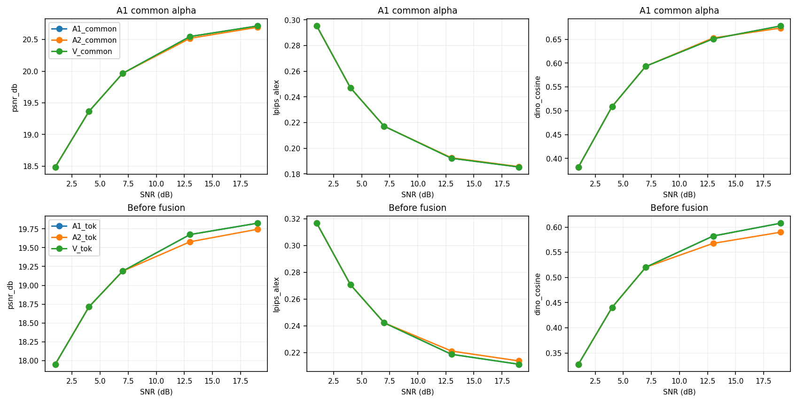

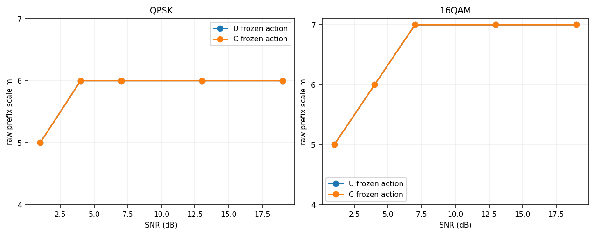

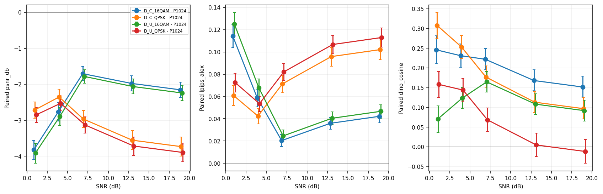

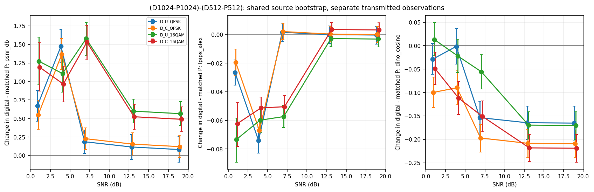

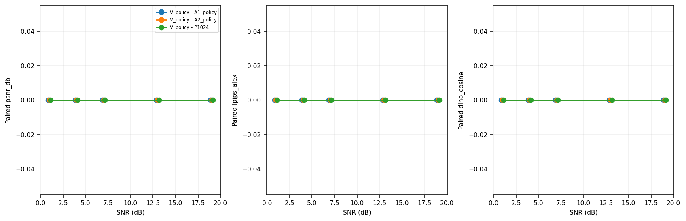

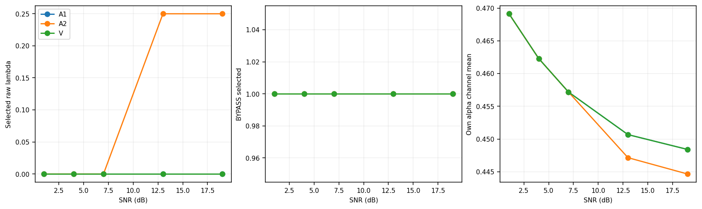

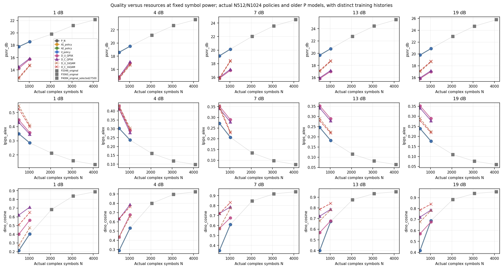

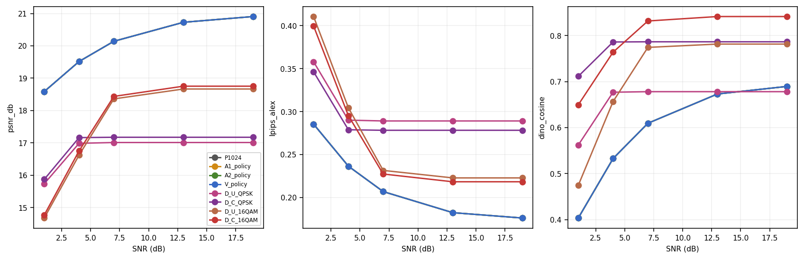

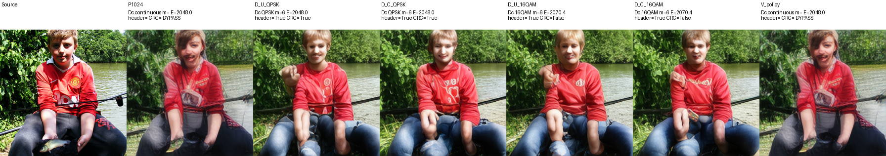

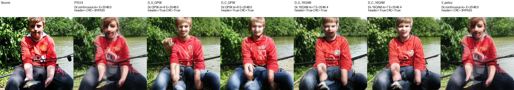

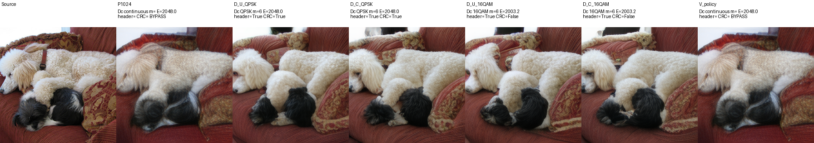

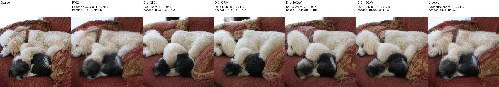

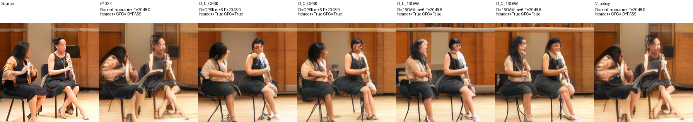

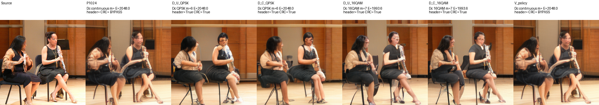

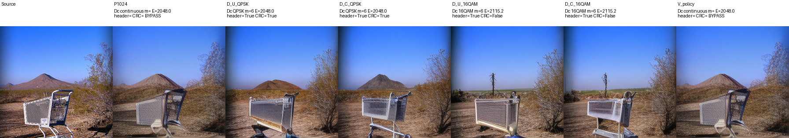

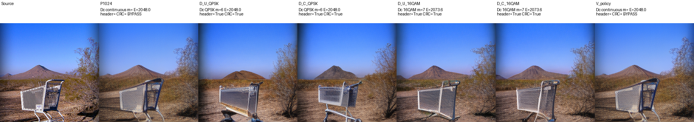
