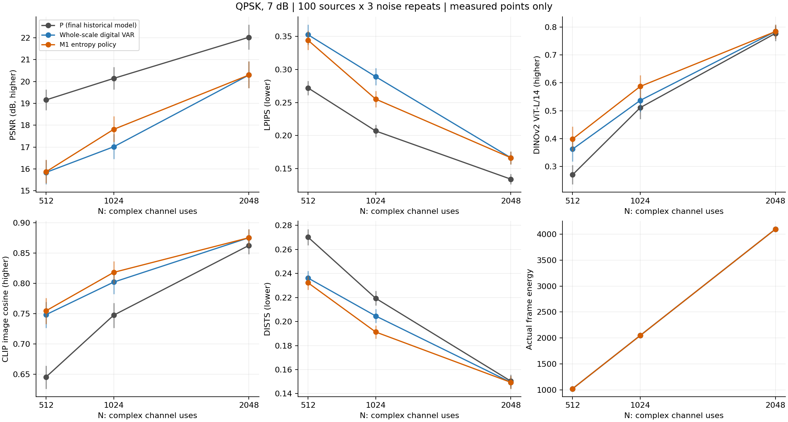
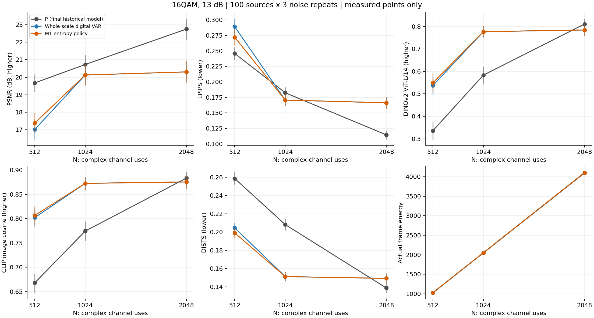
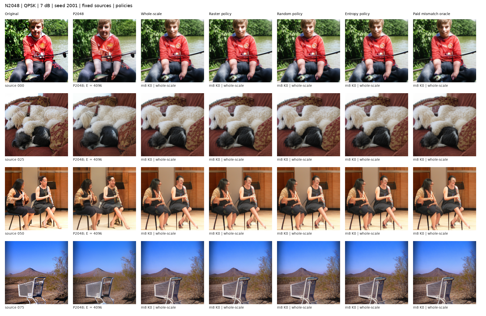

# N2048 完整 M1：同预算质量取舍与尺度内排序

## 完成范围

本报告使用完成登记的真实结果：QPSK、16QAM 各 69 个动作，5 个 SNR，原 1000 张校准图 × 3 个噪声，共 2,070,000 次物理链路评测。以原选模规则分别选择 whole/raster/random/entropy/oracle；不读取开发集选模。开发集为原 100 张图 × 3 个噪声，含同 K 消融，共 24,000 条方法记录。本静态报告构建步骤不进行训练或重新推断。

## 相对 P2048 的取舍

QPSK：DINOv2-L 的差值区间完全高于 0 的 SNR 为无；完全低于 0 的为13 dB、19 dB；其余 3 个区间跨越或触及 0。五个 SNR 的 PSNR 均值差范围为 -2.7261 至 -1.7278 dB，LPIPS 均值差为 0.0324 至 0.0681。

16QAM：DINOv2-L 的差值区间完全高于 0 的 SNR 为无；完全低于 0 的为1 dB、4 dB、13 dB、19 dB；其余 1 个区间跨越或触及 0。五个 SNR 的 PSNR 均值差范围为 -3.0952 至 -1.7392 dB，LPIPS 均值差为 0.0326 至 0.0884。

下表是 **M1 熵序策略 − 最终 P2048**，附源图配对 95% 区间。每张源图先平均 3 个噪声，再进行 10,000 次 bootstrap（seed 20261002）。PSNR、DINO 和 CLIP 正值更好；LPIPS、DISTS 负值更好。区间是复用开发集上的描述性区间，不估计训练 seed 不确定性。

| PHY | SNR | m/K | ΔPSNR | ΔLPIPS | ΔDINOv2-L | ΔCLIP | ΔDISTS |
| --- | --- | --- | --- | --- | --- | --- | --- |
| QPSK | 1 | m7/K0 | -2.7261 [-2.9930, -2.4711] | 0.0681 [0.0609, 0.0754] | -0.0247 [-0.0568, 0.0094] | 0.0192 [0.0070, 0.0321] | 0.0036 [-0.0005, 0.0075] |
| QPSK | 4 | m7/K25 | -2.0615 [-2.2394, -1.8853] | 0.0463 [0.0416, 0.0510] | -0.0234 [-0.0490, 0.0015] | 0.0156 [0.0054, 0.0257] | 0.0030 [-0.0002, 0.0062] |
| QPSK | 7 | m8/K0 | -1.7278 [-1.8849, -1.5763] | 0.0324 [0.0291, 0.0356] | 0.0066 [-0.0110, 0.0256] | 0.0127 [0.0034, 0.0218] | -0.0010 [-0.0038, 0.0018] |
| QPSK | 13 | m8/K0 | -2.4457 [-2.6230, -2.2721] | 0.0518 [0.0479, 0.0556] | -0.0264 [-0.0433, -0.0093] | -0.0078 [-0.0173, 0.0014] | 0.0105 [0.0076, 0.0135] |
| QPSK | 19 | m8/K0 | -2.6519 [-2.8383, -2.4683] | 0.0567 [0.0526, 0.0608] | -0.0349 [-0.0515, -0.0185] | -0.0131 [-0.0230, -0.0034] | 0.0143 [0.0113, 0.0171] |
| 16QAM | 1 | m6/K0 | -3.0952 [-3.3008, -2.8935] | 0.0884 [0.0824, 0.0944] | -0.0650 [-0.1013, -0.0289] | 0.0161 [0.0016, 0.0308] | 0.0146 [0.0107, 0.0184] |
| 16QAM | 4 | m7/K0 | -2.5570 [-2.7644, -2.3552] | 0.0635 [0.0585, 0.0686] | -0.0612 [-0.0893, -0.0340] | 0.0030 [-0.0080, 0.0139] | 0.0084 [0.0053, 0.0116] |
| 16QAM | 7 | m8/K0 | -1.7392 [-1.8981, -1.5849] | 0.0326 [0.0294, 0.0359] | 0.0052 [-0.0126, 0.0242] | 0.0123 [0.0032, 0.0212] | -0.0010 [-0.0039, 0.0019] |
| 16QAM | 13 | m8/K0 | -2.4457 [-2.6230, -2.2721] | 0.0518 [0.0479, 0.0556] | -0.0264 [-0.0433, -0.0093] | -0.0078 [-0.0173, 0.0014] | 0.0105 [0.0076, 0.0135] |
| 16QAM | 19 | m8/K0 | -2.6519 [-2.8383, -2.4683] | 0.0567 [0.0526, 0.0608] | -0.0349 [-0.0515, -0.0185] | -0.0131 [-0.0230, -0.0034] | 0.0143 [0.0113, 0.0171] |

QPSK 与 P 每帧均采用 E=2N=4096；16QAM 保持原固定星座，其实际能量单列，不能把它的差值称为严格同能量优势。历史 P 和数字链使用不同噪声命名空间：源图与名义种子配对，实际噪声波形不相同。各指标应分别解释，某一语义指标提升不等于像素或感知全面提升。

完整主表 CSV 另列 F 恢复平方误差与有效 latent 比例。`F_sq_error_zero_erasure_proxy` 在头部擦除时采用零 latent 代理误差，未把灰色输出当作已恢复的 F；原始有效帧误差和擦除代理仍分别保留在逐帧表中。历史 P2048 未保存这项 F 指标，因此不补造该对照差值。

## 部分尺度和排序是否有作用

熵序策略选为 K=0 的工作点：QPSK/1dB、QPSK/7dB、QPSK/13dB、QPSK/19dB、16QAM/1dB、16QAM/4dB、16QAM/7dB、16QAM/13dB、16QAM/19dB。这些点实际退化为 whole-scale；raster/random/oracle@K 的相同输出不能作为排序收益证据。

其余点在 [SAME_K.md](../results/m1_n2048_full_grid_20261004/SAME_K.md) 中比较相同 m/K 的 raster、random 与 entropy。付费 oracle 按 token 与 VAR 贪心预测是否错配优先选择，并显式付费发送 bitmap；它不是最终图像误差最优选择器，也不是数学性能上界。独立校准的各排序策略见 [完整主表](../results/m1_n2048_full_grid_20261004/MAIN_TABLE.md) 与 [策略表](../results/m1_n2048_full_grid_20261004/POLICIES.csv)。

## 质量—资源曲线

仅使用已完成、兼容的 N512、N1024、N2048 点；没有插补缺失结果。每个调制/SNR 单独绘图，QPSK 与 16QAM 不组成未登记的自适应方法。历史 P 的模型与训练 seed/预算保持原记录，曲线不表示只改变 N 的同一训练轨迹；N512 的 40k 预算截断说明继续有效。

## 固定样例

固定 16 张源图与 seed 2001；主图列为原图、P、whole/raster/random/entropy 策略和付费 oracle，另提供同 K 图。所有画面直接取已保存 float32 重建；PNG 仅作显示转换。图像可用于检查内容错误，分类器不一致本身不等价于人工确认的语义幻觉。

## 计算与接收代价

完整校准网格实测的每源平均处理时长为 34.94 秒（2 源、4,140 次物理帧）。开发集每个完整 240 行方法网格平均 2.87 秒，共 1507 个不同接收状态。它们是带缓存复用的离线 PHY、生成、指标与写盘总耗时，**不是单帧在线接收时延**；不能用标签行数相除后称为每帧延迟。在线逐帧时延本轮未单独测量，详细成本见 COSTS.json。

## 指标与可追溯性

保留原 DINOv2 ViT-S/14，并补 DINOv2 ViT-L/14。CLIP、DISTS、DreamSim、MS-SSIM 与独立 ResNet-50 的精确模型版本、权重和预处理见 MODEL_METADATA.json 与 EVALUATION_REGISTRATION.json。分类报告真实标签准确率及与原图分类预测的一致率；本轮 VAR 全部无类别条件。历史缺失指标保持 N/A。KID/FID 留待更大 holdout。

[完整主表](../results/m1_n2048_full_grid_20261004/MAIN_TABLE.csv) · [各指标配对区间](../results/m1_n2048_full_grid_20261004/metrics_paired_intervals.csv) · [相对 P 的区间](../results/m1_n2048_full_grid_20261004/m1_vs_P_paired.csv) · [全部测量资源点](../results/m1_n2048_full_grid_20261004/resource_summary.csv) · [完整校准表](../results/m1_n2048_full_grid_20261004/calibration_summary.csv)

MANIFEST.json 记录本构建器、完成回执、模型元数据、来源缓存以及每个发布文件的 SHA256。原始权重、张量归档和数据集图片不复制进发布目录；不执行 Git 操作。
