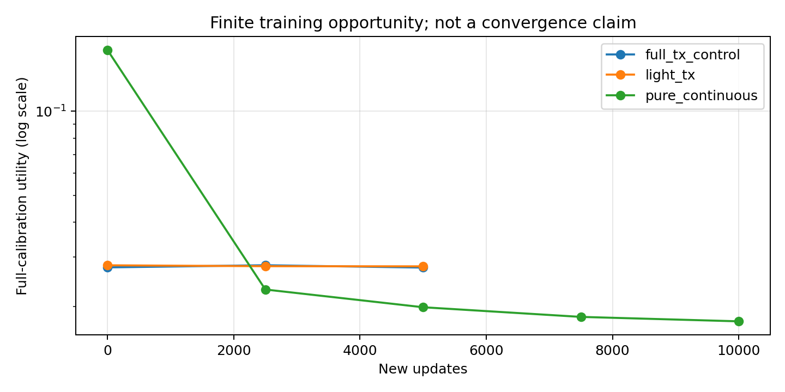
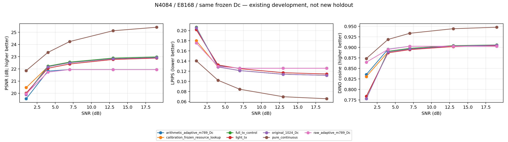
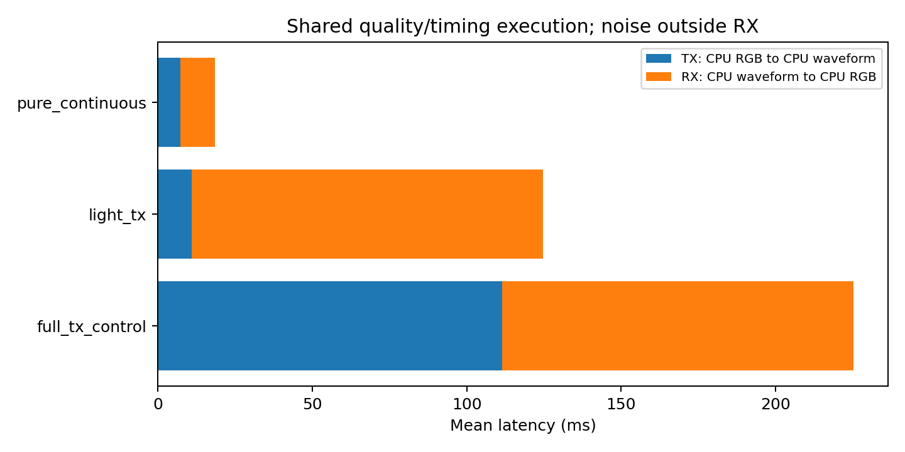

# Phase 2: bounded research after review repairs

This is the second deliverable after phase1 commit `3f229fa73dd8eee117b746a3ee064eeecc0661c4`. All reported quality values below are actual model evaluations on the existing development population. No new holdout was opened and no original A/B checkpoint was retrained or overwritten.

The pure continuous control has the best mean PSNR, LPIPS and DINO among the seven same-Dc methods in this bounded development study. Relative to original1024, its PSNR gain is 1.934dB (source-paired95% interval [1.810, 2.061]). Thus the original digital base does not establish a quality advantage at this particular N4084 operating point; this is not a universal conclusion across datasets, budgets or channels.

Light TX reduces measured TX time substantially but loses 0.091dB PSNR and increases LPIPS by 0.001779 versus its matched full-TX control. Both changes have source-paired intervals excluding zero; DINO's interval includes zero. Keep it as an explicit latency/quality tradeoff, not a quality-equivalent replacement. The original full-TX design is retained.

## Scope and protocol

The visual encoder, original ten-scale quantizer, VAR, frozen selected stageA Decoder Dc, datasets and original training loss remain fixed. There are20,000 training images,1,000 calibration images and100 development images; SNRs1/4/7/13/19dB and three noise seeds. Development results below contain the same1,500 source/SNR/seed keys per method; seed metrics are averaged within each source/SNR, then SNRs within source. Paired95% intervals bootstrap100 independent sources10,000 times. These are descriptive development intervals after repeated research use, not confirmatory holdout inference.

Pure continuous uses all4084 complex channel uses, E8168, and receives no class, digital prefix or VAR completion. The hybrid pair uses digital3060/E6120 plus enhancement1024/E2048. Light TX reads F and the official cumulative m8 prefix, with no TX VAR inference. Full TX uses its original F-Fb_TX and completed Fb_TX. Both hybrid RXs read only their actual received digital completion/status and enhancement observation. Noise is applied once per segment. Development seeds are 2001/2002/2003; new training selection and resource calibration use 4101/4102/4103. Pure uses a registered independent waveform-noise namespace at the same seed keys. Projection calibration preserves the original independently registered base/enhancement streams.

The two hybrid arms start from the same40,000-update selected parent, receive5,000 new updates and independent fresh AdamW optimizers. The first-layer light-TX reparameterization preserves the old function before intentionally changing the condition to the prefix. Resetting both optimizers gives matched new optimization opportunities; old diagonal moments cannot be transformed exactly through that reparameterization. Pure starts fresh and receives10,000 updates. These are bounded opportunities, not equal total training histories or convergence claims. See [registered protocol](research_20260923_protocol.md).

## Numerical-protocol correction discovered during acceptance

The old digital matrix entry point omitted runtime.configure(), leaving cuDNN TF32 enabled. The new registered training and common evaluation disable both TF32 flags. An actual24-candidate comparison with the old calibration table found a maximum3.772390dB difference under strict precision; repeating with the historical cuDNN TF32 setting reduced the maximum difference to0.000003815dB. This is evidence of different numerical protocols, not permission to relax the equality check or silently reuse a cache.

The old table and failed probes are preserved with their scope. This round re-runs only N4084/Dc raw/arithmetic m7/8/9 calibration/development and folded512 development under strict precision, then freezes the unchanged policy rules. Other historical budgets/Decoders are not newly certified or overwritten. The generic digital entry point now applies the common precision configuration. See digital_strict/numerical_precision_incident.json in the result bundle. Historical probe PASS means the old protocol was reproduced, not that a repair passed.

The full adaptive development recheck preserves the earlier digital values to numerical tolerance: maximum PSNR difference is about3.8e-6dB for raw and0 for arithmetic. Thus the old digital development numbers are not declared broadly wrong. Folded512 has a maximum per-frame PSNR difference of0.114883dB and is replaced for this strict-precision scope. Exact paired differences and input hashes are in historical_impact.json.

## Training and selection

Selection uses full calibration utility MSE+0.1LPIPS+0.01normalized latent error at steps0/2500/5000, with additional7500/10000 checks for pure. Hybrid failure masking follows the original loss. All executed updates, selected updates, arm keys and checkpoint hashes are published; a checkpoint can contain multiple arms, so equal file SHA does not mean equal arm weights.

| method | parent_updates | executed_new_updates | selected_new_updates | selected_total_updates | calibration_utility | checkpoint_SHA_prefix |
| --- | --- | --- | --- | --- | --- | --- |
| pure_continuous | 0 | 10000 | 10000 | 10000 | 0.017672 | b6bd1f0bb01b |
| full_tx_control | 40000 | 5000 | 5000 | 45000 | 0.027530 | 8359ea024457 |
| light_tx | 40000 | 5000 | 5000 | 45000 | 0.027814 | 8359ea024457 |

Full checkpoint hashes are recorded in comparison/selected_lineage.csv and the selected JSON receipts.

## Same-Dc quality comparison

All methods below spend N4084/E8168 and retain actual failures. Original1024 is freshly re-evaluated. Digital m7/8/9 adaptive metrics are freshly recomputed at the same explicit precision, with the original quality-selection rule frozen again on calibration. The resource lookup freezes existing endpoints using calibration only; it is not a new scheduling algorithm.

| method | psnr_db | lpips_alex | dino_cosine |
| --- | --- | --- | --- |
| arithmetic_adaptive_m789_Dc | 21.442114 | 0.142121 | 0.887810 |
| calibration_frozen_resource_lookup | 22.182765 | 0.131092 | 0.884955 |
| full_tx_control | 22.117218 | 0.136410 | 0.875347 |
| light_tx | 22.026468 | 0.138190 | 0.874311 |
| original_1024_Dc | 22.067375 | 0.136225 | 0.874412 |
| pure_continuous | 24.000986 | 0.092556 | 0.923571 |
| raw_adaptive_m789_Dc | 21.505339 | 0.136528 | 0.893571 |

The per-frame model_context_sha256 binds the selected checkpoint for a fixed learned arm or the frozen policy for a variable endpoint; the Decoder state SHA and numerical protocol are recorded separately.

Signed differences below are candidate minus control: higher PSNR/DINO and lower LPIPS are favorable. Do not suppress an unfavorable metric or infer an isolated representation mechanism from a complete-pipeline comparison.

| comparison | metric | mean | CI95 |
| --- | --- | --- | --- |
| light_tx minus full_tx_control | psnr_db | -0.090750 | [-0.103991, -0.077961] |
| light_tx minus full_tx_control | lpips_alex | 0.001779 | [0.001453, 0.002111] |
| light_tx minus full_tx_control | dino_cosine | -0.001036 | [-0.002449, 0.000361] |
| pure_continuous minus original_1024_Dc | psnr_db | 1.933611 | [1.810150, 2.060750] |
| pure_continuous minus original_1024_Dc | lpips_alex | -0.043669 | [-0.046461, -0.040915] |
| pure_continuous minus original_1024_Dc | dino_cosine | 0.049159 | [0.042415, 0.056372] |
| pure_continuous minus raw_adaptive_m789_Dc | psnr_db | 2.495647 | [2.358742, 2.636962] |
| pure_continuous minus raw_adaptive_m789_Dc | lpips_alex | -0.043972 | [-0.046832, -0.041108] |
| pure_continuous minus raw_adaptive_m789_Dc | dino_cosine | 0.030001 | [0.024754, 0.035497] |
| pure_continuous minus arithmetic_adaptive_m789_Dc | psnr_db | 2.558872 | [2.412657, 2.709064] |
| pure_continuous minus arithmetic_adaptive_m789_Dc | lpips_alex | -0.049566 | [-0.053822, -0.045552] |
| pure_continuous minus arithmetic_adaptive_m789_Dc | dino_cosine | 0.035762 | [0.029899, 0.041667] |
| calibration_frozen_resource_lookup minus original_1024_Dc | psnr_db | 0.115391 | [0.081833, 0.151389] |
| calibration_frozen_resource_lookup minus original_1024_Dc | lpips_alex | -0.005132 | [-0.006273, -0.004005] |
| calibration_frozen_resource_lookup minus original_1024_Dc | dino_cosine | 0.010543 | [0.007316, 0.013850] |

## Frozen original1024 diagnosis

The oracle-base and zero-enhancement-noise variants are diagnostic only. They keep the neural SNR condition and actual observable status unchanged; actual header failure fallback is retained even for oracle base. Dc(F) is a continuous representation reference with no wireless claim. The following dB differences are not additive physical error fractions.

| method | psnr_db | lpips_alex | dino_cosine | normalized_latent |
| --- | --- | --- | --- | --- |
| Dc_F_representation_reference | 26.472460 | 0.052310 | 0.957301 | 0.000000 |
| actual_RX_AWGN | 22.067375 | 0.136225 | 0.874412 | 0.549136 |
| actual_RX_zero_noise | 22.446564 | 0.129350 | 0.879458 | 0.509009 |
| oracle_TX_AWGN | 22.408489 | 0.123389 | 0.894317 | 0.533709 |
| oracle_TX_zero_noise | 22.810561 | 0.117289 | 0.896821 | 0.494133 |

Per-SNR diagnostic rows and all7,500 source-level observations are published. The normalized-latent diagnostic is the pre-render latent error on every row, including header failures; the actual gray fallback applies to RGB output. They separate the effects of replacing the received base and removing enhancement noise under this fixed receiver, without identifying independent causal error percentages.

## Calibration-frozen resource lookup

Eight existing endpoints compete: raw/arithmetic m7/8/9 plus m8+1024 and the existing folded m8+512 endpoint. Selection minimizes calibration mean MSE+0.1LPIPS with a deterministic lexical tie break. All digital/base/control resources and failures are included.

| SNR_dB | endpoint |
| --- | --- |
| 1.0 | m8_plus_latent_512_fold_N4084 |
| 4.0 | m8_plus_latent_1024 |
| 7.0 | m8_plus_latent_1024 |
| 13.0 | m8_plus_latent_1024 |
| 19.0 | m8_plus_latent_1024 |

The N4084/Dc digital matrix was recomputed on all1,000 calibration and100 development sources (90,000 and9,000 candidate rows). A further24-candidate check verifies reuse of this newly bound table. Folded512 development is also freshly evaluated at the same precision; it is not copied from the historical allocation table. Complete1,000-source calibration tables are published as exact per-method partitions; the frozen JSON was written before development was read. There is no new m10 or fully adapted-Decoder digital competitor.

## Random versus training second-moment projection

Both fixed bases use1984 real measurements,32 protected norm-control uses plus992 measurement uses, the same per-frame energy protocol, fully refitted W and the same Dc. Norm transmission is charged inside the1024 enhancement uses; failed norm packets suppress the complete innovation. The PCA basis is uncentered and trained only on F-Fb_TX training residuals; no mean or sample-dependent gain is transmitted for free.

| method | psnr_db | lpips_alex | dino_cosine |
| --- | --- | --- | --- |
| PCA_residual | 20.865939 | 0.163569 | 0.872731 |
| PCA_source | 20.910881 | 0.161589 | 0.875940 |
| random_residual | 20.567687 | 0.169248 | 0.866022 |
| random_source | 20.620472 | 0.166431 | 0.869913 |

PCA improves mean PSNR over the random basis by 0.290dB in source mode and 0.298dB in residual mode, while their PSNR and LPIPS remain worse than the learned1024 methods. This is a comparison of the full projection pipeline, including refitted norm ranges and W. Projection per-frame records, pooled fits and source-paired intervals are published. Training explained energy alone is not treated as image quality.

## Actual endpoint cost

TX starts at CPU RGB and ends at the CPU waveform. RX starts at the noisy CPU waveform and ends at CPU RGB. Noise generation is outside RX timing. Each method receives five warmups;100 timed calls per method span ten sources, five SNRs and two repeats in rotated order. Quality and timing call the same execute function; 300 output checks pass with maximum absolute difference 0 (tolerance2e-5). These are sequential GPU0 measurements on this host, not universal hardware latency guarantees.

| method | tx_ms_mean | rx_ms_mean | total_ms_mean | total_ms_p95 |
| --- | --- | --- | --- | --- |
| full_tx_control | 111.368156 | 113.732916 | 225.101073 | 227.533879 |
| light_tx | 10.992364 | 113.655318 | 124.647682 | 125.714370 |
| pure_continuous | 7.405890 | 11.182152 | 18.588042 | 18.647225 |

Light/full mean TX latency ratio is 0.098703. Quality tradeoffs must be read together with this measured ratio.

## Historical adapted-Decoder context

These are the same100 development sources/SNRs from historical runs, not newly requalified measurements. They have different Decoder/training and unverified historical numerical/execution context. The historical m8_Dc_adapted alias is collapsed into raw_N4084_m8_Dc_adapted after source-key/resource agreement and numerical-equivalence checks; no additional method is counted. They are shown to locate prior work and must not be treated as the same-Dc main ranking.

| method | N | E | decoder | psnr_db | lpips_alex | dino_cosine |
| --- | --- | --- | --- | --- | --- | --- |
| m8_1024_control | 4084 | 8168 | original_Dc | 22.098482 | 0.135576 | 0.874250 |
| m8_1024_decoder_adapt | 4084 | 8168 | different_adapted_Dc | 22.219015 | 0.131421 | 0.873083 |
| raw_N4084_m8_Dc_adapted | 4084 | 8168 | different_adapted_Dc | 20.317972 | 0.167547 | 0.867490 |
| raw_N4084_m9_Dc_adapted | 4084 | 8168 | different_adapted_Dc | 20.026456 | 0.213775 | 0.737519 |

## Acceptance, evidence and remaining limits

- Asset-free CPU engineering regressions include exact budget/energy, light-TX input boundaries, reparameterization and invalid statistical pairing cases. Final checkout acceptance is recorded separately.
- Real-weight GPU qualification verifies input gradients through frozen Dc, unchanged frozen parameters, actual prefix mapping, normalized energy, independent arm update state and bitwise Adam continuation after save/load. Qualification updates were discarded. Failed early qualification probes are retained locally; they are not quality results.
- The active trainer's registered dependencies were unchanged during training. Selected records and SHA are verified before evaluation. Source/cache/parent/Decoder identities and actual selected lineage are published.
- The same development sources are used for the historical adapted-Decoder context, but those rows retain a different Decoder and incomplete historical execution identity. They are outside the same-Dc ranking and are not newly requalified. This round does not complete the adapted-Decoder digital adaptive control.
- No new holdout, full convergence claim, m10 completion, coset, diffusion, backbone change or original A/B retraining is claimed.
- Weights, raw images, datasets, tensor caches and credentials are excluded from Git. The sole working root remains /home/liulu/projects/VAR_COMM; old publish is an ignored historical backup.

The [artifact index](../results/review_20260923_phase2/artifact_lineage.json) maps every published result to its run_id, original path and SHA256. The source is the actual execution code under experiments/var-latent-enhancement-20260917/research. This report records the bounded new study and does not relabel all historical repair issues as solved.
