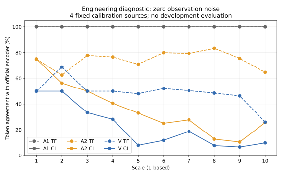

# RX posterior step 1: SNR audit and engineering gate stop (2026-09-29)

The requested exploratory probe was executed through calibration and real-weight engineering checks. It stopped at execution-sheet section 4.2. Oracle quality C and mechanism outcomes M1/M2/M3 remain NOT_RUN; this is not evidence that the scientific direction failed. No new development inference or holdout access occurred.

## Noise convention

Actual project code uses wave + unit_normal * 10**(-SNR_dB/20). With complex-symbol signal energy 2 and two real noise coordinates, complex noise energy is 2/gamma, gamma = 10**(SNR_dB/10). Therefore each real-coordinate noise variance is 1/gamma and eta = 10**(-SNR_dB/20). No 3 dB correction is required. The N3060/E6120 convention and N4084/E8168 use this same definition.

Calibration coordinate standardization ensures ensemble mean energy 8192 over 8192 real dimensions; it does not impose exact per-frame energy. N4096 vs N4084 differs by 12 complex uses (0.294% or approximately 0.01274 dB in the budget ratio). That number is not a correction for missing gain information or a claim of equal physical channels. O1 vs P4084 would remain approximate and privileged-oracle only.

| Equivalent SNR (dB) | eta | Per-real noise variance |
|---:|---:|---:|
| -5 | 1.778279410 | 3.162277660 |
| -2 | 1.258925412 | 1.584893192 |
| 0 | 1.000000000 | 1.000000000 |
| 1 | 0.891250938 | 0.794328235 |
| 4 | 0.630957344 | 0.398107171 |
| 7 | 0.446683592 | 0.199526231 |
| 13 | 0.223872114 | 0.050118723 |

## Actual checks

- Original queue gracefully stopped through its verified outermost SIGTERM handler and saved m8 third-seed step 29001. No SIGKILL, hardware changes, or original model/evaluation-source changes. Original chain/C/controller locks are held by the independent CPU lease.
- 1000 original calibration sources supplied coordinate mean/std, channelwise standardized F-Fq residual variance, per-scale clean codeword residual variance, and static token counts. Unit-eta downsampled noise variance used only the fixed first 200 calibration sources and seeds 4101/4102/4103. All 10 original calibration shard SHAs were checked.
- All models are frozen. V uses unconditional label 1000, full logits, no CFG, no truncation and MAP. Static frequency uses the existing first-gate pseudocount 0.5.
- Four fixed calibration indices (0, 100, 200, 300), each with 680 tokens, were tested. No-noise/no-prior tokens exactly equal the official encoder, and Fq is bitwise equal on all four.
- Sequential VAR logits versus official full teacher forcing: maximum absolute difference 3.814697266e-05, within original first-gate tolerance 0.0002.
- Forty direct float64 likelihood-score checks (one position per scale/source) agree with the implementation argmax; maximum score error 2.232824718e-05. Distances are sums over 32 channels, not means.

| Zero-noise prior | True prefix TF agreement | Closed-loop CL agreement |
|---|---:|---:|
| A1 | 100.0000% | 100.0000% |
| A2 | 72.9412% | 21.3603% |
| V | 39.9632% | 10.6618% |

The implementation froze 99% as a numerical interpretation of “near 100%” before calibration. The observed 39.96% TF / 10.66% CL for V is far from that wording regardless of a reasonable near-100% threshold. This four-source engineering probe is not a population quality estimate.

At eta=0, the specified likelihood retains sigma_k^2 = s_k^2 > 0. Its MAP decision can therefore trade a worse nearest-codeword distance for a larger prior probability. Thus clean lambda=1 MAP is not guaranteed to recover the tokenizer even with exact code and zero observation noise. The TF result shows this is not solely closed-loop error propagation. A wrong SNR factor cannot explain a discrepancy at exactly eta=0.

## Existing results excerpt (no recomputation)

The provided summary.csv contains only 14 new C models; P2048/P3060/legacy P4084 are in the same publication’s combined_summary.csv. Values below are copied verbatim from those published summaries; paired intervals are copied from paired.json. All 26 available low-SNR model/seed rows and 12 matched H6 comparisons are preserved in existing_results_excerpt.json. The primary proposed oracle comparator is first-seed selected P4084, while legacy 10k remains separate.

| Method | SNR | PSNR | LPIPS | DINO |
|---|---:|---:|---:|---:|
| H6-P_N4084_seed2026092304 | 1 | 21.428102 | 0.149736 | 0.848391 |
| H6-P_N4084_seed2026092304 | 4 | 23.325458 | 0.102445 | 0.905303 |
| H6-V_N4084_seed2026092304 | 1 | 21.476950 | 0.148167 | 0.864025 |
| H6-V_N4084_seed2026092304 | 4 | 23.337899 | 0.102582 | 0.913655 |
| P2048 | 1 | 19.805610 | 0.212768 | 0.684700 |
| P2048 | 4 | 21.198497 | 0.160537 | 0.800038 |
| P3060 | 1 | 21.198039 | 0.159098 | 0.838878 |
| P3060 | 4 | 22.664885 | 0.118109 | 0.895991 |
| P4084 | 1 | 21.858831 | 0.140563 | 0.873441 |
| P4084 | 4 | 23.353259 | 0.102211 | 0.918840 |
| P4084_N4084_seed2026092304 | 1 | 22.135834 | 0.131857 | 0.888098 |
| P4084_N4084_seed2026092304 | 4 | 23.548631 | 0.097732 | 0.925193 |

First-seed H6-V minus H6-P:

| SNR | PSNR difference [95% CI] | LPIPS difference [95% CI] | DINO difference [95% CI] |
|---|---|---|---|
| 1 | 0.048847 [-0.011639, 0.111474] | -0.001569 [-0.002964, -0.000244] | 0.015634 [0.010461, 0.020870] |
| 4 | 0.012440 [-0.017885, 0.042303] | 0.000137 [-0.000624, 0.000910] | 0.008352 [0.005452, 0.011383] |
| 1,4,7 | 0.022699 [-0.010004, 0.055735] | -0.000351 [-0.001164, 0.000437] | 0.010112 [0.007265, 0.013020] |

## Decision and boundary

| Item | State |
|---|---|
| Noise/SNR convention | Verified; original conversion retained |
| Clean lambda=0 token/Fq identity | PASS, four real calibration sources |
| Official VAR teacher-forcing parity | PASS |
| Clean lambda=1 near-100% agreement | NOT PASSED |
| Source A development replay | NOT_RUN |
| Four difficulty levels / final config freeze | NOT_RUN |
| C, M1, M2, M3 | NOT_RUN |

The execution sheet says all engineering checks must pass before evaluation and requires stopping/reporting uncovered situations. The probe has therefore stopped. The original queue remains safely paused while this requirement is resolved. Two existing historical waiters protected themselves by exiting after the original main requested stop; their states and original launch records are retained and must be reviewed before restoration. The two other historical waiters remain waiting. This is an expected scheduling consequence, not a new model failure.

Concrete proposed revision, NOT applied: keep exact lambda=0 token/Fq equality and official logits parity as engineering gates; report clean lambda=1 agreement as a diagnostic rather than require near 100%. Keep the supplied likelihood, lambda=1, noise calibration, independent development, and all C/M1/M2/M3 thresholds. A revision needs the user’s decision; no bypass or likelihood tuning has occurred.

## Reproduction and files

- Independent code/design: experiments/rx-posterior-step1-20260929/. The execution sheet is preserved verbatim.
- Raw local evidence: outputs/RX-POSTERIOR-STEP1-20260929/. Calibration tensors, original pixels, tokens, weights and caches are not committed.
- Lightweight evidence: results/rx_posterior_step1_20260929/. Four CPU engineering checks pass; real GPU checks above are separately identified.
- One setup attempt failed before GPU execution because the new launcher omitted an existing import path. Its source/log/launch are archived under setup_attempt1; only the stopped new launcher was corrected. Original experiment files were not modified.

Repository/independent remote verification is recorded separately after publication; it must not be called new GPU quality acceptance.
