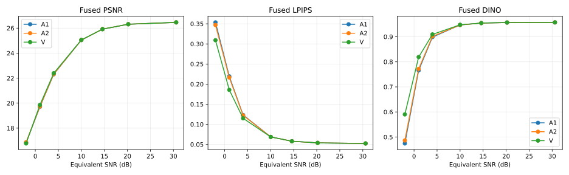
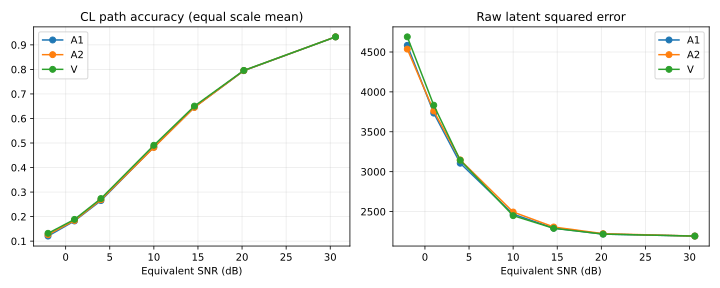
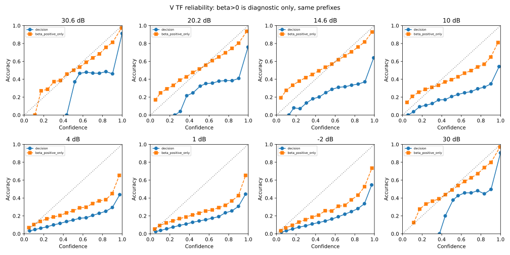

# RX posterior step1 v3：完整 A/B 探针结论

任务 A、精确极限检查、校准冻结和任务 B 已实际完成。原训练、历史等待器和 var-comm 自动推进继续停止；本次没有训练、没有访问新 holdout，也没有自动启动第二步。

## 结论

- C（Oracle天花板）：通过，见[任务A报告](rx_posterior_step1_v3_task_A_20260929.md)。
- 精确极限检查：通过。η=0、β=0、λ=1；四张固定校准源的TF和CL中，V/A1逐token完全一致且Fq逐位一致。
- M1准确率判据：未达到；保留原对数概率附加条件的联合判据：未达到。
- M2（路径条件准确率与latent平方误差）：未达到。
- M3（闭环融合图像）：通过。

V-fuse在目标1 dB和−2 dB同时优于A1-fuse/A2-fuse，达到M3；4 dB虽有改善，但对A2未达到登记幅度门槛。M1未达到的关键是模糊带内相对A2的增益不足，M2仅10 dB一档通过，低SNR融合前latent误差没有同步降低。因此结论是融合后的感知质量有收益，不能宣称token机制全链成立或通过全部门槛；它也不是N4084实际PHY成绩。

**M3是实际图像价值检验，token指标只说明机制。** 低SNR细尺度难判，不自动否定粗/中尺度消歧，但也不能据此免除图像门槛。所有负结果和区间跨0项均保留。

M1原条目的对数概率条件没有得到明确取消，本报告按事先声明同时列出两个判据，不按开发集结果择优命名通过。

## 逐档判定与冻结参数

| 等效SNR | 模糊带尺度 | λ A2 / V | M1准确率 | M1联合 | M2 | M3 |
|---:|---|---|---|---|---|---|
| 30.6 | 4,5,6,7,8,9,10 | 1.5 / 0.5 | 未达到 | 未达到 | 未达到 | 未达到 |
| 20.2 | 2,3,4,5,6,7,8,9,10 | 1.5 / 0.75 | 未达到 | 未达到 | 未达到 | 未达到 |
| 14.6 | 1,2,3,4,5,6,7,8,9,10 | 1.5 / 1 | 未达到 | 未达到 | 未达到 | 未达到 |
| 10 | 1,2,3,4,5,6,7,8,9,10 | 1.5 / 1 | 未达到 | 未达到 | 通过 | 未达到 |
| 4 | 1,2,3,4 | 1.5 / 1.5 | 未达到 | 未达到 | 未达到 | 未达到 |
| 1 | 1,2,3 | 1.5 / 1.5 | 未达到 | 未达到 | 未达到 | 通过 |
| -2 | 1,2 | 1.5 / 1.5 | 未达到 | 未达到 | 未达到 | 通过 |

M1模糊带完全由200张校准源×三噪声seed确定，并在B-development前冻结。每档按模糊带尺度等权准确率选λ，空带用λ=1且M1不适用；A2/V同一网格、同一选择规则。判定β固定为0，β>0仅供概率与可靠性诊断。30 dB只作TF相对诊断，不计入以上七档。

## 目标低信噪比图像结果

| SNR | 方法 | PSNR dB | LPIPS | DINO |
|---:|---|---:|---:|---:|
| 4 | B1 | 21.30782 | 0.133183 | 0.894705 |
| 4 | O1 | 24.45822 | 0.079739 | 0.938177 |
| 4 | A1-fuse | 22.30777 | 0.123248 | 0.898630 |
| 4 | A2-fuse | 22.32018 | 0.122228 | 0.901531 |
| 4 | V-fuse | 22.39113 | 0.114961 | 0.909390 |
| 1 | B1 | 18.50591 | 0.229933 | 0.749238 |
| 1 | O1 | 24.08104 | 0.086774 | 0.931847 |
| 1 | A1-fuse | 19.70269 | 0.219300 | 0.765749 |
| 1 | A2-fuse | 19.72503 | 0.216475 | 0.771654 |
| 1 | V-fuse | 19.85412 | 0.185691 | 0.818914 |
| -2 | B1 | 15.51229 | 0.406421 | 0.377603 |
| -2 | O1 | 23.82870 | 0.091703 | 0.926000 |
| -2 | A1-fuse | 16.85052 | 0.353522 | 0.474341 |
| -2 | A2-fuse | 16.86906 | 0.347098 | 0.486358 |
| -2 | V-fuse | 16.77531 | 0.309210 | 0.590234 |

### 主要配对差与95%区间

下表为V-fuse减对照；LPIPS越低越好，DINO越高越好。源图先平均三噪声，再配对bootstrap。

| SNR | 对照 | ΔLPIPS [95% CI] | ΔDINO [95% CI] | ΔPSNR dB |
|---:|---|---|---|---:|
| 4 | A1-fuse | -0.00829 [-0.01100, -0.00590] | +0.01076 [+0.00713, +0.01475] | +0.08336 |
| 4 | A2-fuse | -0.00727 [-0.00981, -0.00504] | +0.00786 [+0.00490, +0.01098] | +0.07095 |
| 1 | A1-fuse | -0.03361 [-0.04596, -0.02257] | +0.05317 [+0.03858, +0.06999] | +0.15143 |
| 1 | A2-fuse | -0.03078 [-0.04285, -0.02008] | +0.04726 [+0.03357, +0.06281] | +0.12909 |
| -2 | A1-fuse | -0.04431 [-0.05867, -0.03074] | +0.11589 [+0.09131, +0.14199] | -0.07521 |
| -2 | A2-fuse | -0.03789 [-0.05187, -0.02483] | +0.10388 [+0.07954, +0.12906] | -0.09375 |

1 dB的原P4084近似参照为22.13583 dB、LPIPS 0.131857、DINO 0.888098；本轮V-fuse为19.85412 dB、0.185691、0.818914，仍落后。不同资源/前端只允许近似对照，不能把M3通过表述为胜过P4084。

1 dB的M2融合前latent平方误差，V相对A1增加98.77（95% CI 29.11至166.10），相对A2增加72.33（9.85至132.74）；两项均显著变差。该指标必须保留，不能用融合后的latent改善替代。

闭环十尺度等权准确率虽在低SNR提高，但按token数加权的准确率在4/1/−2 dB均下降，说明细尺度并未整体改善；两种汇总均完整报告。

B1/O1取已完成任务A中完全相同源图和噪声draw，新增配对差只作旁证，不改变M1–M3。O1依赖真实Fq，不是可部署接收端。

## 30 dB相对诊断

| 尺度 | A1 | A2固定 | V固定 | A2校准λ | V校准λ |
|---:|---:|---:|---:|---:|---:|
| 1 | 98.67% | 98.67% | 98.67% | 98.67% | 98.67% |
| 2 | 97.25% | 97.25% | 97.25% | 97.25% | 97.25% |
| 3 | 96.00% | 96.04% | 96.00% | 96.04% | 96.00% |
| 4 | 94.00% | 94.00% | 93.98% | 93.98% | 93.98% |
| 5 | 92.69% | 92.68% | 92.72% | 92.67% | 92.71% |
| 6 | 91.47% | 91.47% | 91.46% | 91.46% | 91.49% |
| 7 | 90.79% | 90.79% | 90.80% | 90.80% | 90.80% |
| 8 | 89.65% | 89.66% | 89.71% | 89.68% | 89.73% |
| 9 | 88.55% | 88.54% | 88.59% | 88.54% | 88.57% |
| 10 | 89.80% | 89.81% | 89.81% | 89.80% | 89.80% |

### 细尺度是否接近随机：用实测核对

| SNR | A1 第8–10尺度平均 | A2 第8–10尺度平均 | V 第8–10尺度平均 |
|---:|---:|---:|---:|
| 4 | 10.0026% | 10.0674% | 14.8685% |
| 1 | 4.7850% | 4.7269% | 10.1574% |
| -2 | 2.0739% | 2.0099% | 7.6610% |

4096码字均匀随机猜测参考为1/4096≈0.0244%。低绝对准确率不能自动称为“等同随机”；同时必须与真实A1和A2对照。上表只作机制说明，不改变模糊带或M3判定。

此处不设99%或其他绝对门槛，也不能用CL相对于原编码路径的一致率代替路径条件判决质量。

## 闭环与统计

每个尺度先固定接收端自己的历史判决，用干净F在评分支路确定“当前路径下最近码字”，再评价实际RX选择；干净F不进入RX先验、MAP或融合。真实权重检查中将评分用F改变后，RX tokens和Fq保持逐位相同。latent误差使用原坐标总平方和 ||F−Fq_post||²，未偷换成均方或标准化误差。

M2路径准确率主统计为十尺度等权平均，另报token数加权值。所有source×SNR×noise×profile对象保留。先对每源三噪声平均，再作10000次源图配对bootstrap（seed20260929，逐点95%百分位区间）。区间不表示训练seed变异，也未作多重比较校正。

β>0概率诊断使用同一β=0决策前缀，并不生成另一套可参与M1–M3的MAP输出。CL概率可靠性仍对原编码token评分，因此与M2路径条件目标不同；图中明确区分。

## 执行、身份与边界

- 原100 development源、三seed、七判定档和额外30 dB TF诊断；A1、A2/V判定版以及A2/V固定参照，共22500条完整TF/CL记录。全200张校准网格、200张融合方差统计、100张development原记录以逐源稀疏bin明文JSON封存，可逐字节复原原JSON并校验原SHA。
- 同一源/噪声在先验、前缀模式和SNR档位间配对复用；λ=1时固定版与判定版复用相同推断。22500是完整评测记录数，不是22500个独立噪声样本或实际PHY传输。统计单位仍为100张源图。
- 模型、源码、预处理、原source/seed、校准freeze和每个结果对象的SHA见索引。所有重建统一冻结Dc；Source A复现23.464584 dB、LPIPS .09887115。
- 实际SNR约定为每实数维噪声方差1/γ，η=10^(−SNR_dB/20)。标准化只保证校准分布集合平均能量，非逐帧强制能量。N4096等效latent探针对N4084实际PHY只能近似对照。
- 实测development平均标准化信号功率为0.960869（相对参考约−0.173356 dB）；逐帧功率约0.190915至2.093766。因此同时报告实际能量比，保留预先固定的名义噪声档位，不使用development能量重新调噪声。详见[能量账本](../results/rx_posterior_step1_20260929/revision_v3_controls/signal_noise_energy.json)。
- 原v2 30 dB硬门槛失败保留为历史，并由用户明确替换。v3 CPU端点测试暴露浮点归约问题后，先安全停止校准、归档216份封存数据，修正仅1e−12端点比较容差，回归通过后重算；实际选出的档位/参数未改变。不是GPU质量失败。
- 任务A先读其原development是用户明确要求；A结果没有进入B参数选择，B自身读取development前全部参数和融合方差已冻结。
- B冻结config SHA：ae4e611f98e0a01f2c44046162cd332c1a658c29d1bd6412014c4ee957445dad。
- B完成回执SHA：801f74cfc7ad915b4cd083e6f7ba59a0dc829d2b3f15d767336f80ed1d7e9db9。

[执行单统一逐帧CSV：含task/prior/output/eta及全部逐尺度指标](../results/rx_posterior_step1_20260929/revision_v3_frame_schema/index.json)。A为4200条；B的tok/fuse拆行后为33000条，合计37200条，和原22500条B宽表是同一批推断。

[全部数据、配对区间、校准与图表索引](../results/rx_posterior_step1_20260929/revision_v3_B/index.json)。根工程与独立远端检查以实际receipt为准，报告文件本身不替代验收。
