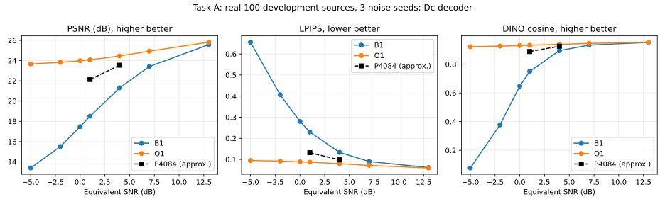

# RX posterior step1 v3：任务 A 和精确极限检查

真实 O1/B1 评测已完成，天花板判定 **C通过**。精确零噪声检查也通过。任务 B 尚在独立校准与评测流程中，本报告不宣称 M1、M2、M3 已通过；原训练和自动推进保持停止。

## 实际范围与检查

使用原100张development源、三噪声seed、七档−5/−2/0/1/4/7/13 dB，共4200条方法帧。所有重建统一用冻结Dc，模型、源图预处理、噪声命名及注册SHA见结果索引。Source A复现：PSNR 23.464584 dB、LPIPS 0.09887115、DINO 0.91415212。

β=0、λ=1、η=0直接实现最近码字极限。在四张预定校准源的TF/CL共8项检查中，V与A1全部680个token逐个完全一致，Fq逐位一致；真实VAR logits与官方teacher-forcing前向误差在登记容差内。这是代码正确性检查，不代表带噪性能。30 dB已改为相对诊断，不再使用99%门槛。

项目实际AWGN约定为每实数维噪声方差1/γ，因此 η=10^(−SNR_dB/20)，无需额外3 dB修正。探针8192实数维对应4096复数uses；逐维标准化使校准分布的集合平均能量为8192，并未逐帧强制归一化。与实际P4084 PHY的对照只能近似，不能把本探针标成N4084通信成绩。

## 结果

| SNR | B1 PSNR | O1 PSNR | B1 LPIPS | O1 LPIPS | B1 DINO | O1 DINO |
|---:|---:|---:|---:|---:|---:|---:|
| −5 | 13.3875 | 23.6725 | .655680 | .094760 | .076622 | .921369 |
| −2 | 15.5123 | 23.8287 | .406421 | .091703 | .377603 | .926000 |
| 0 | 17.4713 | 23.9840 | .280475 | .088644 | .647297 | .929887 |
| 1 | 18.5059 | 24.0810 | .229933 | .086774 | .749238 | .931847 |
| 4 | 21.3078 | 24.4582 | .133183 | .079739 | .894705 | .938177 |
| 7 | 23.4248 | 24.9353 | .089779 | .071579 | .932940 | .944680 |
| 13 | 25.5780 | 25.8241 | .061317 | .059247 | .951984 | .953448 |

先在每张源图上平均三个噪声，再做10000次源图配对bootstrap，seed20260929，逐点95%百分位区间。1 dB下 O1−B1：LPIPS −.143159，区间[−.154375,−.132849]；DINO +.182610，区间[+.157970,+.209466]。≤1 dB的四个点全部满足原C阈值。这里的区间是固定模型、100源population下的源图不确定性，不是训练seed变异或多重比较校正区间。

强P4084参照来自此前已发布的C selected development（第一训练seed，selected27500）：1 dB时22.135834 dB、LPIPS .13185691、DINO .88809845。O1在LPIPS与DINO上均更好，满足原C的近似对照条件；噪声结构和资源不完全相同，不据此宣称可部署接收器优于P4084。

## 结论及后续边界

正确token提供的先验均值与连续观测融合，有明显的潜在图像收益。O1使用接收端不可得的真实Fq，收益是否能由可实现的VAR后验获得，必须继续看任务B。**M3是图像层面的实际检验，token准确率只说明机制。** 即使低SNR细尺度token难以判对，粗/中尺度消歧与图像融合仍可能有价值；不得先把“接近随机”当成已测结论。

v3冻结规则：判定β=0，λ由同一200校准子集的TF准确率选取；A2/V同流程；四个原难度档加4/1/−2 dB；M1使用校准冻结的20%–95%模糊带，M2用接收端自己前缀下的路径条件准确率和原坐标latent平方误差，M3阈值不变。β>0仅作概率和可靠性诊断。A结果不参与B校准。

CPU端点测试发现浮点归约可能把恰好20%/95%误排除。先核验并停止B校准最外层守护，子进程按75安全退出；旧200份网格和16份融合校准封存证据已完整归档。只修正1e−12浮点比较容差，8项回归通过后重新登记、重算B校准；原GPU模型/观测/阈值未改，未读取B-development。这是工程边界修正，不是GPU质量失败。

数据、逐源均值、完整配对区间、判定、模型和极限证据见 [结果索引](../results/rx_posterior_step1_20260929/revision_v3_A/index.json)。该目录不可覆盖。CPU/远端验证以独立receipt为准，本报告本身不替代验收。
