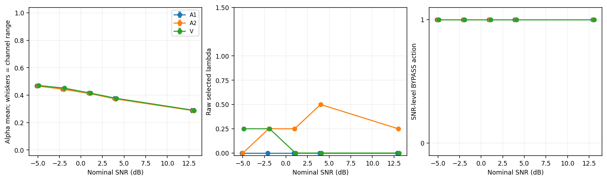
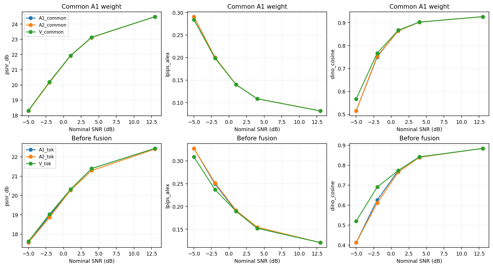
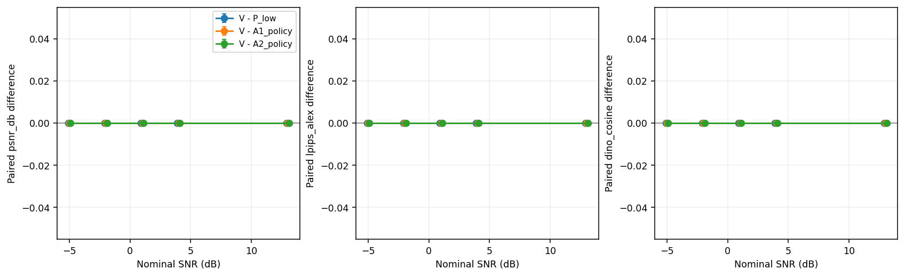
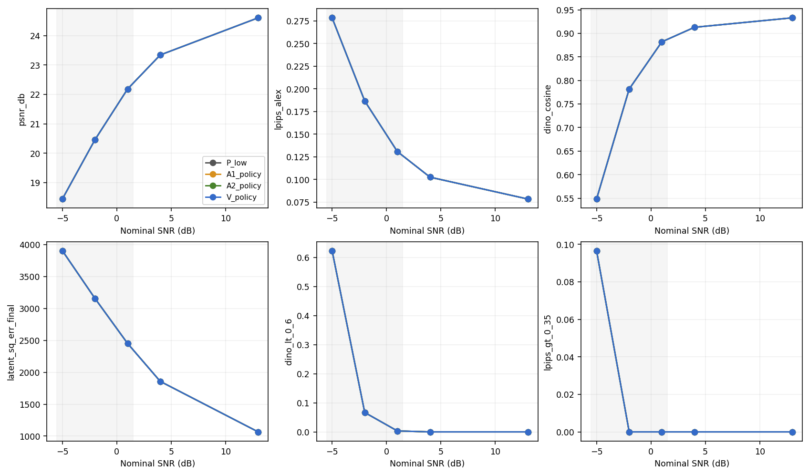

# P_low 专门低 SNR 微调后的接收增量：B 部分

本轮 P_low 训练共完成新增更新 20000；全 1000 张 calibration 选中的 checkpoint 使用新增更新 20000，总更新 47500；SHA-256 `a692befb555a8b88da35814aaba7497ab073dbab094d6b70377b6e91df662d74`。接收后处理评测更新参数次数为 0。

1. **V 是否胜过 P_low？** −5/−2/1 dB 的 G2 主点未建立相对 P_low 的质量收益。逐点指标、PSNR 约束和接收时间列在下表。
2. **V 是否胜过 A1 和 A2？** −5/−2/1 dB 的 G2 主点未建立超出三个直接控制的质量增量。只胜 P_low 时不归因于 VAR 条件先验。
3. **共同融合权重下是否仍有增量？** 下面逐点报告 V_common 相对 A1_common/A2_common 的配对差；共同权重固定为 calibration 的 A1 alpha，未重新选 lambda。旁路时这些是诊断输出。
4. **专门适配低 SNR 后是否保留额外增量？** 当前设置未建立或复现超出三个直接控制的低 SNR 接收增量。这不自动证明新颖性或论文贡献；未通过也不能单凭此结果把 A 的全部收益归因于训练失配。P_low_perc 与旧队列均未启动。

## G2 主结果：−5、−2、1 dB

训练 SNR 为 −5/−2/1/4 dB；4 dB 是支持性评测，13 dB 是训练范围外副作用诊断。以下均先对每张源图的三个噪声平均，再对 100 张源图平均。PSNR 是逐图 PSNR 的均值。

| SNR | 方法 | PSNR dB | LPIPS alex | DINO | 原坐标 latent 平方和 | DINO<0.6 | LPIPS>0.35 |
|---:|---|---:|---:|---:|---:|---:|---:|
| -5 | P_low | 18.4416 | 0.27849 | 0.54812 | 3906.782 | 0.6233 | 0.0967 |
| -5 | A1_policy | 18.4416 | 0.27849 | 0.54812 | 3906.782 | 0.6233 | 0.0967 |
| -5 | A2_policy | 18.4416 | 0.27849 | 0.54812 | 3906.782 | 0.6233 | 0.0967 |
| -5 | V_policy | 18.4416 | 0.27849 | 0.54812 | 3906.782 | 0.6233 | 0.0967 |
| -2 | P_low | 20.4590 | 0.18659 | 0.78186 | 3157.980 | 0.0667 | 0.0000 |
| -2 | A1_policy | 20.4590 | 0.18659 | 0.78186 | 3157.980 | 0.0667 | 0.0000 |
| -2 | A2_policy | 20.4590 | 0.18659 | 0.78186 | 3157.980 | 0.0667 | 0.0000 |
| -2 | V_policy | 20.4590 | 0.18659 | 0.78186 | 3157.980 | 0.0667 | 0.0000 |
| 1 | P_low | 22.1847 | 0.13076 | 0.88209 | 2451.987 | 0.0033 | 0.0000 |
| 1 | A1_policy | 22.1847 | 0.13076 | 0.88209 | 2451.987 | 0.0033 | 0.0000 |
| 1 | A2_policy | 22.1847 | 0.13076 | 0.88209 | 2451.987 | 0.0033 | 0.0000 |
| 1 | V_policy | 22.1847 | 0.13076 | 0.88209 | 2451.987 | 0.0033 | 0.0000 |

上述两个阈值比例仅是所设指标阈值的失效比例。latent 误差是 32×16×16 原坐标平方和；均方值可除以 8192，不能把两者混用。

| SNR | 控制 | ΔPSNR [95% CI] | ΔLPIPS [95% CI] | ΔDINO [95% CI] | Δspecific [95% CI] |
|---:|---|---|---|---|---|
| -5 | P_low | 0.00000 [0.00000, 0.00000] | 0.00000 [0.00000, 0.00000] | 0.00000 [0.00000, 0.00000] | 0.00000 [0.00000, 0.00000] |
| -5 | A1_policy | 0.00000 [0.00000, 0.00000] | 0.00000 [0.00000, 0.00000] | 0.00000 [0.00000, 0.00000] | 0.00000 [0.00000, 0.00000] |
| -5 | A2_policy | 0.00000 [0.00000, 0.00000] | 0.00000 [0.00000, 0.00000] | 0.00000 [0.00000, 0.00000] | 0.00000 [0.00000, 0.00000] |
| -2 | P_low | 0.00000 [0.00000, 0.00000] | 0.00000 [0.00000, 0.00000] | 0.00000 [0.00000, 0.00000] | 0.00000 [0.00000, 0.00000] |
| -2 | A1_policy | 0.00000 [0.00000, 0.00000] | 0.00000 [0.00000, 0.00000] | 0.00000 [0.00000, 0.00000] | 0.00000 [0.00000, 0.00000] |
| -2 | A2_policy | 0.00000 [0.00000, 0.00000] | 0.00000 [0.00000, 0.00000] | 0.00000 [0.00000, 0.00000] | 0.00000 [0.00000, 0.00000] |
| 1 | P_low | 0.00000 [0.00000, 0.00000] | 0.00000 [0.00000, 0.00000] | 0.00000 [0.00000, 0.00000] | 0.00000 [0.00000, 0.00000] |
| 1 | A1_policy | 0.00000 [0.00000, 0.00000] | 0.00000 [0.00000, 0.00000] | 0.00000 [0.00000, 0.00000] | 0.00000 [0.00000, 0.00000] |
| 1 | A2_policy | 0.00000 [0.00000, 0.00000] | 0.00000 [0.00000, 0.00000] | 0.00000 [0.00000, 0.00000] | 0.00000 [0.00000, 0.00000] |

所有差值方向为 V−控制；LPIPS 和 latent 误差越低越好，PSNR/DINO 越高越好。DINO 增量的判定同时要求对应 Δspecific 区间下界>0；LPIPS 判定独立进行。

| SNR | 标签 | 相对 P_low PSNR≥−0.3 | 各控制明显收益分支 |
|---:|---|---|---|
| -5 | BYPASS_SELECTED | True | P_low:未达到0.02幅度; A1_policy:未达到0.02幅度; A2_policy:未达到0.02幅度 |
| -2 | BYPASS_SELECTED | True | P_low:未达到0.02幅度; A1_policy:未达到0.02幅度; A2_policy:未达到0.02幅度 |
| 1 | BYPASS_SELECTED | True | P_low:未达到0.02幅度; A1_policy:未达到0.02幅度; A2_policy:未达到0.02幅度 |

## 共同权重与融合前诊断

| SNR | 输出 | 控制 | ΔLPIPS [95% CI] | ΔDINO [95% CI] | Δlatent平方和 [95% CI] |
|---:|---|---|---|---|---|
| -5 | V_common | A1_common | -0.00661 [-0.00859, -0.00468] | 0.05182 [0.04068, 0.06312] | -89.237 [-97.601, -81.026] |
| -5 | V_common | A2_common | -0.00661 [-0.00859, -0.00468] | 0.05182 [0.04068, 0.06312] | -89.237 [-97.601, -81.026] |
| -5 | V_tok | A1_tok | -0.01872 [-0.02236, -0.01517] | 0.10755 [0.08946, 0.12539] | -65.691 [-82.115, -49.653] |
| -5 | V_tok | A2_tok | -0.01872 [-0.02236, -0.01517] | 0.10755 [0.08946, 0.12539] | -65.691 [-82.115, -49.653] |
| -2 | V_common | A1_common | -0.00099 [-0.00236, 0.00035] | 0.01647 [0.00967, 0.02332] | -83.102 [-90.123, -76.450] |
| -2 | V_common | A2_common | -0.00194 [-0.00339, -0.00049] | 0.01316 [0.00620, 0.02044] | -91.348 [-98.879, -84.270] |
| -2 | V_tok | A1_tok | -0.01253 [-0.01502, -0.01006] | 0.06502 [0.05251, 0.07786] | -94.212 [-108.959, -80.296] |
| -2 | V_tok | A2_tok | -0.01471 [-0.01735, -0.01216] | 0.07963 [0.06438, 0.09548] | -135.565 [-152.052, -120.254] |
| 1 | V_common | A1_common | 0.00000 [0.00000, 0.00000] | 0.00000 [0.00000, 0.00000] | 0.000 [0.000, 0.000] |
| 1 | V_common | A2_common | -0.00009 [-0.00066, 0.00053] | 0.00285 [-0.00027, 0.00632] | -5.565 [-7.399, -3.644] |
| 1 | V_tok | A1_tok | 0.00000 [0.00000, 0.00000] | 0.00000 [0.00000, 0.00000] | 0.000 [0.000, 0.000] |
| 1 | V_tok | A2_tok | -0.00189 [-0.00330, -0.00049] | 0.00768 [-0.00114, 0.01659] | -34.666 [-39.938, -29.257] |
| 4 | V_common | A1_common | 0.00000 [0.00000, 0.00000] | 0.00000 [0.00000, 0.00000] | 0.000 [0.000, 0.000] |
| 4 | V_common | A2_common | -0.00028 [-0.00066, 0.00010] | 0.00030 [-0.00151, 0.00199] | -8.151 [-9.613, -6.679] |
| 4 | V_tok | A1_tok | 0.00000 [0.00000, 0.00000] | 0.00000 [0.00000, 0.00000] | 0.000 [0.000, 0.000] |
| 4 | V_tok | A2_tok | -0.00237 [-0.00357, -0.00117] | 0.00207 [-0.00414, 0.00806] | -52.825 [-58.284, -47.506] |
| 13 | V_common | A1_common | 0.00000 [0.00000, 0.00000] | 0.00000 [0.00000, 0.00000] | 0.000 [0.000, 0.000] |
| 13 | V_common | A2_common | -0.00014 [-0.00032, 0.00005] | 0.00019 [-0.00059, 0.00100] | -1.667 [-2.417, -0.889] |
| 13 | V_tok | A1_tok | 0.00000 [0.00000, 0.00000] | 0.00000 [0.00000, 0.00000] | 0.000 [0.000, 0.000] |
| 13 | V_tok | A2_tok | 0.00004 [-0.00077, 0.00082] | -0.00051 [-0.00380, 0.00272] | -24.114 [-28.623, -19.816] |

各自校准融合与共同权重结果均保留。共同权重保留的质量差支持候选内容的作用；若只有各自融合成立，需结合 alpha、bias/variance/MSE 与交叉二阶矩说明对融合校准的依赖。token 准确率仅解释机制，不参与策略排名。

## 4 dB 支持性结果与 13 dB 副作用

| SNR | 标签 | ΔPSNR V_policy−P_low | ΔLPIPS V_policy−P_low | ΔDINO V_policy−P_low |
|---:|---|---|---|---|
| 4 | SUPPORTING_BYPASS_SELECTED | 0.00000 [0.00000, 0.00000] | 0.00000 [0.00000, 0.00000] | 0.00000 [0.00000, 0.00000] |
| 13 | SIDE_EFFECT_BYPASS_SELECTED | 0.00000 [0.00000, 0.00000] | 0.00000 [0.00000, 0.00000] | 0.00000 [0.00000, 0.00000] |

4 dB 是训练范围内支持性结果，不并入 G2 的极低 SNR 主判据。

| 4 dB 方法 | PSNR dB | LPIPS alex | DINO |
|---|---:|---:|---:|
| P_low | 23.3412 | 0.10250 | 0.91298 |
| A1_policy | 23.3412 | 0.10250 | 0.91298 |
| A2_policy | 23.3412 | 0.10250 | 0.91298 |
| V_policy | 23.3412 | 0.10250 | 0.91298 |

13 dB 最终策略：BYPASS；实测 PSNR 差≥−0.2：True；LPIPS 显著恶化：False。
该点说明旁路保护有效，不证明 VAR 修正本身在高 SNR 下无损。
未发现显著恶化不等于证明统计等效。13 dB 未进入 P_low 专门微调的 SNR 集合，不参与 G2 极低 SNR 主判据。
13 dB 未旁路 V_raw_fused（raw λ=0.0；V_lambda1 固定 λ=1）相对 P_low：PSNR -0.11272 [-0.12621, -0.09942]，LPIPS 0.00313 [0.00275, 0.00355]。
13 dB 未旁路 V_lambda1（raw λ=0.0；V_lambda1 固定 λ=1）相对 P_low：PSNR -0.16460 [-0.18395, -0.14673]，LPIPS 0.00402 [0.00356, 0.00450]。
13 dB 未旁路 V_common（raw λ=0.0；V_lambda1 固定 λ=1）相对 P_low：PSNR -0.11272 [-0.12621, -0.09942]，LPIPS 0.00313 [0.00275, 0.00355]。
13 dB 未旁路 V_tok（raw λ=0.0；V_lambda1 固定 λ=1）相对 P_low：PSNR -2.16973 [-2.28866, -2.05371]，LPIPS 0.04262 [0.03989, 0.04536]。

## 冻结策略与计算代价

| SNR | 接收器 | raw λ | raw可行 | 策略 | alpha均值 [通道范围] |
|---:|---|---:|---|---|---|
| -5 | A1 | 0.0 | True | BYPASS | 0.46695 [0.46215, 0.47043] |
| -5 | A2 | 0.0 | True | BYPASS | 0.46695 [0.46215, 0.47043] |
| -5 | V | 0.25 | True | BYPASS | 0.47081 [0.46687, 0.47477] |
| -2 | A1 | 0.0 | True | BYPASS | 0.44526 [0.44088, 0.44992] |
| -2 | A2 | 0.25 | True | BYPASS | 0.44247 [0.43782, 0.44759] |
| -2 | V | 0.25 | True | BYPASS | 0.45080 [0.44753, 0.45475] |
| 1 | A1 | 0.0 | True | BYPASS | 0.41465 [0.41147, 0.42026] |
| 1 | A2 | 0.25 | True | BYPASS | 0.41192 [0.40836, 0.41682] |
| 1 | V | 0.0 | True | BYPASS | 0.41465 [0.41147, 0.42026] |
| 4 | A1 | 0.0 | True | BYPASS | 0.37659 [0.37085, 0.38303] |
| 4 | A2 | 0.5 | True | BYPASS | 0.37247 [0.36688, 0.37877] |
| 4 | V | 0.0 | True | BYPASS | 0.37659 [0.37085, 0.38303] |
| 13 | A1 | 0.0 | True | BYPASS | 0.28897 [0.27309, 0.30431] |
| 13 | A2 | 0.25 | True | BYPASS | 0.28698 [0.27200, 0.30175] |
| 13 | V | 0.0 | True | BYPASS | 0.28897 [0.27309, 0.30431] |

| SNR | 方法 | raw λ | 实际运行VAR | 接收时间均值 ms | 中位 ms | p95 ms | 测量次数 |
|---:|---|---:|---|---:|---:|---:|---:|
| -5 | P_low |  | False | 12.840 | 12.828 | 12.899 | 20 |
| -5 | V_policy | 0.25 | False | 12.944 | 12.839 | 13.024 | 20 |
| -5 | V_raw 未旁路修正 | 0.25 | True | 123.635 | 122.270 | 124.153 | 20 |
| -2 | P_low |  | False | 12.937 | 12.841 | 13.012 | 20 |
| -2 | V_policy | 0.25 | False | 12.857 | 12.838 | 12.923 | 20 |
| -2 | V_raw 未旁路修正 | 0.25 | True | 122.702 | 122.371 | 125.267 | 20 |
| 1 | P_low |  | False | 12.842 | 12.843 | 12.886 | 20 |
| 1 | V_policy | 0.0 | False | 12.874 | 12.849 | 12.941 | 20 |
| 1 | V_raw 未旁路修正 | 0.0 | False | 16.452 | 16.464 | 16.535 | 20 |
| 4 | P_low |  | False | 12.844 | 12.829 | 12.948 | 20 |
| 4 | V_policy | 0.0 | False | 12.954 | 12.845 | 13.052 | 20 |
| 4 | V_raw 未旁路修正 | 0.0 | False | 16.423 | 16.406 | 16.523 | 20 |
| 13 | P_low |  | False | 12.833 | 12.828 | 12.899 | 20 |
| 13 | V_policy | 0.0 | False | 12.851 | 12.836 | 12.955 | 20 |
| 13 | V_raw 未旁路修正 | 0.0 | False | 16.526 | 16.427 | 16.971 | 20 |
计时边界为 CPU 接收波形→CPU 图像，包括 P receive 网络；新增修正分项见 timing.csv/timing_summary.csv。旁路耗时与实际运行 VAR 的未旁路耗时分别报告。
V_raw 表示未旁路修正；若选中 lambda=0，修正只运行无先验量化，ran_VAR=False，其速度不能称为运行 VAR 的速度。

## P_low 与原 P4084 的跨基线比较

两者按相同源图、预处理、SNR、噪声种子和 N4084/E8168 配对，各自生成收发波形与观测。此比较评价低 SNR 基线适配，未参与 G2 的 VAR 独立增量判据。

| SNR | ΔPSNR P_low−原 P | ΔLPIPS P_low−原 P | ΔDINO P_low−原 P |
|---:|---|---|---|
| -5 | 1.52454 [1.38252, 1.67781] | -0.10777 [-0.11963, -0.09637] | 0.23612 [0.21762, 0.25430] |
| -2 | 0.82384 [0.72887, 0.92406] | -0.04620 [-0.05170, -0.04101] | 0.06840 [0.05553, 0.08180] |
| 1 | 0.04889 [0.00151, 0.10324] | -0.00110 [-0.00203, -0.00019] | -0.00601 [-0.01093, -0.00168] |
| 4 | -0.20741 [-0.25904, -0.14791] | 0.00477 [0.00406, 0.00546] | -0.01221 [-0.01585, -0.00915] |
| 13 | -0.86218 [-0.95084, -0.77404] | 0.01466 [0.01338, 0.01601] | -0.01813 [-0.02138, -0.01499] |

## 证据与适用范围

- 原始 per_frame.csv 保留同一 P_low 观测下的全量配对图像指标、原坐标 latent 误差、动作、lambda 与实测 N/E。
- 以 100 个源图为推断单位；每张源图先平均三噪声。所有方法共用 10000 组源图 bootstrap 索引，seed=20260930，逐点 95% 百分位区间，未作多重比较校正。
- 该 development 已多轮使用，本轮是探索性验证；区间不包含训练 seed 变异。
- 经验重建误差方差包含学习映射与压缩误差；融合是误差可能相关时的启发式收缩，不是精确物理后验。
- BYPASS 原样返回 P_low；lambda=0 仍是量化修正候选。旁路结果不记为 VAR 修正成功。
- TF 使用真实前缀，只作局部判别诊断；CL 的路径条件准确率与对原编码 token 的一致率分别保留。
- checkpoint 由完整 1000 张 calibration 选择；之后在固定 200 张 calibration 上重新估计误差并冻结 lambda、融合与旁路，再运行原 100 张 development。未按 development 修改参数或 checkpoint。

文件身份：config.json `161482f96df7f910e3f55eb84e0db24f290c93655db9727ac66535405a4e2ecc`；selected_policy.json `d9111a0c4f0dadbe5b3c6dac58d3987eea39f336e592181346fd4dd9b9729377`；per_frame.csv `8150935bd693dcbd801ba485410075fc51b86e95a1ced0ffd6822b7fe3b35912`。

详细表：summary.csv、paired.csv、source_means.csv、decisions.json、error_stats.csv、timing.csv、original_base_paired.csv、original_base_pairing.csv；逐尺度 token 诊断另表保留。

配对统计的预先数值保护：每源图差值绝对值≤1e−12 置为数值0后 bootstrap；paired.csv 同时保留 raw_delta_mean。该规则避免理论相同的匹配/错配增益被浮点舍入误记为特异性增益。

