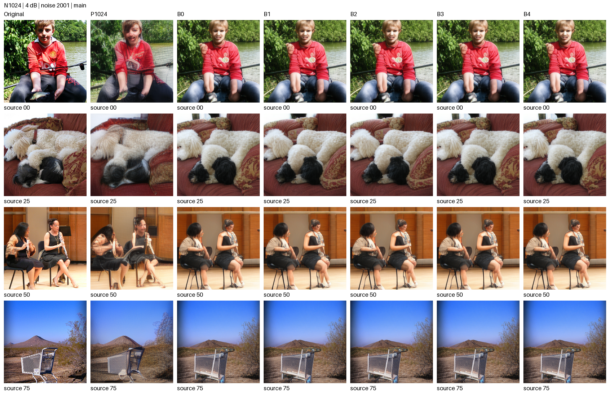
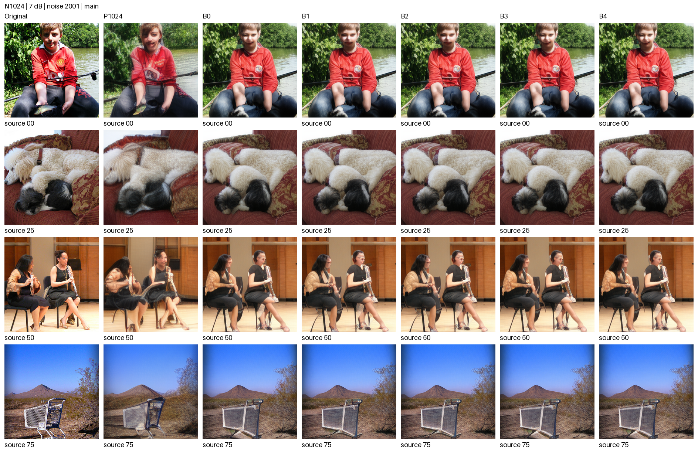
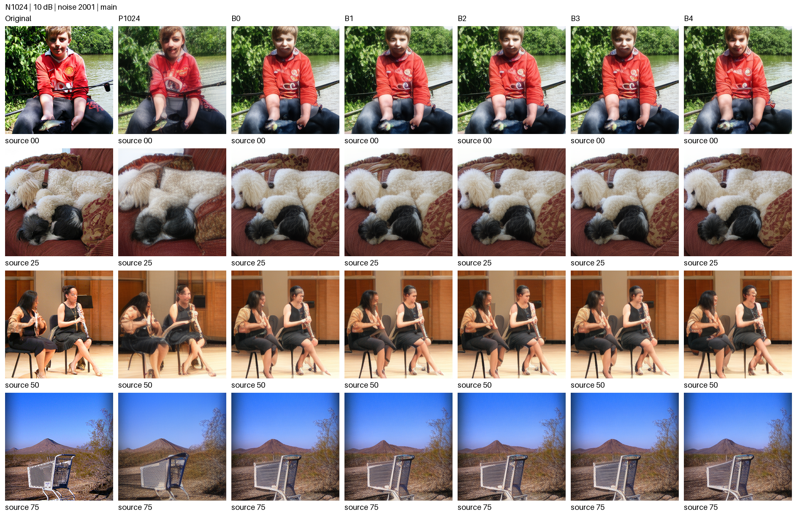
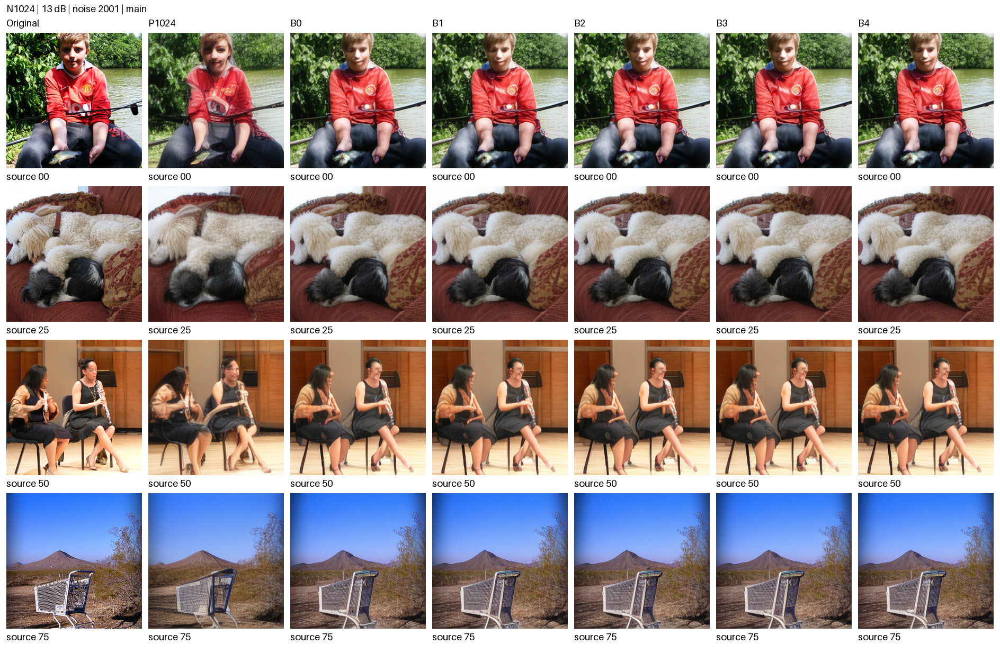

# 先验感知 UEP：冻结 N1024 实链路结果

校准选策与开发集评测已分离。主表使用原 100 张 development 图像、每图 3 个登记噪声种子，在 4/7/10/13 dB 完成实际付费码流解码；失败帧也计入均值。

## 校准样本与候选范围

阶段A预计总成本 17.55 小时未超过登记的48小时阈值，直接在完整1000张校准图上评估登记候选集合，未触发300张初筛。 成本规则为 max(Q实测估计,剩余粗BLER估计)+精化+实链路+报告；规划余量不是已经发生的耗时。

## 主要结果

- DINOv2-L ↑，B3−B0：4 dB 0.0000 [0.0000, 0.0000]；7 dB 0.0000 [0.0000, 0.0000]；10 dB 0.0000 [0.0000, 0.0000]；13 dB -0.0042 [-0.0098, 0.0017]。
- ConvNeXt 一致率 ↑，B3−B0：4 dB 0.0000 [0.0000, 0.0000]；7 dB 0.0000 [0.0000, 0.0000]；10 dB 0.0000 [0.0000, 0.0000]；13 dB 0.0100 [-0.0200, 0.0400]。
- PSNR ↑，B3−B0：4 dB 0.0000 [0.0000, 0.0000]；7 dB 0.0000 [0.0000, 0.0000]；10 dB 0.0000 [0.0000, 0.0000]；13 dB -0.0621 [-0.0874, -0.0382]。
- LPIPS ↓，B3−B0：4 dB 0.0000 [0.0000, 0.0000]；7 dB 0.0000 [0.0000, 0.0000]；10 dB 0.0000 [0.0000, 0.0000]；13 dB 0.0014 [0.0007, 0.0021]。

**门槛结果：** `DELIVER_AND_STOP_NO_EXTENSION`。本结果来自已多次使用的 development 集，门槛不是独立 holdout 确认。

## 完整主表摘要

| SNR/dB | 方法 | PSNR ↑ | LPIPS ↓ | DINOv2-L ↑ | CLIP ↑ | DISTS ↓ | ConvNeXt 一致率 ↑ | F 误差/零擦除代理 ↓ |
| --- | --- | --- | --- | --- | --- | --- | --- | --- |
| 4 | P1024 | 19.5159 | 0.2365 | 0.4178 | 0.7162 | 0.2326 | 0.5000 | 3850.9926 |
| 4 | B0 | 17.4249 | 0.2706 | 0.5538 | 0.8078 | 0.1981 | 0.6500 | 4781.3432 |
| 4 | B1 | 17.3080 | 0.2768 | 0.5516 | 0.8043 | 0.2020 | 0.6533 | 4800.2612 |
| 4 | B2 | 17.3080 | 0.2768 | 0.5516 | 0.8043 | 0.2020 | 0.6533 | 4800.2612 |
| 4 | B3 | 17.4249 | 0.2706 | 0.5538 | 0.8078 | 0.1981 | 0.6500 | 4781.3432 |
| 4 | B4 | 17.4249 | 0.2706 | 0.5538 | 0.8078 | 0.1981 | 0.6500 | 4781.3432 |
| 7 | P1024 | 20.1413 | 0.2070 | 0.5110 | 0.7476 | 0.2194 | 0.5900 | 3626.0096 |
| 7 | B0 | 18.6797 | 0.2272 | 0.6665 | 0.8370 | 0.1776 | 0.7533 | 4284.9686 |
| 7 | B1 | 18.6740 | 0.2251 | 0.6554 | 0.8395 | 0.1765 | 0.7667 | 4302.4978 |
| 7 | B2 | 18.6740 | 0.2251 | 0.6554 | 0.8395 | 0.1765 | 0.7667 | 4302.4978 |
| 7 | B3 | 18.6797 | 0.2272 | 0.6665 | 0.8370 | 0.1776 | 0.7533 | 4284.9686 |
| 7 | B4 | 18.6797 | 0.2272 | 0.6665 | 0.8370 | 0.1776 | 0.7533 | 4284.9686 |
| 10 | P1024 | 20.5152 | 0.1908 | 0.5604 | 0.7654 | 0.2121 | 0.6100 | 3478.1104 |
| 10 | B0 | 19.6793 | 0.1879 | 0.7464 | 0.8616 | 0.1590 | 0.8000 | 3852.4353 |
| 10 | B1 | 19.6458 | 0.1900 | 0.7383 | 0.8656 | 0.1608 | 0.8100 | 3864.7825 |
| 10 | B2 | 19.6458 | 0.1900 | 0.7383 | 0.8656 | 0.1608 | 0.8100 | 3864.7825 |
| 10 | B3 | 19.6793 | 0.1879 | 0.7464 | 0.8616 | 0.1590 | 0.8000 | 3852.4353 |
| 10 | B4 | 19.4782 | 0.2233 | 0.7102 | 0.8438 | 0.1934 | 0.7967 | 3807.8868 |
| 13 | P1024 | 20.7284 | 0.1825 | 0.5834 | 0.7746 | 0.2082 | 0.6267 | 3390.1392 |
| 13 | B0 | 20.4243 | 0.1637 | 0.7829 | 0.8781 | 0.1481 | 0.8400 | 3533.7346 |
| 13 | B1 | 20.3854 | 0.1646 | 0.7807 | 0.8768 | 0.1486 | 0.8300 | 3544.0844 |
| 13 | B2 | 20.3623 | 0.1651 | 0.7787 | 0.8763 | 0.1487 | 0.8500 | 3559.7524 |
| 13 | B3 | 20.3623 | 0.1651 | 0.7787 | 0.8763 | 0.1487 | 0.8500 | 3559.7524 |
| 13 | B4 | 20.4243 | 0.1637 | 0.7829 | 0.8781 | 0.1481 | 0.8400 | 3533.7346 |

全部已算指标及配对区间见 [完整主表](../results/prior_aware_uep_20261004/complete_main_table.csv) 与 [方法配对区间](../results/prior_aware_uep_20261004/paired_method_intervals.csv)。空白表示该点或指标未完成测量，不插值、不以别的 SNR 代替。

## 相同源信息与分组边界的对照

| SNR/dB | 方法 | PSNR ↑ | LPIPS ↓ | DINOv2-L ↑ |
| --- | --- | --- | --- | --- |
| 4 | B3 | 17.4249 | 0.2706 | 0.5538 |
| 4 | matched_B1 | — | — | — |
| 4 | matched_B2 | — | — | — |
| 4 | matched_B3 | — | — | — |
| 7 | B3 | 18.6797 | 0.2272 | 0.6665 |
| 7 | matched_B1 | — | — | — |
| 7 | matched_B2 | — | — | — |
| 7 | matched_B3 | — | — | — |
| 10 | B3 | 19.6793 | 0.1879 | 0.7464 |
| 10 | matched_B1 | — | — | — |
| 10 | matched_B2 | — | — | — |
| 10 | matched_B3 | — | — | — |
| 13 | B3 | 20.3623 | 0.1651 | 0.7787 |
| 13 | matched_B1 | — | — | — |
| 13 | matched_B2 | 20.3623 | 0.1651 | 0.7787 |
| 13 | matched_B3 | 20.3623 | 0.1651 | 0.7787 |

matched_B1/B2/B3 保持 B3 的 (m,K,j)。B3 退化为单组时，这组对照标为不适用；同一波形或旁路复用不算独立方法增益。B4 根据 direct Q 选策，但最终仍用同一个 VAR 接收器。

## 对 P1024 的取舍

[P1024 覆盖清单](../results/prior_aware_uep_20261004/P1024_coverage.csv) 与 [完整源配对差值](../results/prior_aware_uep_20261004/paired_against_P1024.csv)。仅完整 100×3 的同源点进入配对表。P 使用原信道噪声命名空间，UEP 使用新实链路噪声命名空间；相同种子编号不代表噪声向量逐值相同。

## 功率、失败与指标口径

- 全部实际 N=1024；68 次 QPSK 头、正文 CRC/LDPC/rate matching 与已知填充符号均计费。纯 QPSK 逐帧 E=2048；含 16QAM 的方案按固定星座平均 Es=2，逐帧实际能量另存，不能宣称与 QPSK 严格逐帧同能量。
- 头或第一组失败输出 RGB0.5；第二组失败只用实际接受的第一组前缀。CRC 误接受按实际错误 token 重建，不替换成干净前缀。所有非灰图由同一冻结 Dc 解码。
- DINOv2 ViT-L/14（无 register，1024维 CLS）是本轮校准选择目标；原 DINOv2 ViT-S/14 保留。OpenAI CLIP ViT-L/14（224px）的图像余弦、LPIPS-Alex、DISTS、DreamSim ensemble v0.2.0、MS-SSIM、ResNet-50 两种准确率与错配检查仍报。独立 ConvNeXt-Tiny IMAGENET1K_V1 仅用于冻结策略后的开发评测，未参与候选精化。
- F 误差为 32×16×16 latent 的平方误差和。无接收 latent 的灰图，条件 F 误差留空；全帧代理用零擦除的 F 误差明确计入，不能把该代理称为灰图的真实 latent。
- 置信区间先对每源三个噪声求均值，再按源配对 bootstrap 10,000 次，种子 20261002。未为寻求显著性追加样本。

## 预测模型验证与接收代价

[模型验证](../results/prior_aware_uep_20261004/model_validation.json)、[扩展门槛](../results/prior_aware_uep_20261004/extension_gate.json) 与 [离线总耗时](../results/prior_aware_uep_20261004/offline_costs.csv)。开发 clean Q 只评估最终冻结码本需要的状态，用来区分源分布变化和链路预测误差，不回流选策。

### 本轮无最终图像缓存的实测代价

| SNR/dB | 方法 | TX 熵序/ms | 接收图像/ms | 16帧中灰图数 |
| --- | --- | --- | --- | --- |
| 4 | B0 | 78.6059 | 124.7742 | 0 |
| 4 | B1 | 78.6059 | 123.9155 | 0 |
| 4 | B2 | 78.6059 | 123.9155 | 0 |
| 4 | B3 | 78.6059 | 124.7742 | 0 |
| 4 | B4 | 78.6059 | 124.7742 | 0 |
| 7 | B0 | 90.5120 | 125.4690 | 0 |
| 7 | B1 | 90.5120 | 122.3478 | 0 |
| 7 | B2 | 90.5120 | 122.3478 | 0 |
| 7 | B3 | 90.5120 | 125.4690 | 0 |
| 7 | B4 | 90.5120 | 125.4690 | 0 |
| 10 | B0 | 90.5120 | 125.4832 | 0 |
| 10 | B1 | 90.5120 | 126.0648 | 0 |
| 10 | B2 | 90.5120 | 126.0648 | 0 |
| 10 | B3 | 90.5120 | 125.4832 | 0 |
| 10 | B4 | 90.5120 | 117.7217 | 1 |
| 13 | B0 | 103.6953 | 127.9110 | 0 |
| 13 | B1 | 103.6953 | 128.0560 | 0 |
| 13 | B2 | 103.6953 | 127.8570 | 0 |
| 13 | B3 | 103.6953 | 127.8570 | 0 |
| 13 | B4 | 103.6953 | 127.9110 | 0 |

固定16张、noise2001；每个实际独立波形先热身1次，再正式3次，CUDA同步，先对重复求均值。正式接收每次清空最终图像与KV缓存；重复方法共享同一波形的测量记录。TX仅含已知粗token前缀到完整熵排序，K0为不需要；图像接收从实际CRC接受payload到CPU RGB，含VAR与Dc，指标计算排除在计时外。

PHY/LDPC编解码在旧实链路ledger中没有同步计时，单列为未测，因此不拼接端到端时延。旧链路约60–75ms仅作历史参考，不并入本轮统计。详细重复值见 [本轮计时](../results/prior_aware_uep_20261004/timing.json)。

offline_costs.csv 是含多状态缓存、去重和指标的离线批量耗时，另列于上述无缓存接收时延。

## 固定 16 张样例

沿用原固定样例及 noise=2001。图像按原 256×256 像素直接拼接，只进行 PNG 显示所需的浮点量化。完整 16 张原图在 [originals](../results/prior_aware_uep_20261004/originals/)。

### 4 dB

### 7 dB

### 10 dB

### 13 dB

所有主方法与 matched 图页见 [图像清单](../results/prior_aware_uep_20261004/figures_manifest.json)。
