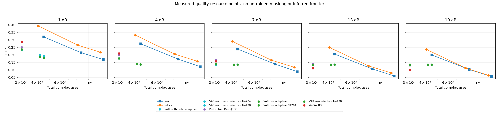
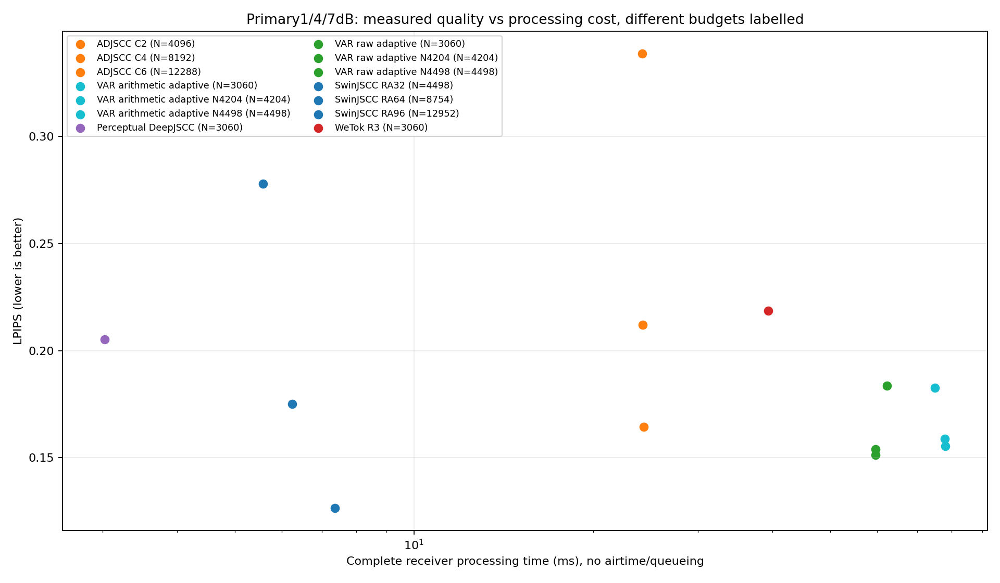
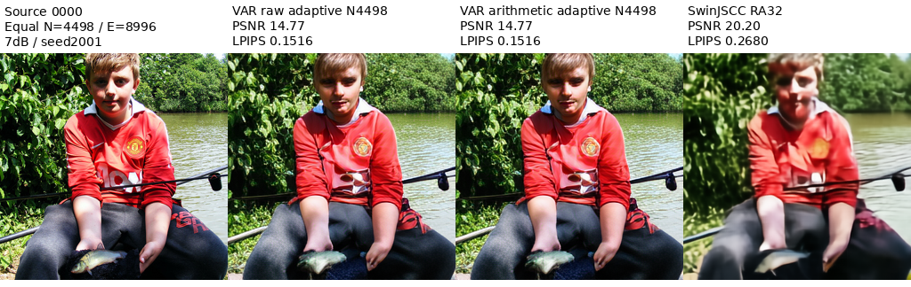

# 外部方法：非扩散阶段结果

**HiFi-DiffCom仍在运行，状态快照不是完成回执，不进入本次排名。**

- [阶段报告](../../reports/external_baseline_non_diffusion_result_20260916.md)
- [计费协议完整表](analysis/common_protocol_tables.md) · [作者信息假设独立表](analysis/author_protocol_tables.md)
- [119项汇总](analysis/summary.csv) · [1624项配对指标区间](analysis/paired.csv)
- [源图平均](analysis/per_source.csv) · [完整TX/RX成本](analysis/online_costs.csv) · [复核](analysis/audit.json)



不同预算不能当等预算排名；连线只是实测点，不是理论最优边界。



时间不含空口/排队。

## 等N4498例图

固定源0/25/50/75和噪声2001，不挑最好图；指标使用原float重建，不以展示PNG重算。



[120张展示PNG](figures/preselected_images/)包含24张拼图、96张独立重建。拼图中的源图是研究参照，不是数据集发布；不提供4个独立源图文件、完整数据集或像素数组。参见[选图清单](figures/preselected_images/manifest.csv)。

## 数据

| 路径 | 内容 |
|---|---|
| `author_per_frame/` | 13500协议视图，按协议/方法分片；9000次实际传输 |
| `reference_per_frame.csv` | 原四强系统6000行 |
| `digital_development.csv` | 新预算冻结动作6000行 |
| `development_manifest.json` | 源标识/哈希，无源像素 |
| `calibration/digital_per_frame/` | 18000校准行，按N分片，不改科学数值 |
| `calibration/digital_policies.json` | 只用校准冻结的动作 |
| `digital_timing/` | 1920对完整收发计时 |
| `qualification/`、`receipts/` | 资格、完成、调度及工程失败记录 |
| `hifi_status_snapshot.json` | 发布时运行快照，不是实时或完整结果 |

历史报告的`outputs/EXTERNAL-BASELINE-POSITIONING-20260916/non_diffusion_analysis_001/`对应公开的`analysis/`和`figures/`。其他原路径和哈希是追溯线索，不表示资产已上传。发布清单记录原始/公开双SHA及分片条件。

## CPU复算

在仓库根目录安装`requirements-results.txt`后运行：

```bash
python tools/reproduce_external_results.py
```

从25500行重算汇总/区间，并从18000校准行核对动作。不重算像素指标、不训练、不下载模型、不访问新holdout。完整GPU重演仍需要合法数据、权重及历史组件。
