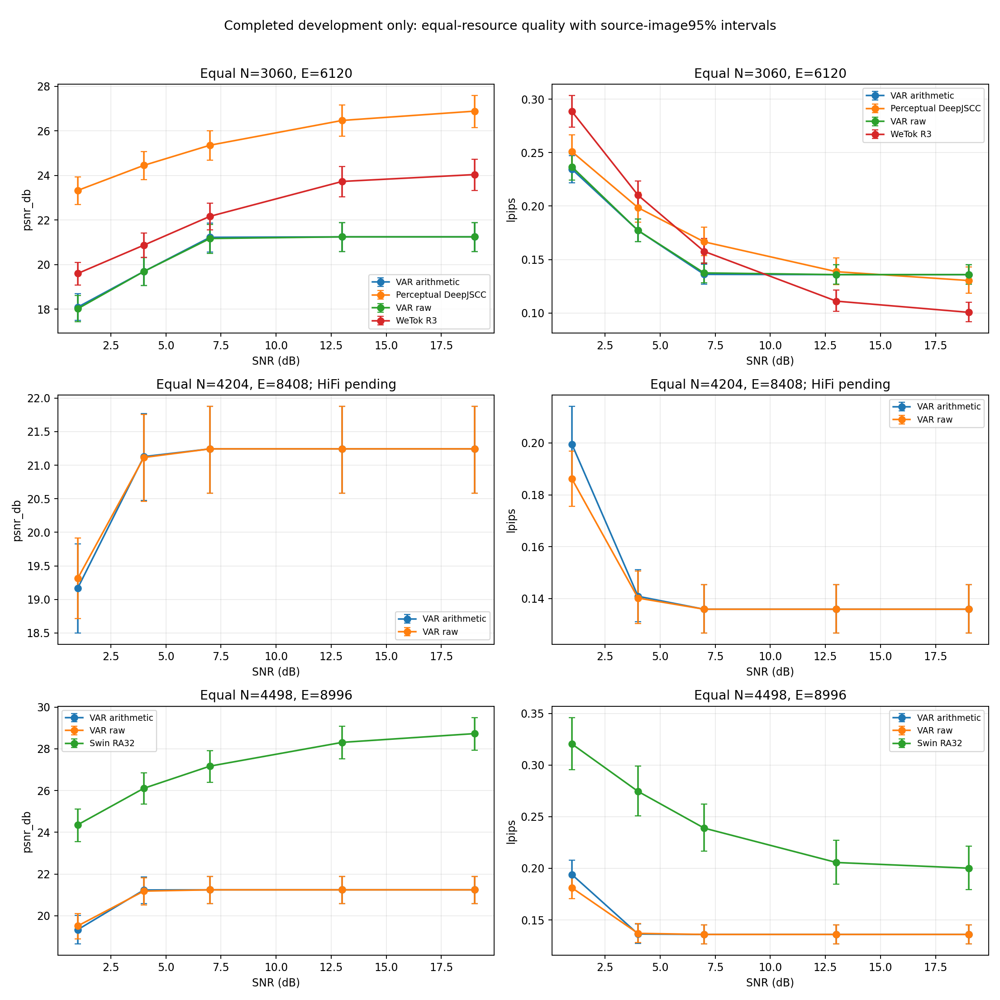
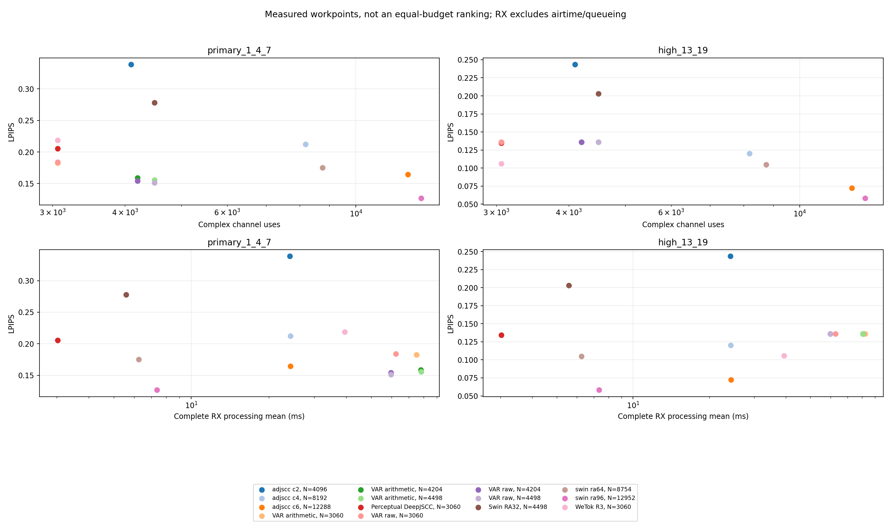

# 不等待HiFi的研究定位（阶段版）

本次仅使用已完成结果，不含HiFi全量质量，不是新的最终测试，也没有新训练。

- [一页研究定位](../../../reports/research_positioning_one_page_20260916.md)
- [相关工作具体差异](../../../reports/external_related_work_difference_20260916.md)
- [HiFi收尾条件与数值一致性说明](../../../reports/hifi_completion_readiness_20260916.md)

## 三类取舍

N4204中尚未加入HiFi；不能从缺少该方法的阶段图判最终胜负。

不同预算的点不是统一排名；处理时间不含空口/排队，计时会话和样本规模差异已记录。m9饱和只属于当前候选集，不是整个数字VAR系统上限。

## 数表

| 文件 | 内容 |
|---|---|
| `quality_resource_compute_points.csv` | 已测质量、N/E、完整RX代价；经验非支配不是显著性或应用成功 |
| `failure_consequences.csv` | 全部传输和可靠/非可靠输出分层；真值仅用于事后解释 |
| `raw_minus_arithmetic_paired.csv` | 同预算raw−算术的56项源图级配对指标区间 |
| `completion.json` | 本次CPU只读分析及原输入绑定 |
| `hifi_status_snapshot.json` | 发布时的HiFi运行快照，不是实时状态或完成回执 |
| `closure_status_snapshot.json` | CPU收尾等待器快照，不是已经完成分析 |

所有图同时提供PNG/PDF。旧实验、失败记录、原强对照保留。这里登记的普通误差韧性熵码只是证据缺口，未开始新实验。

收尾代码的发布不会在克隆仓库中自动启动任务；原工作区的等待器只在全量回执齐备后生成最终比较，不训练、不推送Git、不主动发送聊天通知。不能照历史PID操作其他机器。
