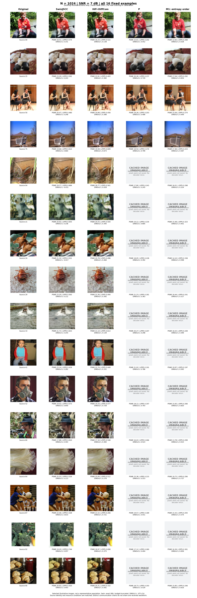
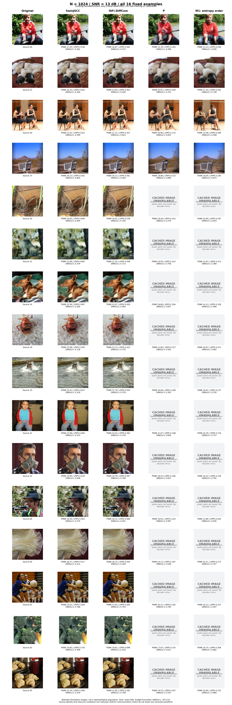
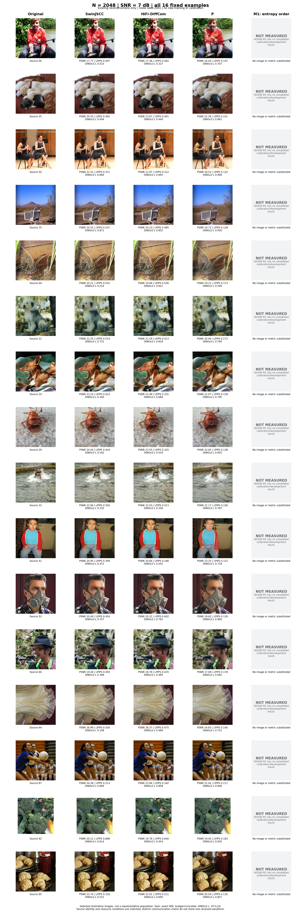
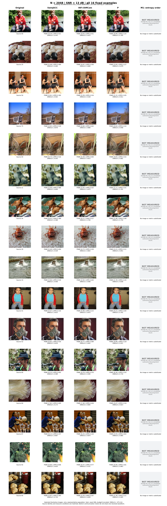

# 固定16图：Original / Swin / HiFi / P / M1

[先看一张合并对比表](MAIN_TABLE.md)

本报告仅整理已完成实验的重建图和已有逐帧指标，没有重新训练、推断、校准或运行评测模型。原图单独作为视觉参照，不把恒等重建的虚构分数放入传输方法排名。

范围：原登记的16张固定样例、噪声种子2001。该集合用于展示，不能代表完整100张开发图像或ImageNet总体。Swin使用指定80,000步模型；训练实际暂停于81,551步，保留预算截断与未证明收敛的说明。

均值及95%区间以16张源图为单位bootstrap 10,000次，种子20261002。差值使用相同源图的配对重采样；名义噪声种子均为2001，但各链的噪声命名空间不同，信道噪声并非逐元素相同，跨链实际接收波形也不同。

DINOv2-L为ViT-L/14；保留DINOv2-S、CLIP ViT-L/14及其余已登记指标。分类器错配只是自动诊断，不等于人工语义错误判决。图像从原缓存导出为256×256 RGB PNG；表中指标沿用原始评测缓存，未在量化PNG上重算。

已有指标但图像缓存缺失的项保留指标，并在图中明确标记；未执行的方法不填写指标。只对完整16图且该指标均可用的组计算区间，缺失值不置零、不改用较少样本的均值。P/M1若未保存置信度诊断则标N/A；分类器错配率可由1−原图预测一致率直接得到。

**N2048 的 M1 未正式运行，不能据此与其他方法比较。** 该列明确保留“NOT MEASURED”，不使用其他带宽或相邻SNR结果替代。

本轮只提取已完成的重建图和逐帧指标，没有新增推断、评测模型调用、校准或训练。所有16张原图单独提供PNG和原始float32 NPZ。
P1024和M1在全部16张图上的旧指标仍在；仅原先4张固定样例保存了7/13 dB图像，其他12张保留明确缺图格。N2048 M1未完成校准和开发评测，整列标为未运行。
7 dB旧样例由原exact-float导出回执关联指标和PNG；13 dB旧样例验证原Git发布PNG，未重新解码验证float像素。图像仅作展示，不使用PNG重算指标。
每张图保留新旧reference浮点哈希核对；同原始uint8像素已验证。旧原生PSNR/LPIPS/DINO定义和值保留，不声称重新用新参照评测。
Swin/HiFi共享完全相同的接收波形。P/M1只匹配原图、总N、SNR和标称种子2001，其信道噪声命名空间不同，不能称为同波形比较。
P2048为历史最终模型（训练seed2026092304），P1024为已登记模型（seed2026093001）；历史Dc权重版本也需按各自出处区分。Swin为固定80k、预算截断模型。
旧P/M1没有分类top1置信概率，confidently_wrong留空；P2048没有错配DINO，specificity留空。semantic_error由已存分类一致率作1−一致率计算；没有补造未测指标。

## N1024，7 dB

**P：4/16张可用。** Metrics exist; reconstruction pixels were not saved. No decoder rerun.

**M1: entropy order：4/16张可用。** Metrics exist; reconstruction pixels were not saved. No decoder rerun.

| 方法 | 已存图像 | PSNR ↑ | LPIPS ↓ | DINOv2-L ↑ | CLIP ↑ |
| --- | --- | --- | --- | --- | --- |
| SwinJSCC | 16/16 | 20.902 [19.820, 22.016] | 0.561 [0.509, 0.610] | 0.271 [0.168, 0.377] | 0.586 [0.540, 0.633] |
| HiFi-DiffCom | 16/16 | 20.433 [19.398, 21.494] | 0.502 [0.452, 0.549] | 0.397 [0.301, 0.493] | 0.700 [0.644, 0.749] |
| P | 4/16 | 18.939 [17.969, 19.931] | 0.213 [0.200, 0.227] | 0.537 [0.453, 0.622] | 0.712 [0.659, 0.765] |
| M1: entropy order | 4/16 | 16.341 [15.367, 17.327] | 0.275 [0.257, 0.292] | 0.534 [0.464, 0.604] | 0.800 [0.754, 0.844] |

| 方法 | 已存图像 | DISTS ↓ | DreamSim ↓ | MS-SSIM ↑ | DINOv2-S ↑ | DINO specificity ↑ |
| --- | --- | --- | --- | --- | --- | --- |
| SwinJSCC | 16/16 | 0.339 [0.326, 0.351] | 0.437 [0.397, 0.482] | 0.785 [0.761, 0.807] | 0.299 [0.230, 0.369] | 0.300 [0.224, 0.378] |
| HiFi-DiffCom | 16/16 | 0.287 [0.270, 0.303] | 0.299 [0.254, 0.348] | 0.764 [0.740, 0.787] | 0.493 [0.407, 0.576] | 0.494 [0.407, 0.583] |
| P | 4/16 | 0.214 [0.205, 0.223] | 0.230 [0.200, 0.264] | 0.711 [0.684, 0.736] | 0.618 [0.542, 0.689] | 0.607 [0.541, 0.671] |
| M1: entropy order | 4/16 | 0.201 [0.192, 0.209] | 0.202 [0.179, 0.225] | 0.517 [0.471, 0.569] | 0.715 [0.675, 0.754] | 0.702 [0.653, 0.749] |

| 方法 | 已存图像 | R50 / true label ↑ | R50 / original prediction ↑ | R50 mismatch ↓ | Confident mismatch ↓ |
| --- | --- | --- | --- | --- | --- |
| SwinJSCC | 16/16 | 0.188 [0.000, 0.375] | 0.125 [0.000, 0.312] | 0.875 [0.688, 1.000] | 0.000 [0.000, 0.000] |
| HiFi-DiffCom | 16/16 | 0.125 [0.000, 0.312] | 0.125 [0.000, 0.312] | 0.875 [0.688, 1.000] | 0.000 [0.000, 0.000] |
| P | 4/16 | 0.250 [0.062, 0.500] | 0.438 [0.188, 0.688] | 0.562 [0.312, 0.812] | N/A |
| M1: entropy order | 4/16 | 0.375 [0.125, 0.625] | 0.438 [0.188, 0.688] | 0.562 [0.312, 0.812] | N/A |

同源图配对差值，方向为表中前者减后者。

| 方法差值 | PSNR ↑ | LPIPS ↓ | DINOv2-L ↑ |
| --- | --- | --- | --- |
| HiFi-DiffCom − SwinJSCC | -0.469 [-0.558, -0.377] | -0.059 [-0.081, -0.039] | 0.126 [0.065, 0.197] |
| P − SwinJSCC | -1.963 [-2.269, -1.685] | -0.347 [-0.390, -0.301] | 0.266 [0.184, 0.345] |
| M1: entropy order − SwinJSCC | -4.561 [-5.272, -3.876] | -0.286 [-0.333, -0.234] | 0.263 [0.148, 0.373] |
| P − HiFi-DiffCom | -1.494 [-1.764, -1.245] | -0.288 [-0.332, -0.243] | 0.140 [0.056, 0.221] |
| M1: entropy order − HiFi-DiffCom | -4.093 [-4.759, -3.463] | -0.227 [-0.276, -0.174] | 0.137 [0.037, 0.231] |
| M1: entropy order − P | -2.598 [-3.082, -2.097] | 0.062 [0.049, 0.074] | -0.002 [-0.081, 0.072] |

[总览PDF](figures/comparison_N1024_SNR7_all16.pdf) · [四页近景PDF](figures/comparison_N1024_SNR7_closeups.pdf)

[近景第1页](figures/comparison_N1024_SNR7_page1.png)
[近景第2页](figures/comparison_N1024_SNR7_page2.png)
[近景第3页](figures/comparison_N1024_SNR7_page3.png)
[近景第4页](figures/comparison_N1024_SNR7_page4.png)

## N1024，13 dB

**P：4/16张可用。** Metrics exist; reconstruction pixels were not saved. No decoder rerun.

**M1: entropy order：4/16张可用。** Metrics exist; reconstruction pixels were not saved. No decoder rerun.

| 方法 | 已存图像 | PSNR ↑ | LPIPS ↓ | DINOv2-L ↑ | CLIP ↑ |
| --- | --- | --- | --- | --- | --- |
| SwinJSCC | 16/16 | 21.764 [20.607, 22.935] | 0.523 [0.466, 0.577] | 0.388 [0.280, 0.498] | 0.620 [0.582, 0.659] |
| HiFi-DiffCom | 16/16 | 21.405 [20.259, 22.560] | 0.460 [0.401, 0.516] | 0.470 [0.374, 0.563] | 0.741 [0.680, 0.790] |
| P | 4/16 | 19.495 [18.494, 20.512] | 0.189 [0.177, 0.202] | 0.628 [0.548, 0.706] | 0.760 [0.716, 0.805] |
| M1: entropy order | 4/16 | 16.616 [15.616, 17.626] | 0.261 [0.239, 0.281] | 0.584 [0.512, 0.654] | 0.805 [0.757, 0.850] |

| 方法 | 已存图像 | DISTS ↓ | DreamSim ↓ | MS-SSIM ↑ | DINOv2-S ↑ | DINO specificity ↑ |
| --- | --- | --- | --- | --- | --- | --- |
| SwinJSCC | 16/16 | 0.325 [0.311, 0.339] | 0.364 [0.320, 0.413] | 0.828 [0.806, 0.848] | 0.413 [0.335, 0.487] | 0.416 [0.330, 0.501] |
| HiFi-DiffCom | 16/16 | 0.267 [0.246, 0.286] | 0.233 [0.189, 0.278] | 0.812 [0.788, 0.835] | 0.602 [0.522, 0.677] | 0.599 [0.515, 0.682] |
| P | 4/16 | 0.204 [0.194, 0.213] | 0.201 [0.174, 0.234] | 0.744 [0.718, 0.768] | 0.681 [0.601, 0.750] | 0.678 [0.607, 0.740] |
| M1: entropy order | 4/16 | 0.193 [0.182, 0.202] | 0.176 [0.157, 0.194] | 0.537 [0.488, 0.590] | 0.740 [0.692, 0.785] | 0.724 [0.671, 0.773] |

| 方法 | 已存图像 | R50 / true label ↑ | R50 / original prediction ↑ | R50 mismatch ↓ | Confident mismatch ↓ |
| --- | --- | --- | --- | --- | --- |
| SwinJSCC | 16/16 | 0.188 [0.000, 0.375] | 0.188 [0.000, 0.375] | 0.812 [0.625, 1.000] | 0.000 [0.000, 0.000] |
| HiFi-DiffCom | 16/16 | 0.125 [0.000, 0.312] | 0.062 [0.000, 0.188] | 0.938 [0.812, 1.000] | 0.000 [0.000, 0.000] |
| P | 4/16 | 0.438 [0.188, 0.688] | 0.625 [0.375, 0.875] | 0.375 [0.125, 0.625] | N/A |
| M1: entropy order | 4/16 | 0.500 [0.250, 0.750] | 0.625 [0.375, 0.875] | 0.375 [0.125, 0.625] | N/A |

同源图配对差值，方向为表中前者减后者。

| 方法差值 | PSNR ↑ | LPIPS ↓ | DINOv2-L ↑ |
| --- | --- | --- | --- |
| HiFi-DiffCom − SwinJSCC | -0.359 [-0.471, -0.251] | -0.063 [-0.082, -0.046] | 0.081 [0.003, 0.152] |
| P − SwinJSCC | -2.269 [-2.618, -1.941] | -0.334 [-0.380, -0.283] | 0.239 [0.155, 0.320] |
| M1: entropy order − SwinJSCC | -5.148 [-5.991, -4.328] | -0.263 [-0.312, -0.208] | 0.195 [0.074, 0.320] |
| P − HiFi-DiffCom | -1.910 [-2.257, -1.587] | -0.271 [-0.321, -0.218] | 0.158 [0.074, 0.240] |
| M1: entropy order − HiFi-DiffCom | -4.788 [-5.594, -4.020] | -0.199 [-0.254, -0.141] | 0.114 [-0.013, 0.240] |
| M1: entropy order − P | -2.879 [-3.412, -2.329] | 0.072 [0.058, 0.086] | -0.044 [-0.130, 0.046] |

[总览PDF](figures/comparison_N1024_SNR13_all16.pdf) · [四页近景PDF](figures/comparison_N1024_SNR13_closeups.pdf)

[近景第1页](figures/comparison_N1024_SNR13_page1.png)
[近景第2页](figures/comparison_N1024_SNR13_page2.png)
[近景第3页](figures/comparison_N1024_SNR13_page3.png)
[近景第4页](figures/comparison_N1024_SNR13_page4.png)

## N2048，7 dB

**M1: entropy order：0/16张可用。** N2048 M1 has no completed calibration/development result.

| 方法 | 已存图像 | PSNR ↑ | LPIPS ↓ | DINOv2-L ↑ | CLIP ↑ |
| --- | --- | --- | --- | --- | --- |
| SwinJSCC | 16/16 | 22.324 [21.157, 23.492] | 0.448 [0.396, 0.499] | 0.521 [0.416, 0.625] | 0.682 [0.636, 0.726] |
| HiFi-DiffCom | 16/16 | 21.782 [20.659, 22.920] | 0.397 [0.338, 0.456] | 0.601 [0.519, 0.684] | 0.783 [0.735, 0.828] |
| P | 16/16 | 20.685 [19.666, 21.708] | 0.145 [0.135, 0.155] | 0.798 [0.748, 0.842] | 0.849 [0.807, 0.887] |
| M1: entropy order | 0/16 | N/A | N/A | N/A | N/A |

| 方法 | 已存图像 | DISTS ↓ | DreamSim ↓ | MS-SSIM ↑ | DINOv2-S ↑ | DINO specificity ↑ |
| --- | --- | --- | --- | --- | --- | --- |
| SwinJSCC | 16/16 | 0.296 [0.284, 0.308] | 0.295 [0.258, 0.334] | 0.852 [0.832, 0.870] | 0.488 [0.409, 0.561] | 0.485 [0.403, 0.563] |
| HiFi-DiffCom | 16/16 | 0.246 [0.225, 0.267] | 0.190 [0.150, 0.230] | 0.833 [0.810, 0.854] | 0.691 [0.633, 0.749] | 0.679 [0.617, 0.740] |
| P | 16/16 | 0.154 [0.145, 0.162] | 0.120 [0.102, 0.139] | 0.812 [0.788, 0.835] | 0.841 [0.791, 0.878] | N/A |
| M1: entropy order | 0/16 | N/A | N/A | N/A | N/A | N/A |

| 方法 | 已存图像 | R50 / true label ↑ | R50 / original prediction ↑ | R50 mismatch ↓ | Confident mismatch ↓ |
| --- | --- | --- | --- | --- | --- |
| SwinJSCC | 16/16 | 0.188 [0.000, 0.375] | 0.125 [0.000, 0.312] | 0.875 [0.688, 1.000] | 0.062 [0.000, 0.188] |
| HiFi-DiffCom | 16/16 | 0.188 [0.000, 0.375] | 0.188 [0.000, 0.375] | 0.812 [0.625, 1.000] | 0.000 [0.000, 0.000] |
| P | 16/16 | 0.812 [0.625, 1.000] | 0.938 [0.812, 1.000] | 0.062 [0.000, 0.188] | N/A |
| M1: entropy order | 0/16 | N/A | N/A | N/A | N/A |

同源图配对差值，方向为表中前者减后者。

| 方法差值 | PSNR ↑ | LPIPS ↓ | DINOv2-L ↑ |
| --- | --- | --- | --- |
| HiFi-DiffCom − SwinJSCC | -0.542 [-0.645, -0.438] | -0.051 [-0.071, -0.028] | 0.080 [0.003, 0.163] |
| P − SwinJSCC | -1.639 [-1.862, -1.403] | -0.303 [-0.347, -0.258] | 0.277 [0.200, 0.359] |
| P − HiFi-DiffCom | -1.097 [-1.277, -0.910] | -0.253 [-0.304, -0.200] | 0.197 [0.122, 0.270] |

[总览PDF](figures/comparison_N2048_SNR7_all16.pdf) · [四页近景PDF](figures/comparison_N2048_SNR7_closeups.pdf)

[近景第1页](figures/comparison_N2048_SNR7_page1.png)
[近景第2页](figures/comparison_N2048_SNR7_page2.png)
[近景第3页](figures/comparison_N2048_SNR7_page3.png)
[近景第4页](figures/comparison_N2048_SNR7_page4.png)

## N2048，13 dB

**M1: entropy order：0/16张可用。** N2048 M1 has no completed calibration/development result.

| 方法 | 已存图像 | PSNR ↑ | LPIPS ↓ | DINOv2-L ↑ | CLIP ↑ |
| --- | --- | --- | --- | --- | --- |
| SwinJSCC | 16/16 | 23.210 [21.943, 24.456] | 0.416 [0.358, 0.471] | 0.616 [0.523, 0.701] | 0.731 [0.696, 0.764] |
| HiFi-DiffCom | 16/16 | 22.864 [21.601, 24.117] | 0.345 [0.289, 0.399] | 0.713 [0.638, 0.782] | 0.830 [0.793, 0.866] |
| P | 16/16 | 21.356 [20.275, 22.435] | 0.124 [0.114, 0.134] | 0.832 [0.794, 0.869] | 0.880 [0.846, 0.908] |
| M1: entropy order | 0/16 | N/A | N/A | N/A | N/A |

| 方法 | 已存图像 | DISTS ↓ | DreamSim ↓ | MS-SSIM ↑ | DINOv2-S ↑ | DINO specificity ↑ |
| --- | --- | --- | --- | --- | --- | --- |
| SwinJSCC | 16/16 | 0.280 [0.267, 0.292] | 0.243 [0.206, 0.283] | 0.887 [0.870, 0.902] | 0.578 [0.494, 0.654] | 0.569 [0.481, 0.654] |
| HiFi-DiffCom | 16/16 | 0.219 [0.198, 0.239] | 0.147 [0.117, 0.179] | 0.875 [0.855, 0.893] | 0.752 [0.691, 0.807] | 0.740 [0.668, 0.806] |
| P | 16/16 | 0.143 [0.132, 0.153] | 0.102 [0.087, 0.119] | 0.839 [0.816, 0.860] | 0.867 [0.818, 0.902] | N/A |
| M1: entropy order | 0/16 | N/A | N/A | N/A | N/A | N/A |

| 方法 | 已存图像 | R50 / true label ↑ | R50 / original prediction ↑ | R50 mismatch ↓ | Confident mismatch ↓ |
| --- | --- | --- | --- | --- | --- |
| SwinJSCC | 16/16 | 0.438 [0.188, 0.688] | 0.312 [0.125, 0.562] | 0.688 [0.438, 0.875] | 0.000 [0.000, 0.000] |
| HiFi-DiffCom | 16/16 | 0.438 [0.188, 0.688] | 0.312 [0.125, 0.562] | 0.688 [0.438, 0.875] | 0.000 [0.000, 0.000] |
| P | 16/16 | 0.812 [0.625, 1.000] | 0.938 [0.812, 1.000] | 0.062 [0.000, 0.188] | N/A |
| M1: entropy order | 0/16 | N/A | N/A | N/A | N/A |

同源图配对差值，方向为表中前者减后者。

| 方法差值 | PSNR ↑ | LPIPS ↓ | DINOv2-L ↑ |
| --- | --- | --- | --- |
| HiFi-DiffCom − SwinJSCC | -0.347 [-0.492, -0.194] | -0.070 [-0.092, -0.049] | 0.097 [0.028, 0.175] |
| P − SwinJSCC | -1.854 [-2.145, -1.549] | -0.292 [-0.339, -0.241] | 0.217 [0.137, 0.308] |
| P − HiFi-DiffCom | -1.508 [-1.791, -1.234] | -0.222 [-0.269, -0.171] | 0.120 [0.040, 0.199] |

[总览PDF](figures/comparison_N2048_SNR13_all16.pdf) · [四页近景PDF](figures/comparison_N2048_SNR13_closeups.pdf)

[近景第1页](figures/comparison_N2048_SNR13_page1.png)
[近景第2页](figures/comparison_N2048_SNR13_page2.png)
[近景第3页](figures/comparison_N2048_SNR13_page3.png)
[近景第4页](figures/comparison_N2048_SNR13_page4.png)

## 下载与审计

- [全部逐帧指标](metrics_per_frame.csv)
- [全部均值与区间](metrics_summary.csv)
- [全部可比方法对的差值与配对区间](metrics_paired_intervals.csv)
- [图像清单与哈希](asset_inventory.csv)

原尺寸PNG与原图独立包作为本地附件交付，不提交Git：`original_size_pngs.zip`含可用重建图和原图；`original_inputs_16.zip`只含16张256×256评测输入图及说明，并非ImageNet原始JPEG。

缺测项不补值、不插值，不使用相邻SNR或其他带宽的图像顶替。完整HiFi队列继续保持暂停。
