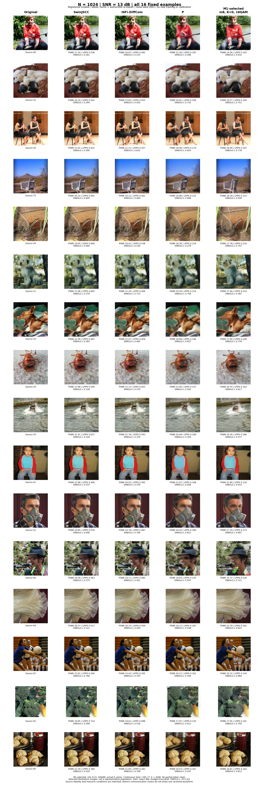

# 固定16图：Original / Swin / HiFi / P / M1

[先看一张合并对比表](MAIN_TABLE.md)

本报告整理已完成实验的重建图和已有逐帧指标，并按授权使用原模型、原条件与原种子补导出缺失重建图；没有重新训练、校准或运行指标评测模型。原图单独作为视觉参照，不把恒等重建的虚构分数放入传输方法排名。

范围：原登记的16张固定样例、噪声种子2001。该集合用于展示，不能代表完整100张开发图像或ImageNet总体。Swin使用指定80,000步模型；训练实际暂停于81,551步，保留预算截断与未证明收敛的说明。

均值及95%区间以16张源图为单位bootstrap 10,000次，种子20261002。差值使用相同源图的配对重采样；名义噪声种子均为2001，但各链的噪声命名空间不同，信道噪声并非逐元素相同，跨链实际接收波形也不同。

DINOv2-L为ViT-L/14；保留DINOv2-S、CLIP ViT-L/14及其余已登记指标。分类器错配只是自动诊断，不等于人工语义错误判决。图像从原缓存导出为256×256 RGB PNG；表中指标沿用原始评测缓存，未在量化PNG上重算。

已有指标但图像缓存缺失的项保留指标，并在图中明确标记；未执行的方法不填写指标。只对完整16图且该指标均可用的组计算区间，缺失值不置零、不改用较少样本的均值。P/M1若未保存置信度诊断则标N/A；分类器错配率可由1−原图预测一致率直接得到。

**本图M1的既有校准选中动作是m8、K=0、whole、16QAM。没有发送部分尺度token，不能把该点的差异归因为熵序或部分尺度传输的收益。**
各方法总信道使用N=1024。Swin、HiFi和P采用连续链逐帧2N能量约束（E=2048）；M1保持原16QAM星座并单列实际能量，不能称为严格同逐帧能量比较。M1的头部68次、正文956次；头部QPSK，正文16QAM。
M1在这16张图上的实际能量：均值2057.700000，最小1980.800000，最大2124.800000。完整逐帧E保存在指标CSV中；该均值与1000图校准均值不是同一统计量。
Swin/HiFi共享同一实际接收波形。P/M1只匹配源图、N、SNR和名义种子2001，各链噪声命名空间不同。配对区间以源图为单位，不声称跨链同波形。
全部16张源图的新旧评测参考float32哈希完全相同；本次补导出的32张P/M1重建float32哈希也与已有指标登记值完全相同。没有在PNG上重算指标。
分类器置信概率未保存的旧P/M1项保持N/A。本文仅是固定16图的展示与配对描述，不能据此宣称总体或全面优势。

## N1024，13 dB

| 方法 | 已存图像 | PSNR ↑ | LPIPS ↓ | DINOv2-L ↑ | CLIP ↑ |
| --- | --- | --- | --- | --- | --- |
| SwinJSCC | 16/16 | 21.764 [20.607, 22.935] | 0.523 [0.466, 0.577] | 0.388 [0.280, 0.498] | 0.620 [0.582, 0.659] |
| HiFi-DiffCom | 16/16 | 21.405 [20.259, 22.560] | 0.460 [0.401, 0.516] | 0.470 [0.374, 0.563] | 0.741 [0.680, 0.790] |
| P | 16/16 | 19.495 [18.494, 20.512] | 0.189 [0.177, 0.202] | 0.628 [0.548, 0.706] | 0.760 [0.716, 0.805] |
| M1-selected (m8, K=0, 16QAM) | 16/16 | 18.607 [17.543, 19.695] | 0.184 [0.168, 0.199] | 0.763 [0.708, 0.818] | 0.842 [0.804, 0.876] |

| 方法 | 已存图像 | DISTS ↓ | DreamSim ↓ | MS-SSIM ↑ | DINOv2-S ↑ | DINO specificity ↑ |
| --- | --- | --- | --- | --- | --- | --- |
| SwinJSCC | 16/16 | 0.325 [0.311, 0.339] | 0.364 [0.320, 0.413] | 0.828 [0.806, 0.848] | 0.413 [0.335, 0.487] | 0.416 [0.330, 0.501] |
| HiFi-DiffCom | 16/16 | 0.267 [0.246, 0.286] | 0.233 [0.189, 0.278] | 0.812 [0.788, 0.835] | 0.602 [0.522, 0.677] | 0.599 [0.515, 0.682] |
| P | 16/16 | 0.204 [0.194, 0.213] | 0.201 [0.174, 0.234] | 0.744 [0.718, 0.768] | 0.681 [0.601, 0.750] | 0.678 [0.607, 0.740] |
| M1-selected (m8, K=0, 16QAM) | 16/16 | 0.159 [0.150, 0.168] | 0.122 [0.108, 0.135] | 0.685 [0.650, 0.722] | 0.833 [0.786, 0.875] | 0.819 [0.759, 0.870] |

| 方法 | 已存图像 | R50 / true label ↑ | R50 / original prediction ↑ | R50 mismatch ↓ | Confident mismatch ↓ |
| --- | --- | --- | --- | --- | --- |
| SwinJSCC | 16/16 | 0.188 [0.000, 0.375] | 0.188 [0.000, 0.375] | 0.812 [0.625, 1.000] | 0.000 [0.000, 0.000] |
| HiFi-DiffCom | 16/16 | 0.125 [0.000, 0.312] | 0.062 [0.000, 0.188] | 0.938 [0.812, 1.000] | 0.000 [0.000, 0.000] |
| P | 16/16 | 0.438 [0.188, 0.688] | 0.625 [0.375, 0.875] | 0.375 [0.125, 0.625] | N/A |
| M1-selected (m8, K=0, 16QAM) | 16/16 | 0.500 [0.250, 0.750] | 0.688 [0.438, 0.875] | 0.312 [0.125, 0.562] | N/A |

同源图配对差值，方向为表中前者减后者。

| 方法差值 | PSNR ↑ | LPIPS ↓ | DINOv2-L ↑ |
| --- | --- | --- | --- |
| HiFi-DiffCom − SwinJSCC | -0.359 [-0.471, -0.251] | -0.063 [-0.082, -0.046] | 0.081 [0.003, 0.152] |
| P − SwinJSCC | -2.269 [-2.618, -1.941] | -0.334 [-0.380, -0.283] | 0.239 [0.155, 0.320] |
| M1-selected (m8, K=0, 16QAM) − SwinJSCC | -3.157 [-3.646, -2.668] | -0.339 [-0.382, -0.292] | 0.374 [0.286, 0.470] |
| P − HiFi-DiffCom | -1.910 [-2.257, -1.587] | -0.271 [-0.321, -0.218] | 0.158 [0.074, 0.240] |
| M1-selected (m8, K=0, 16QAM) − HiFi-DiffCom | -2.797 [-3.235, -2.379] | -0.276 [-0.324, -0.226] | 0.293 [0.196, 0.391] |
| M1-selected (m8, K=0, 16QAM) − P | -0.888 [-1.199, -0.511] | -0.005 [-0.013, 0.001] | 0.135 [0.071, 0.202] |

[总览PDF](figures/comparison_N1024_SNR13_all16.pdf) · [四页近景PDF](figures/comparison_N1024_SNR13_closeups.pdf)

[近景第1页](figures/comparison_N1024_SNR13_page1.png)
[近景第2页](figures/comparison_N1024_SNR13_page2.png)
[近景第3页](figures/comparison_N1024_SNR13_page3.png)
[近景第4页](figures/comparison_N1024_SNR13_page4.png)

## 下载与审计

- [全部逐帧指标](metrics_per_frame.csv)
- [全部均值与区间](metrics_summary.csv)
- [全部可比方法对的差值与配对区间](metrics_paired_intervals.csv)
- [图像清单与哈希](asset_inventory.csv)

原尺寸PNG与原图独立包作为本地附件交付，不提交Git：`original_size_pngs.zip`含可用重建图和原图；`original_inputs_16.zip`只含16张256×256评测输入图及说明，并非ImageNet原始JPEG。

缺测项不补值、不插值，不使用相邻SNR或其他带宽的图像顶替。完整HiFi队列继续保持暂停。
