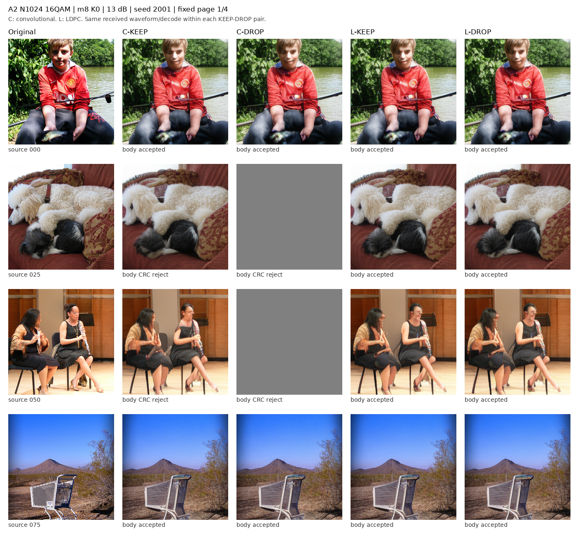
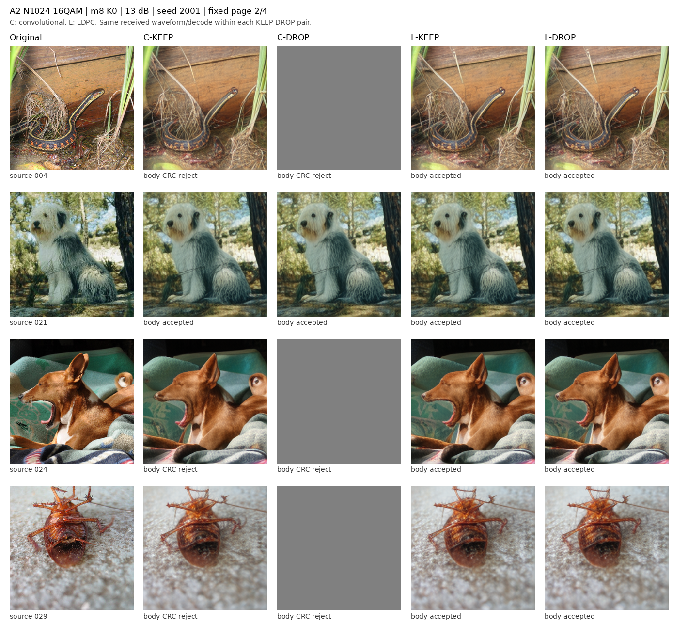
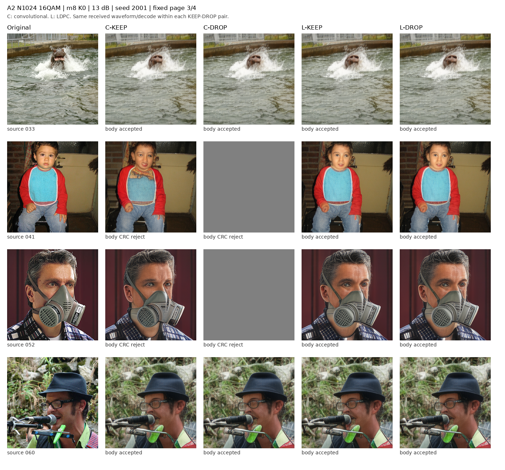
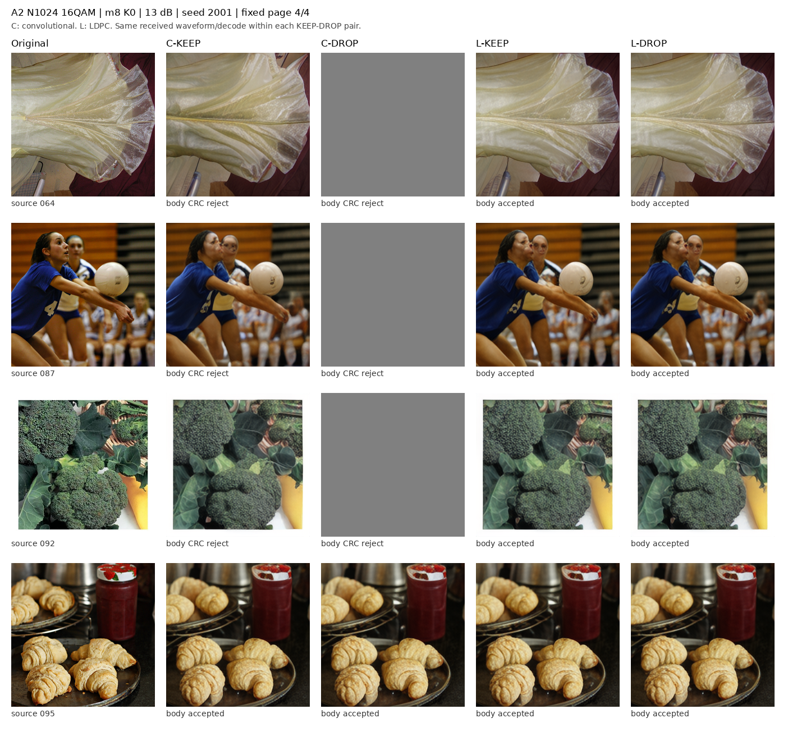
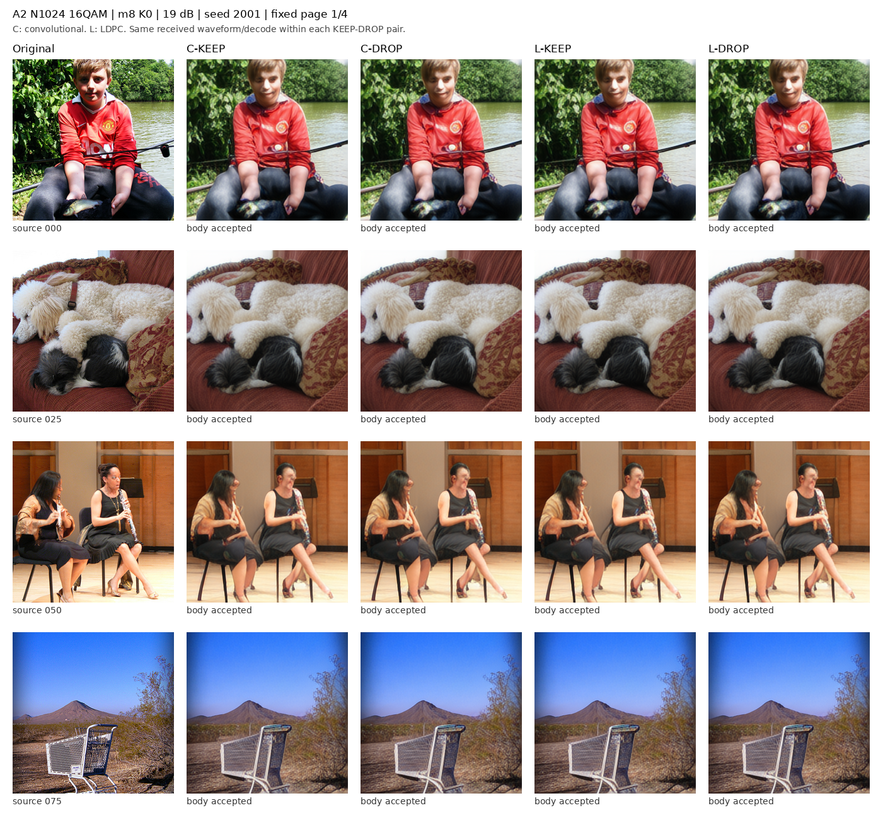
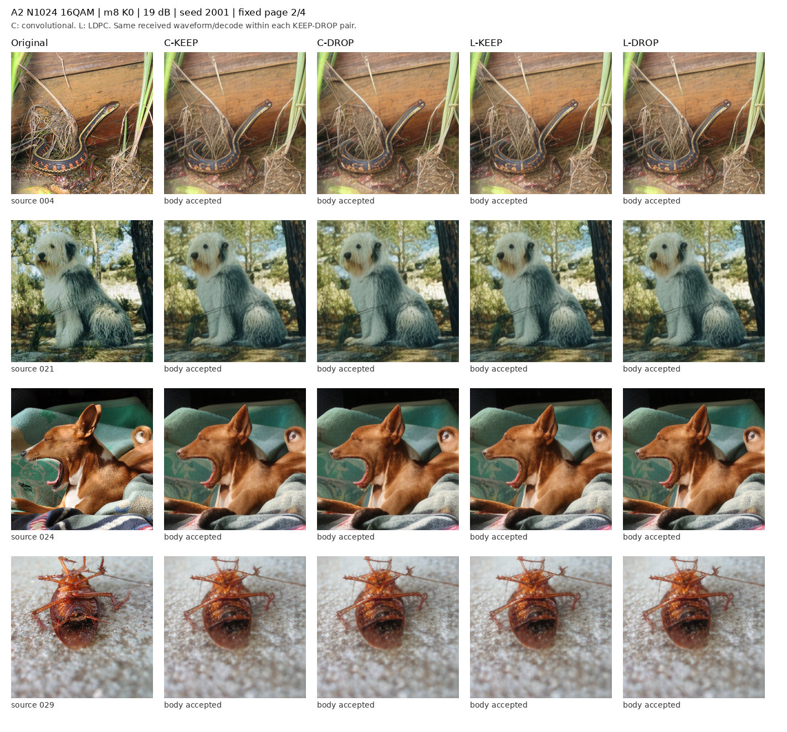
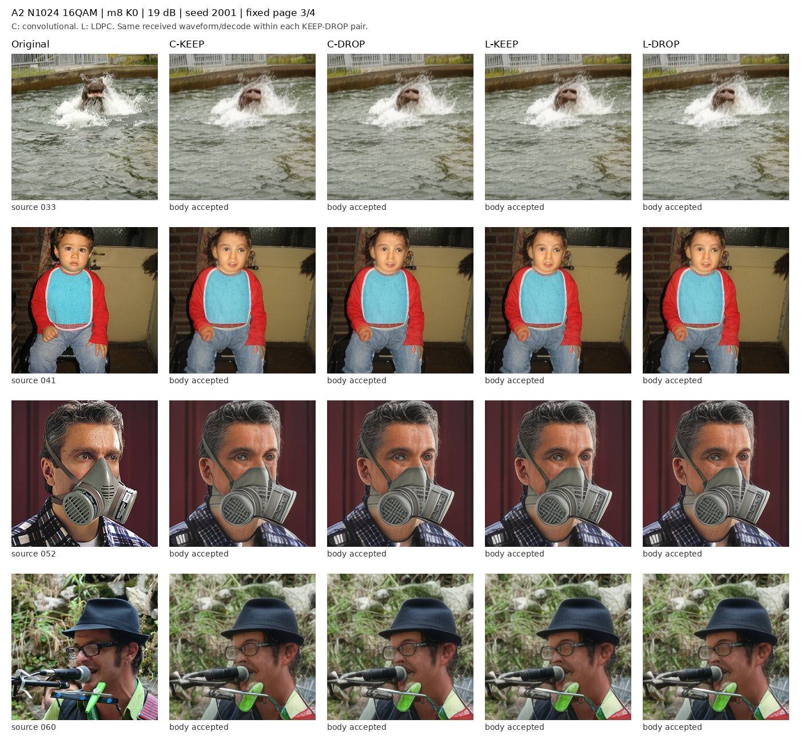
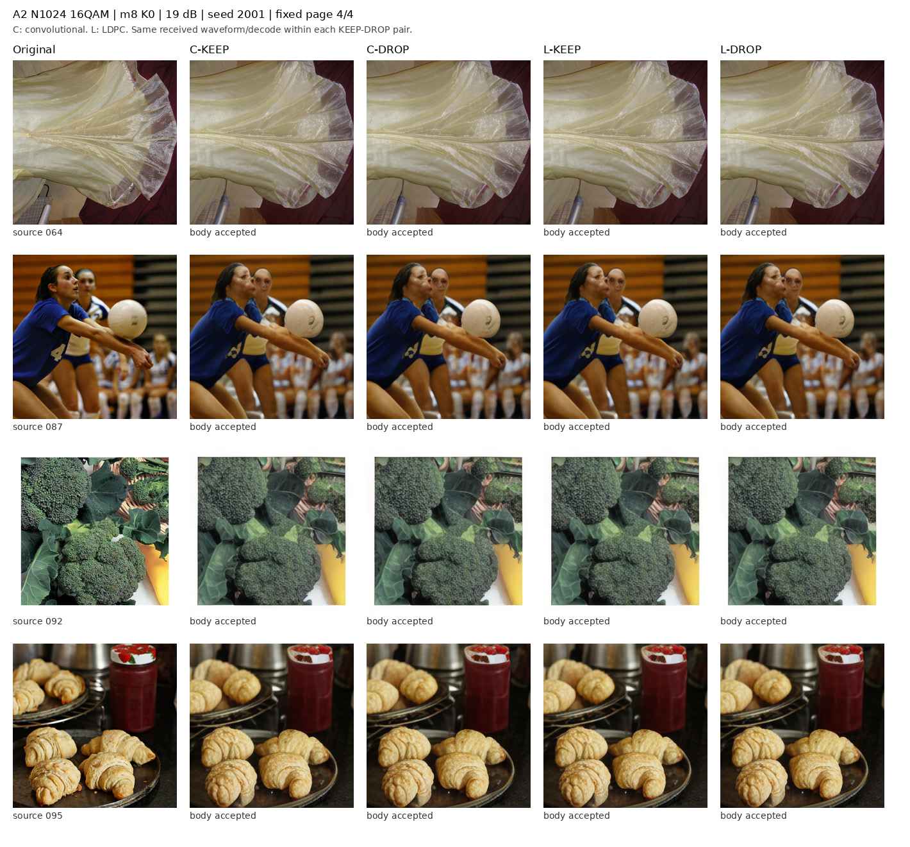

# A2：固定载荷下信道码与失败规则的 2×2 对照

N1024、16QAM、整尺度 m8、K=0；四臂均传输同一 3060 bit 源载荷，头部 68 次、正文 956 次信道使用。

工作点为 [13, 19] dB：13 dB 固定，另一点仅由校准 PHY 的 CRC 拒收率选择。development 没有参与选 SNR、载荷或策略。
C 表示卷积码，L 表示 LDPC。每种码的 KEEP 与 DROP 共用同一接收波形和译码结果。头部拒收时两臂均输出灰图；正文 CRC 拒收时，KEEP 使用实际硬判决前缀，DROP 丢弃。

这是独立登记的新匹配实现；旧 M1、旧 UEP 的协议与停止结论均未改写。16QAM 使用同平均功率，逐帧实际能量另列，不能称逐帧等能量。

## 四臂主结果

| SNR | 方法 | PSNR ↑ | LPIPS ↓ | DINOv2-L ↑ | ConvNeXt 原图预测一致率 ↑ |
| --- | --- | --- | --- | --- | --- |
| 13 | C-KEEP | 20.1436 [19.5567, 20.7465] | 0.1698 [0.1600, 0.1796] | 0.7753 [0.7496, 0.8002] | 0.8200 [0.7467, 0.8867] |
| 13 | C-DROP | 15.3860 [14.7830, 16.0131] | 0.6048 [0.5648, 0.6449] | 0.3374 [0.2985, 0.3762] | 0.3633 [0.3100, 0.4134] |
| 13 | L-KEEP | 20.3046 [19.7007, 20.9281] | 0.1663 [0.1566, 0.1759] | 0.7844 [0.7591, 0.8088] | 0.8200 [0.7400, 0.8900] |
| 13 | L-DROP | 20.3046 [19.7007, 20.9281] | 0.1663 [0.1566, 0.1759] | 0.7844 [0.7591, 0.8088] | 0.8200 [0.7400, 0.8900] |
| 19 | C-KEEP | 20.3046 [19.7007, 20.9281] | 0.1663 [0.1566, 0.1759] | 0.7844 [0.7591, 0.8088] | 0.8200 [0.7400, 0.8900] |
| 19 | C-DROP | 20.3046 [19.7007, 20.9281] | 0.1663 [0.1566, 0.1759] | 0.7844 [0.7591, 0.8088] | 0.8200 [0.7400, 0.8900] |
| 19 | L-KEEP | 20.3046 [19.7007, 20.9281] | 0.1663 [0.1566, 0.1759] | 0.7844 [0.7591, 0.8088] | 0.8200 [0.7400, 0.8900] |
| 19 | L-DROP | 20.3046 [19.7007, 20.9281] | 0.1663 [0.1566, 0.1759] | 0.7844 [0.7591, 0.8088] | 0.8200 [0.7400, 0.8900] |

100 张固定 development 图 × 3 个登记噪声。先对每源图三个噪声取均值，再做 10,000 次源配对 bootstrap，种子 20261002；区间为 95% 描述性区间，development 已被复用，不能替代 holdout。

## 三项主要归因

| SNR | 差值 | 指标 | 均值 [95% 区间] |
| --- | --- | --- | --- |
| 13 | code_L_minus_C_under_DROP | psnr_db | 4.9186 [4.3572, 5.5151] |
| 13 | rule_DROP_minus_KEEP_under_L | psnr_db | 0.0000 [0.0000, 0.0000] |
| 13 | interaction_L_DROP_minus_L_KEEP_minus_C_DROP_plus_C_KEEP | psnr_db | 4.7576 [4.2046, 5.3405] |
| 13 | code_L_minus_C_under_DROP | lpips_alex | -0.4385 [-0.4751, -0.4018] |
| 13 | rule_DROP_minus_KEEP_under_L | lpips_alex | 0.0000 [0.0000, 0.0000] |
| 13 | interaction_L_DROP_minus_L_KEEP_minus_C_DROP_plus_C_KEEP | lpips_alex | -0.4350 [-0.4713, -0.3986] |
| 13 | code_L_minus_C_under_DROP | dinov2_vitl14_cosine | 0.4470 [0.4072, 0.4866] |
| 13 | rule_DROP_minus_KEEP_under_L | dinov2_vitl14_cosine | 0.0000 [0.0000, 0.0000] |
| 13 | interaction_L_DROP_minus_L_KEEP_minus_C_DROP_plus_C_KEEP | dinov2_vitl14_cosine | 0.4379 [0.3989, 0.4765] |
| 13 | code_L_minus_C_under_DROP | convnext_source_prediction_agreement | 0.4567 [0.4000, 0.5167] |
| 13 | rule_DROP_minus_KEEP_under_L | convnext_source_prediction_agreement | 0.0000 [0.0000, 0.0000] |
| 13 | interaction_L_DROP_minus_L_KEEP_minus_C_DROP_plus_C_KEEP | convnext_source_prediction_agreement | 0.4567 [0.4000, 0.5133] |
| 19 | code_L_minus_C_under_DROP | psnr_db | 0.0000 [0.0000, 0.0000] |
| 19 | rule_DROP_minus_KEEP_under_L | psnr_db | 0.0000 [0.0000, 0.0000] |
| 19 | interaction_L_DROP_minus_L_KEEP_minus_C_DROP_plus_C_KEEP | psnr_db | 0.0000 [0.0000, 0.0000] |
| 19 | code_L_minus_C_under_DROP | lpips_alex | 0.0000 [0.0000, 0.0000] |
| 19 | rule_DROP_minus_KEEP_under_L | lpips_alex | 0.0000 [0.0000, 0.0000] |
| 19 | interaction_L_DROP_minus_L_KEEP_minus_C_DROP_plus_C_KEEP | lpips_alex | 0.0000 [0.0000, 0.0000] |
| 19 | code_L_minus_C_under_DROP | dinov2_vitl14_cosine | 0.0000 [0.0000, 0.0000] |
| 19 | rule_DROP_minus_KEEP_under_L | dinov2_vitl14_cosine | 0.0000 [0.0000, 0.0000] |
| 19 | interaction_L_DROP_minus_L_KEEP_minus_C_DROP_plus_C_KEEP | dinov2_vitl14_cosine | 0.0000 [0.0000, 0.0000] |
| 19 | code_L_minus_C_under_DROP | convnext_source_prediction_agreement | 0.0000 [0.0000, 0.0000] |
| 19 | rule_DROP_minus_KEEP_under_L | convnext_source_prediction_agreement | 0.0000 [0.0000, 0.0000] |
| 19 | interaction_L_DROP_minus_L_KEEP_minus_C_DROP_plus_C_KEEP | convnext_source_prediction_agreement | 0.0000 [0.0000, 0.0000] |

交互项定义为 (L-DROP − L-KEEP) − (C-DROP − C-KEEP)。所有差值按指标原方向报告，LPIPS 等误差指标越小越好。没有预设信道码或 DROP 必须有正增益，也不把单项获胜写成全面优势。

完整指标含 PSNR、LPIPS-Alex、DINOv2 ViT-S/14、DINOv2 ViT-L/14、CLIP 图像相似度、DISTS、DreamSim、MS-SSIM、DINO 错配特异性、ResNet-50 与 ConvNeXt-Tiny 的标签准确率及原图预测一致率。模型、权重和预处理版本见 model_metadata.json 与 EVALUATION_REGISTRATION.json。两个分类器仅用于评测。

F 误差在无接收 latent 的灰图分支沿用零擦除代理，完整 latent_valid 字段保留；该代理不代表灰图可逆推出真实 latent。FID 未测，KID 留待更大 holdout。

## 失败子集诊断

failure_subset_diagnostics.csv 单列头部通过且正文 CRC 拒收的配对样本。该诊断以源图为簇重采样，保留每源失败次数；它是按接收事件条件化的描述，不代表全总体因果效应。无失败时明确 NOT_ESTIMABLE，稀疏失败使重采样分母为零时不给伪造区间，也不追加 SNR 来找显著性。

## 固定样例

固定原 16 张样例、seed 2001；每个 SNR 四页，列为原图、C-KEEP、C-DROP、L-KEEP、L-DROP。科学指标使用浮点原始重建，PNG/PDF 只作显示。

## 资源与范围

训练更新为 0。真实阶段耗时、物理帧数与实际能量由完成凭证及逐帧表记录；在线独占单帧时延为 NOT_MEASURED。F2 未由本流程启动。

[全部指标](metrics_summary.csv) · [配对差值](paired_effects.csv) · [失败子集](failure_subset_diagnostics.csv) · [样例来源](VISUAL_MANIFEST.json)
