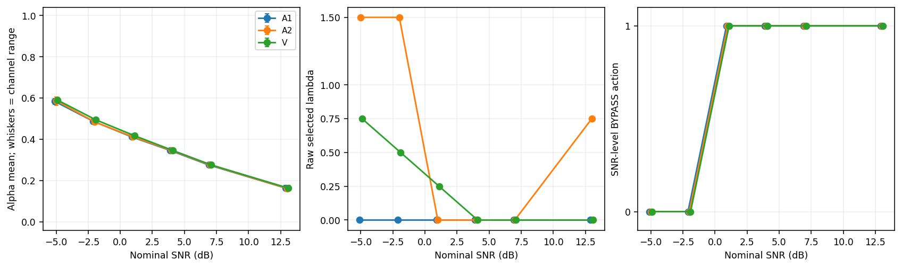
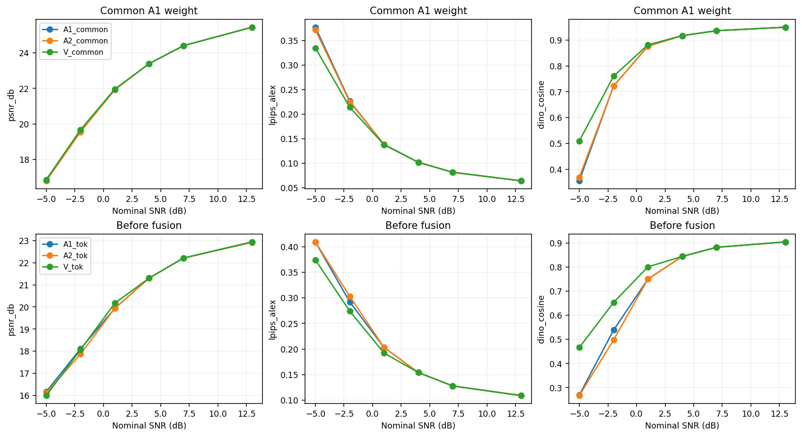
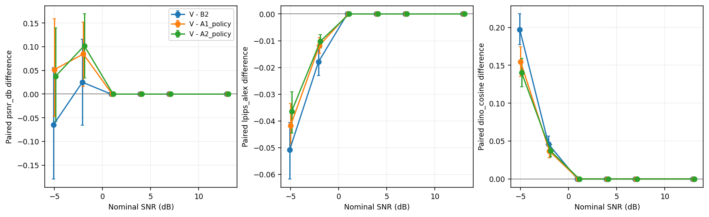
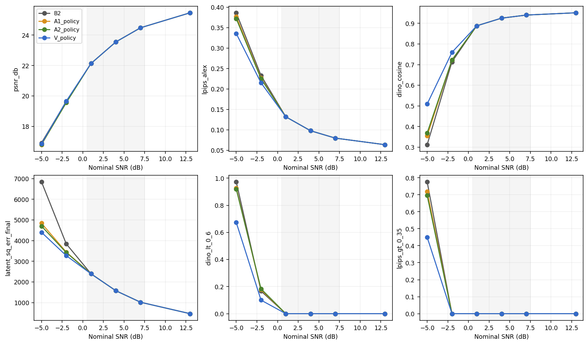

# 冻结 P4084 接收端增量验证：A 部分

本轮使用 C priority 第一训练 seed 2026092304 的 P4084 selected27500，完成冻结模型评测；新增训练更新为 0。

1. **V 是否胜过原 P4084？** 1/4/7 dB 范围内未建立相对 B2 的质量收益。逐点指标、PSNR 约束和接收时间列在下表。
2. **V 是否胜过 A1 和 A2？** 1/4/7 dB 范围内未建立超出三个直接控制的质量增量。只胜 B2 时不归因于 VAR 条件先验。
3. **共同融合权重下是否仍有增量？** 下面逐点报告 V_common 相对 A1_common/A2_common 的配对差；共同权重固定为 calibration 的 A1 alpha，未重新选 lambda。旁路时这些是诊断输出。
4. **下一步支持验证什么？** 若仅范围外出现增量，可在用户独立确认后验证低 SNR 基线适配；否则当前数据支持结束这套直接后处理实现，并保留码本/融合和条件先验的具体归因。B 部分、P_low 和旧队列均不自动启动。

## 范围内主结果

以下均先对每张源图的三个噪声平均，再对 100 张源图平均。PSNR 是逐图 PSNR 的均值。

| SNR | 方法 | PSNR dB | LPIPS alex | DINO | 原坐标 latent 平方和 | DINO<0.6 | LPIPS>0.35 |
|---:|---|---:|---:|---:|---:|---:|---:|
| 1 | B2 | 22.1358 | 0.13186 | 0.88810 | 2394.863 | 0.0000 | 0.0000 |
| 1 | A1_policy | 22.1358 | 0.13186 | 0.88810 | 2394.863 | 0.0000 | 0.0000 |
| 1 | A2_policy | 22.1358 | 0.13186 | 0.88810 | 2394.863 | 0.0000 | 0.0000 |
| 1 | V_policy | 22.1358 | 0.13186 | 0.88810 | 2394.863 | 0.0000 | 0.0000 |
| 4 | B2 | 23.5486 | 0.09773 | 0.92519 | 1577.911 | 0.0000 | 0.0000 |
| 4 | A1_policy | 23.5486 | 0.09773 | 0.92519 | 1577.911 | 0.0000 | 0.0000 |
| 4 | A2_policy | 23.5486 | 0.09773 | 0.92519 | 1577.911 | 0.0000 | 0.0000 |
| 4 | V_policy | 23.5486 | 0.09773 | 0.92519 | 1577.911 | 0.0000 | 0.0000 |
| 7 | B2 | 24.4821 | 0.07968 | 0.94016 | 1018.484 | 0.0000 | 0.0000 |
| 7 | A1_policy | 24.4821 | 0.07968 | 0.94016 | 1018.484 | 0.0000 | 0.0000 |
| 7 | A2_policy | 24.4821 | 0.07968 | 0.94016 | 1018.484 | 0.0000 | 0.0000 |
| 7 | V_policy | 24.4821 | 0.07968 | 0.94016 | 1018.484 | 0.0000 | 0.0000 |

上述两个阈值比例仅是所设指标阈值的失效比例。latent 误差是 32×16×16 原坐标平方和；均方值可除以 8192，不能把两者混用。

| SNR | 控制 | ΔPSNR [95% CI] | ΔLPIPS [95% CI] | ΔDINO [95% CI] | Δspecific [95% CI] |
|---:|---|---|---|---|---|
| 1 | B2 | 0.00000 [0.00000, 0.00000] | 0.00000 [0.00000, 0.00000] | 0.00000 [0.00000, 0.00000] | 0.00000 [0.00000, 0.00000] |
| 1 | A1_policy | 0.00000 [0.00000, 0.00000] | 0.00000 [0.00000, 0.00000] | 0.00000 [0.00000, 0.00000] | 0.00000 [0.00000, 0.00000] |
| 1 | A2_policy | 0.00000 [0.00000, 0.00000] | 0.00000 [0.00000, 0.00000] | 0.00000 [0.00000, 0.00000] | 0.00000 [0.00000, 0.00000] |
| 4 | B2 | 0.00000 [0.00000, 0.00000] | 0.00000 [0.00000, 0.00000] | 0.00000 [0.00000, 0.00000] | 0.00000 [0.00000, 0.00000] |
| 4 | A1_policy | 0.00000 [0.00000, 0.00000] | 0.00000 [0.00000, 0.00000] | 0.00000 [0.00000, 0.00000] | 0.00000 [0.00000, 0.00000] |
| 4 | A2_policy | 0.00000 [0.00000, 0.00000] | 0.00000 [0.00000, 0.00000] | 0.00000 [0.00000, 0.00000] | 0.00000 [0.00000, 0.00000] |
| 7 | B2 | 0.00000 [0.00000, 0.00000] | 0.00000 [0.00000, 0.00000] | 0.00000 [0.00000, 0.00000] | 0.00000 [0.00000, 0.00000] |
| 7 | A1_policy | 0.00000 [0.00000, 0.00000] | 0.00000 [0.00000, 0.00000] | 0.00000 [0.00000, 0.00000] | 0.00000 [0.00000, 0.00000] |
| 7 | A2_policy | 0.00000 [0.00000, 0.00000] | 0.00000 [0.00000, 0.00000] | 0.00000 [0.00000, 0.00000] | 0.00000 [0.00000, 0.00000] |

所有差值方向为 V−控制；LPIPS 和 latent 误差越低越好，PSNR/DINO 越高越好。DINO 增量的判定同时要求对应 Δspecific 区间下界>0；LPIPS 判定独立进行。

| SNR | 标签 | 相对 B2 PSNR≥−0.3 | 各控制明显收益分支 |
|---:|---|---|---|
| 1 | BYPASS_SELECTED | True | B2:未达到0.02幅度; A1_policy:未达到0.02幅度; A2_policy:未达到0.02幅度 |
| 4 | BYPASS_SELECTED | True | B2:未达到0.02幅度; A1_policy:未达到0.02幅度; A2_policy:未达到0.02幅度 |
| 7 | BYPASS_SELECTED | True | B2:未达到0.02幅度; A1_policy:未达到0.02幅度; A2_policy:未达到0.02幅度 |

## 共同权重与融合前诊断

| SNR | 输出 | 控制 | ΔLPIPS [95% CI] | ΔDINO [95% CI] | Δlatent平方和 [95% CI] |
|---:|---|---|---|---|---|
| -5 | V_common | A1_common | -0.04222 [-0.05118, -0.03397] | 0.15440 [0.13539, 0.17425] | -431.187 [-469.513, -394.172] |
| -5 | V_common | A2_common | -0.03689 [-0.04503, -0.02951] | 0.14012 [0.12176, 0.15856] | -298.921 [-331.621, -266.801] |
| -5 | V_tok | A1_tok | -0.03509 [-0.04415, -0.02686] | 0.19719 [0.17055, 0.22497] | -99.995 [-154.879, -45.547] |
| -5 | V_tok | A2_tok | -0.03504 [-0.04259, -0.02808] | 0.19961 [0.17482, 0.22496] | -28.221 [-74.384, 17.190] |
| -2 | V_common | A1_common | -0.01232 [-0.01533, -0.00949] | 0.03747 [0.02869, 0.04669] | -174.345 [-187.637, -161.149] |
| -2 | V_common | A2_common | -0.01088 [-0.01336, -0.00854] | 0.03844 [0.03050, 0.04680] | -151.011 [-161.981, -140.240] |
| -2 | V_tok | A1_tok | -0.01791 [-0.02231, -0.01370] | 0.11484 [0.09900, 0.13109] | -108.545 [-131.791, -85.450] |
| -2 | V_tok | A2_tok | -0.02889 [-0.03296, -0.02494] | 0.15559 [0.13785, 0.17324] | -152.743 [-171.691, -134.190] |
| 1 | V_common | A1_common | -0.00053 [-0.00116, 0.00012] | 0.00520 [0.00261, 0.00796] | -64.489 [-69.114, -60.052] |
| 1 | V_common | A2_common | -0.00053 [-0.00116, 0.00012] | 0.00520 [0.00261, 0.00796] | -64.489 [-69.114, -60.052] |
| 1 | V_tok | A1_tok | -0.01111 [-0.01333, -0.00906] | 0.05067 [0.04052, 0.06156] | -99.166 [-109.189, -89.430] |
| 1 | V_tok | A2_tok | -0.01111 [-0.01333, -0.00906] | 0.05067 [0.04052, 0.06156] | -99.166 [-109.189, -89.430] |
| 4 | V_common | A1_common | 0.00000 [0.00000, 0.00000] | 0.00000 [0.00000, 0.00000] | 0.000 [0.000, 0.000] |
| 4 | V_common | A2_common | 0.00000 [0.00000, 0.00000] | 0.00000 [0.00000, 0.00000] | 0.000 [0.000, 0.000] |
| 4 | V_tok | A1_tok | 0.00000 [0.00000, 0.00000] | 0.00000 [0.00000, 0.00000] | 0.000 [0.000, 0.000] |
| 4 | V_tok | A2_tok | 0.00000 [0.00000, 0.00000] | 0.00000 [0.00000, 0.00000] | 0.000 [0.000, 0.000] |
| 7 | V_common | A1_common | 0.00000 [0.00000, 0.00000] | 0.00000 [0.00000, 0.00000] | 0.000 [0.000, 0.000] |
| 7 | V_common | A2_common | 0.00000 [0.00000, 0.00000] | 0.00000 [0.00000, 0.00000] | 0.000 [0.000, 0.000] |
| 7 | V_tok | A1_tok | 0.00000 [0.00000, 0.00000] | 0.00000 [0.00000, 0.00000] | 0.000 [0.000, 0.000] |
| 7 | V_tok | A2_tok | 0.00000 [0.00000, 0.00000] | 0.00000 [0.00000, 0.00000] | 0.000 [0.000, 0.000] |
| 13 | V_common | A1_common | 0.00000 [0.00000, 0.00000] | 0.00000 [0.00000, 0.00000] | 0.000 [0.000, 0.000] |
| 13 | V_common | A2_common | 0.00008 [-0.00002, 0.00017] | 0.00021 [-0.00015, 0.00059] | -0.615 [-0.934, -0.306] |
| 13 | V_tok | A1_tok | 0.00000 [0.00000, 0.00000] | 0.00000 [0.00000, 0.00000] | 0.000 [0.000, 0.000] |
| 13 | V_tok | A2_tok | -0.00037 [-0.00100, 0.00023] | 0.00081 [-0.00220, 0.00399] | -20.099 [-24.217, -16.348] |

各自校准融合与共同权重结果均保留。共同权重保留的质量差支持候选内容的作用；若只有各自融合成立，需结合 alpha、bias/variance/MSE 与交叉二阶矩说明对融合校准的依赖。token 准确率仅解释机制，不参与策略排名。

## 范围外与 13 dB 保护

| SNR | 标签 | ΔPSNR V_policy−B2 | ΔLPIPS V_policy−B2 | ΔDINO V_policy−B2 |
|---:|---|---|---|---|
| -5 | G1_CLEAR_GAIN | -0.06459 [-0.17918, 0.05632] | -0.05076 [-0.06168, -0.04065] | 0.19734 [0.17704, 0.21776] |
| -2 | G1_CLEAR_GAIN | 0.02500 [-0.06579, 0.11594] | -0.01789 [-0.02300, -0.01306] | 0.04599 [0.03573, 0.05673] |
| 13 | BYPASS_SELECTED | 0.00000 [0.00000, 0.00000] | 0.00000 [0.00000, 0.00000] | 0.00000 [0.00000, 0.00000] |

13 dB 最终策略：BYPASS；实测 PSNR 差≥−0.2：True；LPIPS 显著恶化：False。
该点说明旁路保护有效，不证明 VAR 修正本身在高 SNR 下无损。
未发现显著恶化不等于证明统计等效。−5/−2 dB 是训练范围外诊断，不能合并成范围内优势。
13 dB 未旁路 V_raw_fused（raw λ=0.0；V_lambda1 固定 λ=1）相对 B2：PSNR -0.02037 [-0.02850, -0.01187]，LPIPS 0.00056 [0.00042, 0.00070]。
13 dB 未旁路 V_lambda1（raw λ=0.0；V_lambda1 固定 λ=1）相对 B2：PSNR -0.02820 [-0.03674, -0.01977]，LPIPS 0.00072 [0.00058, 0.00085]。
13 dB 未旁路 V_common（raw λ=0.0；V_lambda1 固定 λ=1）相对 B2：PSNR -0.02037 [-0.02850, -0.01187]，LPIPS 0.00056 [0.00042, 0.00070]。
13 dB 未旁路 V_tok（raw λ=0.0；V_lambda1 固定 λ=1）相对 B2：PSNR -2.52136 [-2.67418, -2.37303]，LPIPS 0.04527 [0.04258, 0.04793]。

## 冻结策略与计算代价

| SNR | 接收器 | raw λ | raw可行 | 策略 | alpha均值 [通道范围] |
|---:|---|---:|---|---|---|
| -5 | A1 | 0.0 | True | CORRECT | 0.58397 [0.57017, 0.59692] |
| -5 | A2 | 1.5 | True | CORRECT | 0.58784 [0.56444, 0.60434] |
| -5 | V | 0.75 | True | CORRECT | 0.59057 [0.57189, 0.60278] |
| -2 | A1 | 0.0 | True | CORRECT | 0.48746 [0.48081, 0.49471] |
| -2 | A2 | 1.5 | True | CORRECT | 0.48472 [0.47305, 0.49359] |
| -2 | V | 0.5 | True | CORRECT | 0.49446 [0.48728, 0.50055] |
| 1 | A1 | 0.0 | True | BYPASS | 0.41186 [0.40746, 0.41732] |
| 1 | A2 | 0.0 | True | BYPASS | 0.41186 [0.40746, 0.41732] |
| 1 | V | 0.25 | True | BYPASS | 0.41794 [0.41370, 0.42334] |
| 4 | A1 | 0.0 | True | BYPASS | 0.34618 [0.34254, 0.35243] |
| 4 | A2 | 0.0 | True | BYPASS | 0.34618 [0.34254, 0.35243] |
| 4 | V | 0.0 | True | BYPASS | 0.34618 [0.34254, 0.35243] |
| 7 | A1 | 0.0 | True | BYPASS | 0.27595 [0.27068, 0.28444] |
| 7 | A2 | 0.0 | True | BYPASS | 0.27595 [0.27068, 0.28444] |
| 7 | V | 0.0 | True | BYPASS | 0.27595 [0.27068, 0.28444] |
| 13 | A1 | 0.0 | True | BYPASS | 0.16374 [0.15400, 0.17806] |
| 13 | A2 | 0.75 | True | BYPASS | 0.16257 [0.15256, 0.17649] |
| 13 | V | 0.0 | True | BYPASS | 0.16374 [0.15400, 0.17806] |

| SNR | 方法 | raw λ | 实际运行VAR | 接收时间均值 ms | 中位 ms | p95 ms | 测量次数 |
|---:|---|---:|---|---:|---:|---:|---:|
| -5 | B2 | 0.75 | False | 12.993 | 12.881 | 13.068 | 20 |
| -5 | V_policy | 0.75 | True | 125.873 | 125.404 | 131.064 | 20 |
| -5 | V_raw 未旁路修正 | 0.75 | True | 125.784 | 125.148 | 128.687 | 20 |
| -2 | B2 | 0.5 | False | 12.939 | 12.880 | 13.013 | 20 |
| -2 | V_policy | 0.5 | True | 125.314 | 125.020 | 126.163 | 20 |
| -2 | V_raw 未旁路修正 | 0.5 | True | 125.432 | 124.991 | 127.910 | 20 |
| 1 | B2 | 0.25 | False | 12.953 | 12.879 | 13.100 | 20 |
| 1 | V_policy | 0.25 | False | 13.036 | 12.894 | 13.225 | 20 |
| 1 | V_raw 未旁路修正 | 0.25 | True | 125.383 | 125.154 | 127.100 | 20 |
| 4 | B2 | 0.0 | False | 12.921 | 12.877 | 13.096 | 20 |
| 4 | V_policy | 0.0 | False | 12.990 | 12.891 | 13.105 | 20 |
| 4 | V_raw 未旁路修正 | 0.0 | False | 16.624 | 16.610 | 16.851 | 20 |
| 7 | B2 | 0.0 | False | 13.062 | 12.876 | 14.382 | 20 |
| 7 | V_policy | 0.0 | False | 12.902 | 12.892 | 12.973 | 20 |
| 7 | V_raw 未旁路修正 | 0.0 | False | 16.609 | 16.599 | 16.694 | 20 |
| 13 | B2 | 0.0 | False | 12.876 | 12.875 | 12.933 | 20 |
| 13 | V_policy | 0.0 | False | 12.901 | 12.888 | 12.985 | 20 |
| 13 | V_raw 未旁路修正 | 0.0 | False | 16.647 | 16.608 | 16.959 | 20 |
计时边界为 CPU 接收波形→CPU 图像，包括 P receive 网络；新增修正分项见 timing.csv/timing_summary.csv。旁路耗时与实际运行 VAR 的未旁路耗时分别报告。
V_raw 表示未旁路修正；若选中 lambda=0，修正只运行无先验量化，ran_VAR=False，其速度不能称为运行 VAR 的速度。

## 证据与适用范围

- 原始 per_frame.csv 保留同一 P 观测下的全量配对图像指标、原坐标 latent 误差、动作、lambda 与实测 N/E。
- 以 100 个源图为推断单位；每张源图先平均三噪声。所有方法共用 10000 组源图 bootstrap 索引，seed=20260930，逐点 95% 百分位区间，未作多重比较校正。
- 该 development 已多轮使用，本轮是探索性验证；区间不包含训练 seed 变异。
- 经验重建误差方差包含学习映射与压缩误差；融合是误差可能相关时的启发式收缩，不是精确物理后验。
- BYPASS 原样返回 B2；lambda=0 仍是量化修正候选。旁路结果不记为 VAR 修正成功。
- TF 使用真实前缀，只作局部判别诊断；CL 的路径条件准确率与对原编码 token 的一致率分别保留。
- calibration 冻结参数后一次运行 development，未按 development 修改 lambda、融合、SNR 子集或 checkpoint。

文件身份：config.json `bf81654c086b28f1cb7e90d02c810224040b39ddd328e7ebd36e24593080ad76`；selected_policy.json `c8f1a488465ada5ee1644fad2a30e0a1dec7a9a557768f750b3905550a9479ea`；per_frame.csv `b8df30cc90f3a82af4360c1c9986859b291d4e0f98c870c746b3df5221839f23`。

详细表：summary.csv、paired.csv、source_means.csv、decisions.json、error_stats.csv、timing.csv；逐尺度 token 诊断另表保留。

配对统计的预先数值保护：每源图差值绝对值≤1e−12 置为数值0后 bootstrap；paired.csv 同时保留 raw_delta_mean。该规则避免理论相同的匹配/错配增益被浮点舍入误记为特异性增益。

