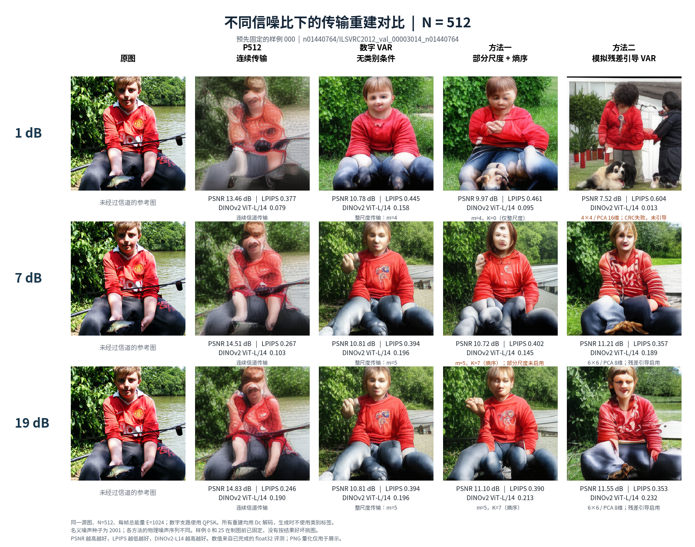
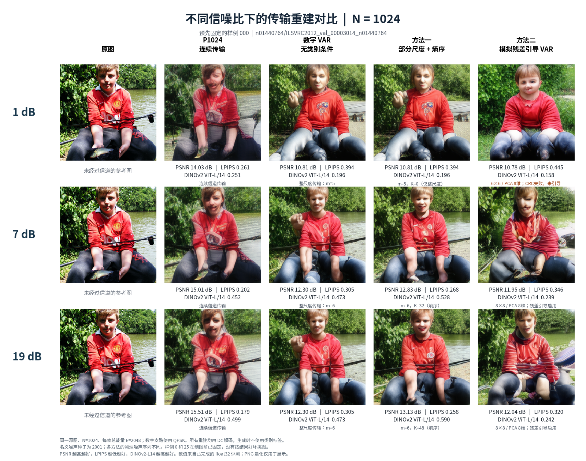
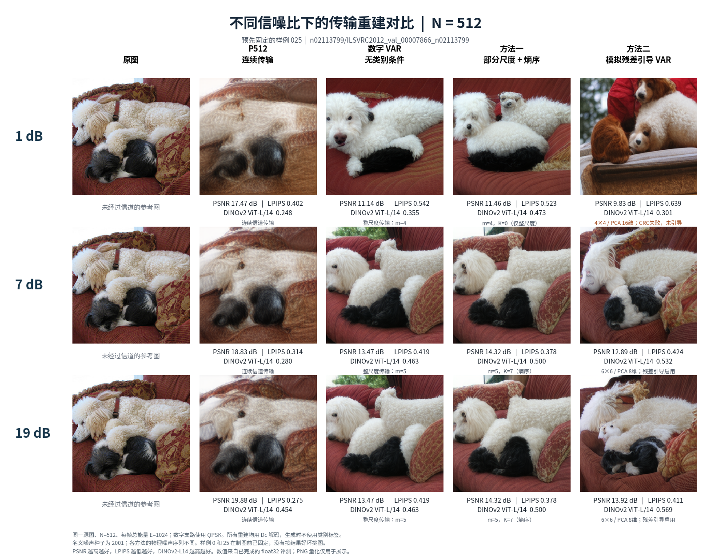
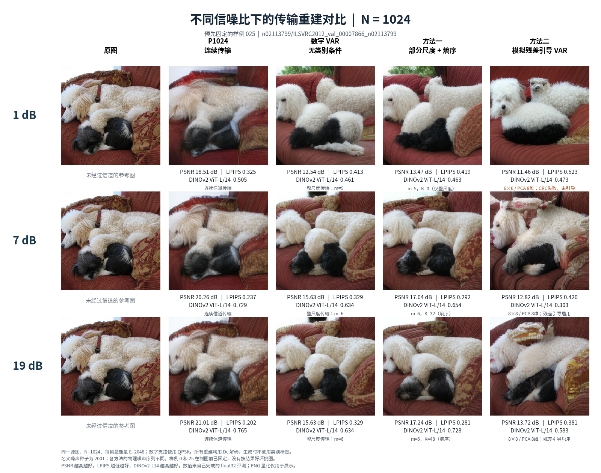

# 不同信噪比下的传输重建对比

固定样例 0、25；N512、N1024；SNR 1、7、19 dB；名义噪声种子 2001。
列顺序：原图、连续 P、无类别数字 VAR、方法一熵序、方法二实际残差引导链路。
所有重建使用同一 Dc，无真实类别标签、无 oracle。QPSK/连续链每帧总能量 E=2N；不同研究沿用各自的物理噪声序列，不能声称噪声逐样本相同。

48 个重建均通过原指标复现检查，并与已完成统一评测的 float32 RGB 指纹完全一致。图中 PSNR、LPIPS、DINOv2 ViT-L/14 取自原评测，PNG 量化仅用于显示。样例来自原先固定的可视化名单，未根据效果挑选；单帧图不能替代总体配对统计。
方法一 K=0、部分尺度未启用，以及方法二 CRC 失败时残差未启用，均在图下标明。

## 样例 000 · N512

[PDF](comparison_source000_N512.pdf)

## 样例 000 · N1024

[PDF](comparison_source000_N1024.pdf)

## 样例 025 · N512

[PDF](comparison_source025_N512.pdf)

## 样例 025 · N1024

[PDF](comparison_source025_N1024.pdf)

[统一指标完整报告](../unified_metrics_20261002/METRICS_REPORT.md)。完整行、图像指纹及策略来源见 comparisons_manifest.json。
